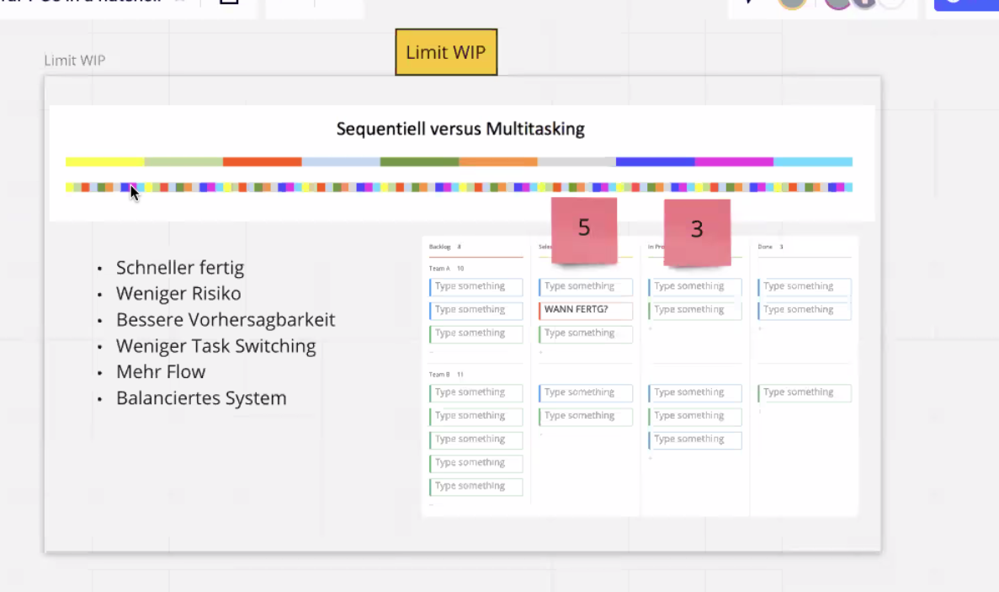

# Kanban for Product Owners in a nutshell

## host: Sacha Storz
"Sacha ist Scrum Professional, SAFe 4 Program Consultant, Kanban Professional und Management 3.0 Facilitator.Er lebt in München. Als Agile Coach der Techdivision GmbH gestaltet er im agilen Transitionsteams die Weiterentwicklung der Unternehmenskultur und Zusammenarbeit bei der TechDivision."

## whiteboard for that event
* <https://miro.com/app/board/o9J_lOwNzJk=/>

## notes
* evolutionary, start where you are currently, improve while you move
* Scrum would be revolutionary: creates also breaks
* manages the effort (the work), not the workers! -> "Watch the baton, not the runner!"
* the result is what matters
* customer not really itnerested what you do in detail, but what is delivered to him
* Kaizen: continuous improvement
* feedback loops
* past "visualize the work", now "visualize"
* just visualize the human work or everything? even automated things?
* kanban is board where YOU visualize how YOU work
* sequential versus multitasking 
* "get more done by doing less"; limit yourself on what you are doing, to be more predictable, and to deliver faster
* additional time is needed for "Umrüstung des Gehirns"; less flow with lots of tasks
* add some balance: less task switching is what is aimed for
* 'stop starting, start finishing!' - angefangene Dinge haben keinen Wert
* pull limits, WIP limits?
* commitment process mit stakeholdern klar definieren: sachen werden erst "real" bearbeitet wenn sie in "selected" sind und nicht wenn sie (stakeholder) den PO angerufen haben
* gewohnheitsmäßig folgt alles dem Schema: wer (bei mehrerern Stakeholdern) am lautesten schreit, wird zuerst bedient; wie kann man dies handhaben? Weil man sonst nur Feuerwehr spielt?
* Kanban regelt dies durch Indentifizierung der externen Abhängigkeiten; gibt auch Regeln dies zu managen
* Pull instead of Push
* "so true (abseits von Kanban): LIEFERN erstickt jede Diskussion im Keim (da gehts halt los, abseits von PO / outcome Themen, die natürlich mindestens genauso wichtig sind)"
* Begrenzung wie man Themen neu aufnimmt (nicht nur "über Zaun werfen"): explicit policies; Art zu Arbeiten explizit definiert, Workflows festgelegt (und transparent)
* Wann wird gepullt? Prioriserung (wie? was taugt, was man kann, was ganz oben liegt? welche serviceklassen?) klarstellen
* "On hold"-Spalte..

