# pspo 202103

## 20210319: tech check
* presented by Glenn Lamming
* fünf Leute werden es sein; Boris derzeit anderweitig beschäftigt
* miro board für den lauf der schulung <https://app.mural.co/t/glennlammingcoachingtraining9759/m/glennlammingcoachingtraining9759/1615825149184/173e5fc577da8bb916861af700b5f49d958ed0d7>
* TODO: prepare some official login
* wird Schulung mit breakouts
* rechte Seite Hilfsnavigation
* team mural?
* viele Informationen in Registrationsmail
* Boris Steiner and Glenn Lamming are both PSPO trainers
* test der erneuten Breakout-rooms: zwei teams für zehn Minuten
* the participants are Bogenschützen und Radfahrer xD
* kurze 10 min-Breakoutsession; lief gut

## topics
* todo: was bedeutet product ownership? was kann es bedeuten?
* ganzheitliche produktverantwortung, aber in agiler vorgehensweise entwickeln?
* herzstück: value (nutzen); das muss im Fokus stehen
* ! product backlog management
* working agreements
* ELMO: moderationsbegriff?
* "nicht alle fragen beantworten, aber man wird mit besseren fragen weggehen"
* wird sehr interaktiv mit dem Board
* 9 to 5; mittagspause 13 uhr; alle 50 min Pause über 10 min
* smily bis cryly?
* Sachen auf dem Board kann man sich bis dahin gern anschauen!

### Frage: Prüfungsthematik; wann und wie einschreiben?
* online; 80 fragen, 60 min; vorbereitung: open assessments of scrum.org;
* scrum product owner plus scrum master open assessment anzugehen (siehe email bzw chat):
<https://www.scrum.org/open-assessments>
* während/nach Schulung: mail von scrum.org mit password und link für Prüfung: ersten Versuch bitte bevor 14 Tagen herum sind; bei Nichtbestehen zweiter Versuch kostenfrei
* halbe Stunde vorher schon online in Zoom:

-- bis 0900 Donnerstag --

-----------------------------------------
## 20210325: PSPO day 1
-----------------------------------------
* Glenn Lamming and Boris Steiner

* Kennenlernen it Christoph in einem Breakoutroom
* Projektmanagement, Organisationsentwicklung, im letzten Projekt agil gearbeitet, 

* Glenn: Produktmanagement-Historie
* Boris: Informatiker; Entwicklung, schrittweise in die Scrum-Master-Rolle
* Training sind 30%, ansonsten weiterhin aktiv als Trainer für Agilität
* Teamforming
* first preparation
1. Identität: name photos purpose of scrum?
2. wie zusammenarbeiten? working agreements?
3. Fragen die uns umtreiben? z. B. Budgetierung? Top 1 Frage?

* agile projektmanagement-methode um mehrwert zu schaffen (value)
* PO sammelt requirements von stakeholdern; projektleiter?
* working agreements: be on time; ask constructive questions; ; try not to fail the certificate-exam (assessment)

* Scrum Framework; Kapitel 4 (wichtig); gemeinsames Verständis mit Begrifflichkeiten [check this]
* heute bis Ende Value-Kapitel
* heute: big picture auf die Sicht als Productowner
* Feedback wall auch als Übung im Sinne der Transparenz: eat your own dogfood
* "whispering out loud": live von dem Gedankenprozess teilhaben
* active checkout erlaubt
[break]

* Burndown-Chart
* Verständnis was man für Scrum braucht?
* Teachern "folgen", dann sieht man auch wo er auf Mural arbeitet

### Begrifflichkeiten:
* Accountabilities: Rollen? Scrum master, developer, product owner?
* artifacts: product backlog, sprint backlog, increment! (die drei!)
* change: alles zusammen bildet EIN team, nicht mehr "das development team" und PO, SM, ..
* events: sprint, sprint planning, daily scrum, sprint retrospective  (sprint refinement findet nicht zu fixen ereignissen statt; muss helfen ein gesundes
* artifact commitments: Definition of Done, Product goal, sprint goal

* product vision is something completely own; gehört nicht zum core-scrum
* in product backlog kann es mehr als für product goal braucht, geben
* ziel einer sprint iteration: welchen value will man zu dem product hinzufügen?

### task 45: Visualisierung von SCRUM schaffen (um jemenaden, der scrum nicht kennt, es zu erklären)
* wie spielen SM, PO und Devs zusammen?
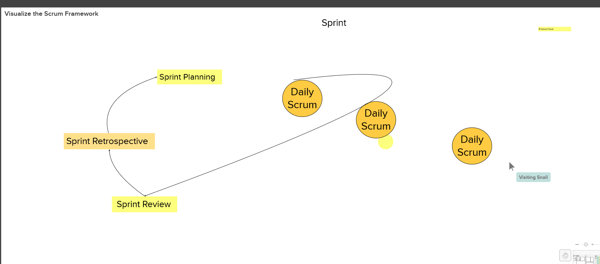
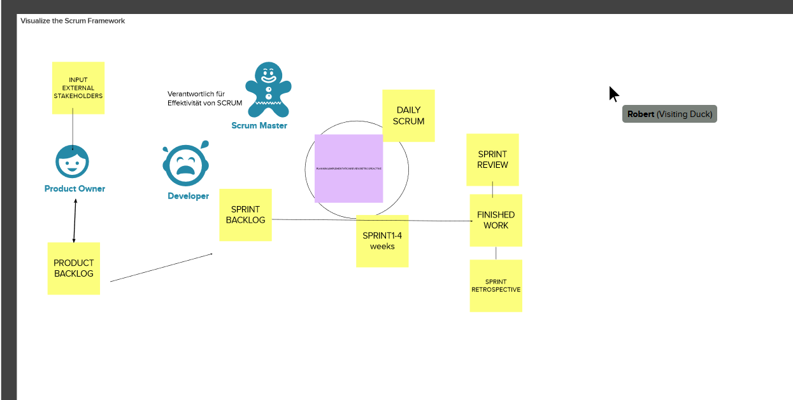

* scrum framework als Produktentwicklung
* PO hat entweder Eigenidee für Produkt oder jemand anders hat die Idee (Vision)
* solange das Produkt lebt, lebt auch das Backlog (und entwickelt sich weiter)
* zu Beginn kein Anspruch auf Vollständigkeit
* Product backlog bietet als Möglichkeit einen Fokus
* Hauptverantwortlichkeit PO in Sprint Planning? Product backlog zu kommunizieren?
* Muss man das "Warum" kommunizieren? "Start with why"? (Simon Sinning?); sorgt für Verständnis und höheren Beteiligungsgrad; (siehe Scrum guide); was benutzt man? Sprint goal?
* check auf: sprint ziel, sprint backlog und forecast
(* own remark: different views from PO and developer: pm asks why i should explain the why? and not just say: do this, this and this. ..)
* wer definiert das print goal? das team gemeinsam, für verständnis, so dass jeder es mitträgt
* durch Scrum innere Konflikte aufgelöst: weil es mehrere Personen gibt
* daily scrum: developer nehmen teil
* 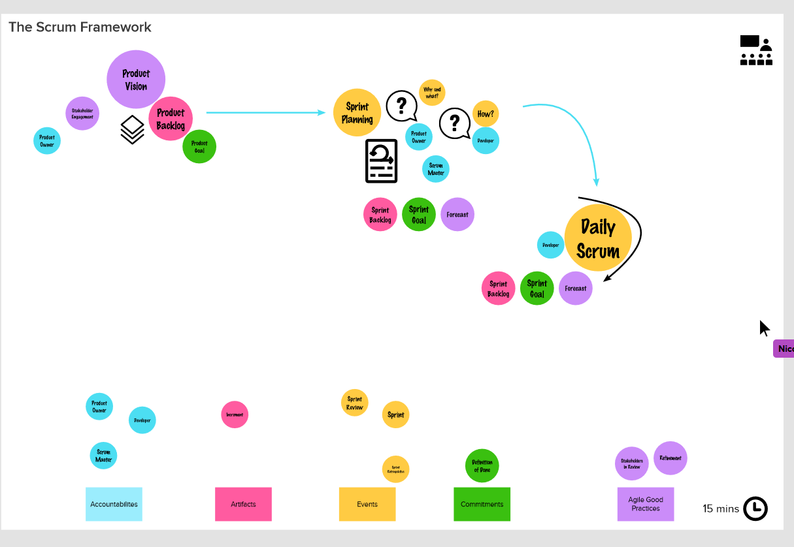
[break] 

Links zu virtuellen Whiteboards:
* <https://www.boardle.io/boards>
* <https://app.mural.co/template/a7827f2d-4584-4afe-9001-55e83efc13dd/8b74b81c-adde-4dc1-be91-cdfe31f5560b>

* Wer nimmt an Sprint Reviews teil? Stakeholder und gesamtes Sprintteam
* man darf jeden sprint release, muss aber nicht
* Anspruch haben etwas brauchbares zu entwickeln, mit Qualitätsanspruch, _Wert_ für Kunden erzeugen (Deployment-Pipeline kann ihren Wert beweisen durch Zeigen einer Loginseite für das Produkt)
* Was wenn ein Item nicht die DoD erreicht? DoD ist Eintrittskarte für das Increment ins Review zu kommen
* Increment ist immer _integrativ_; wenn man nicht den Qualitätsanspruch erreicht hat, dann kommt es nicht in Review
* falls man etwa nicht "fertig" hat, dann es nicht in review packt, dann ist das Review intransparent. Weiterführung im nächsten Sprint verringert dort die Kapa, man lügt sich in die eigene Tasche, nächster Sprint langsamer, und man baut an dem qualitativ nicht sauberen Teil weiter.
* deshalb unfertige Sachen nicht in Review packen; ehrliche Inspektion des aktuellen Standes
* aus review wird das product backlog aufgearbeitet
* falls man lange reviews verschiebt, dann gibt es überraschungen (nach drie monatne)
* man macht scrum um produktentwicklung in einer komplexen welt zu betreiben
* mechanismus um das risiko zu kontrollieren
* sprintlänge: 2 wochen usus; aber eigentlich frage "wieviel risiko ist man bereit in kauf zu nehmen"?; je weniger risiko, desto weniger die sprintlänge - das ist etwas gutes, wenn man dies möglichst schnell feststellt
* kürzere zyklen zu haben, shorter time to product
* aufs extreme getrieben: lieber in einer Woche als in einem Monat (den stand herausfinden)
* Trennung von Produkt und Prozess
* retro: früher mindestens eine Prozessverbesserung pro Sprint, derzeit "kann"
* refinement: backlog immer gut gepflegt (was bedeutet 'gut'? transparent und sortiert); wann betreibt man eigentlich refinement? immer wenn man muss
* "Plans Are Worthless, But Planning Is Everything"
* falls man prozessorientiert unterwegs ist, muss man auf dieser agilen Reise etwas loslassen
* Scrum Schulungen als transformational, nicht esoterisch; neue Denkprozesse annehmen
[break until 1300]

## agile Produktmanagement
*  nun etwas höhere Blickrichtung: Weitsichtung; agile Produktmanagement; ganzheitliche Verantwortung für eine Produkt in seinem größten Reifegrad
* Produktentwicklung in einer passenden agilen Vorgehensweise: wie zB Scrum
* was haben alle drei Firmen gemeinsam? Blackberry, Kodak, Blockbuster (Videothek?)
* Unterscheidung Netflix und Blockbuster? permamnente Evolution, Business agility, mindset impulse!
* genauso diese Mindset wird auch von den Leadershipteams gebraucht
* wie definiert man ein Projekt und wie ein Produkt?
Project Management/Product Management

* Unteschied Projekt und Produkt in einem Sinn? Projekt Zeitschiene und Produkt Kundenzufriedenheit
* klassisches Dreieck aus Time, scope, Budget
* falls man budget, zeit, scope festgelegt hat, steigt der druck. agile wäre dann den scope anzupassen, er muss "atmen"
* man hängt nicht an dem ursprungs-scope; welche adaption ist sinnvoll?
* jedes Produkt hat einen Consumer; und einen supplier/manufacturer

### Outlinenummer 13:
* Productmanager: pricing
*[](screen06.png)
* accountability bleibt bei product owner
* wenn es wirklich erlaubt wäre, den product owner zu "leben"? wer ist der wahre produkt owner in realität?
* wieviele andere leute muss man nach erlaubnis bitten für sie produkt etwas zu tun? zwei oder drei hierarchieebenen höher
* nur eine person von sechs seminarteilnehmern hat "happy bubble" und nur eine person als entscheidungsrechte
* "nicht storywriter, nicht befehlsausführer, sondern product owner!"

### the bigger picture (the product management onion)
(von außen nach innen)
* company vision
* business strategy
* product vision X
* product strategy X
* value x Solution delivery X
* delivery & validation
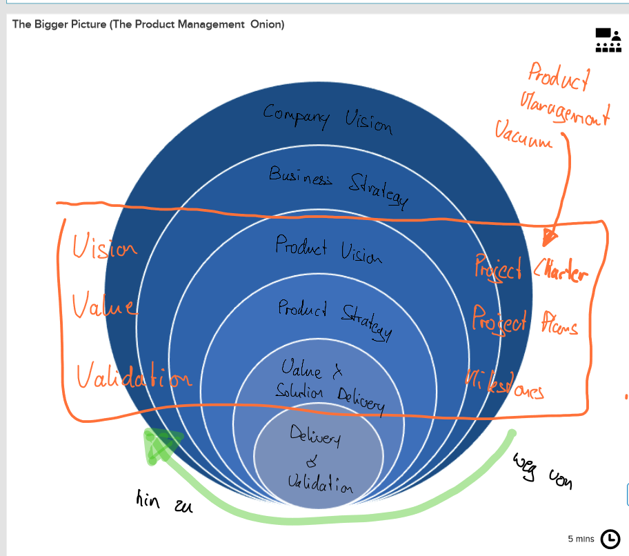
* die mit X markierten drei Bereiche sind ein gewisses Vakuum: Product Management Vacuum
* dieses muss man über den Ansatz von value stabil und solide füllen
* Vision, Value, Validation: das ist mein Modus Operandi als Product Owner
* extrem wichtig, diese drei Vs:  statt Project charter (*), Project Plans und Milestones
(*) Project in einer Form schriftlich festzuhalten; Komplettbeschreibung

[break]
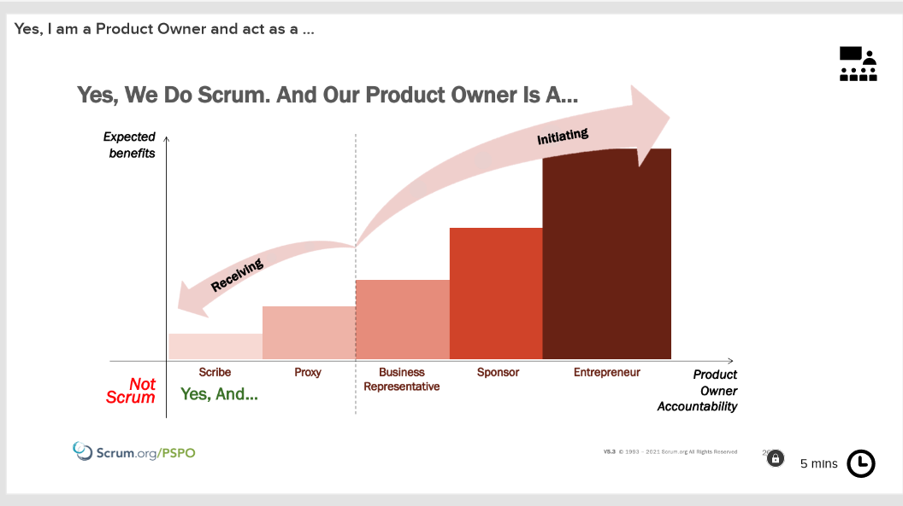
* product development is a strategic and tactical team sport
* vertical cutting, delivery&validation; nicht auf einzelne Ebenen fokussieren, sondern quer schneiden
* maxi und marcel wetrden die glücksfeen: zahl zwischen 1 und 5, A bis E: 1A gewählt
* "social media for prisons": das wird die aufgabe, die in den nächsten zwei tagen bearbeitet werden
* !check Business Model canvas
* !check Lean canvas
* !check value proposition canvas
* Empfehlung: lean canvas
* see: <http://businessmodelgeneration.com>
* unfair advantage: herausstelungpunkt, der kopieren verhindert

### breakout: social media for prisons
* für wen?
* welches problem
* wie werden wir geld verdienen
* Metriken: was werden wir messen auf dem weg?
* 15 min
[breakout]
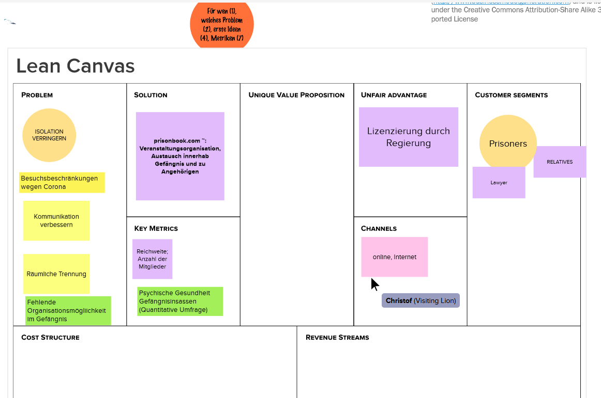

### Pitch für "Höhle des Löwen"; Sponsoren gewinnen; - Produktvision entwickeln
* Productbox: features, werbe claims,
Hilfestellung bei Erstellung der Product vision
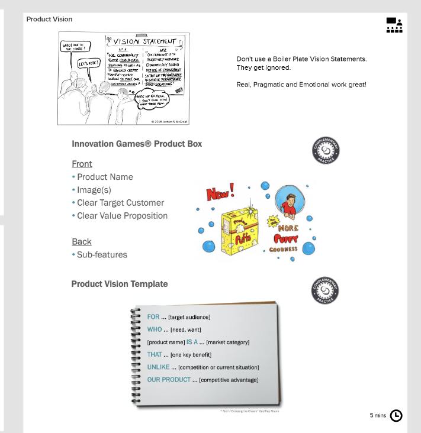
* zwei Worte zur Hilfe: Sachlichkeit und Emotion; Kopf und Herz ansprechen
* we used the vision template/a7827f2d-4584-4afe-9001-55e83efc13dd/8b74b81c-adde-4dc1-be91-cdfe31f5560b
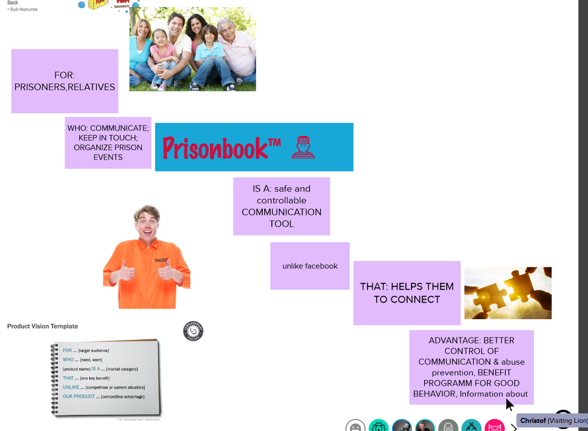
* Pitch als Klammer gestalten: so dass Bilder im Kopf entstehen
* nur wenn man als PO eine klare Vision hat, wird man diese auch den Entwicklern vermitteln können

### Product owner and technology
- Pro/Cons von Technologie-(Un)Kenntnis des Product Owners
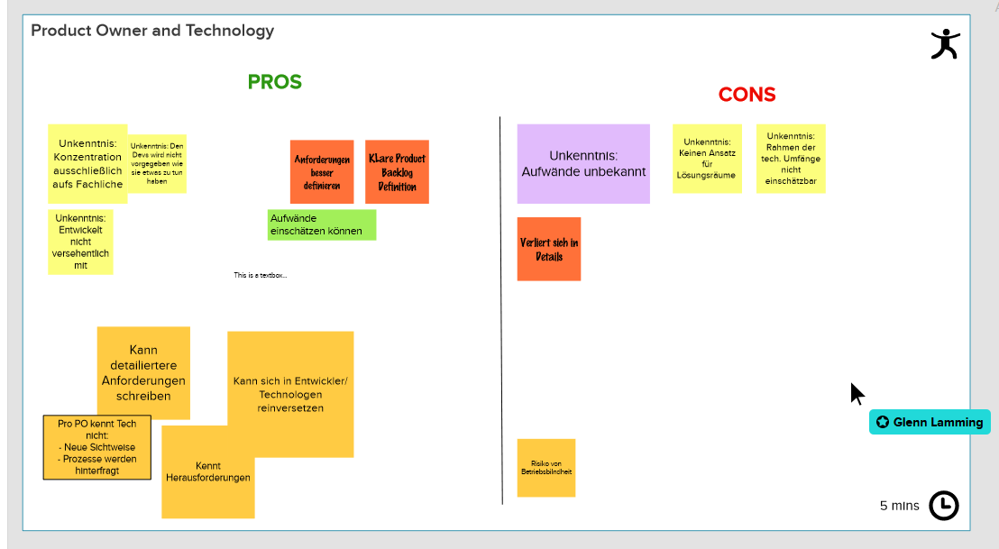
* weg von command&control, hin zu transparenz und vertrauen 

### Strategic alignment
* alle Modelle sind falsch, manche sind nützlich
* diese Model hat vier Quadranten
* technologische Ausrichtung, geschäftsstrategische Ausrichtung

* zebra and hippos: lieblingsprojekte von stakeholdern, die laut schreien
* see: <https://www.productboard.com/wp-content/uploads/2020/10/The-Essential-Guide-to-Prioritization.pdf> (with more animals)
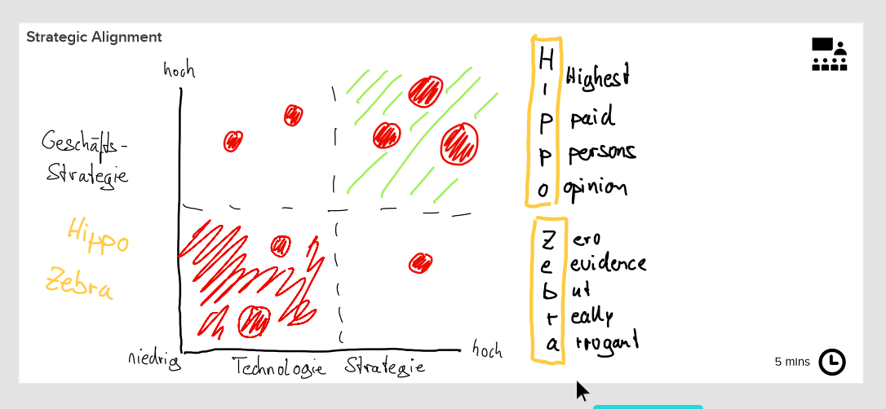

### take away
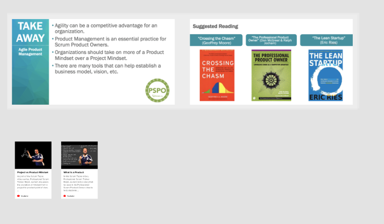

### what is value?
* simplicity, monetärer nutzen, uptime
* happiness, money terms, benefit
* favor Value creation over Revenue Extraction

### Was muss man alles machen um Wert zu schaffen?
* Wert definieren, Kundenfeedback einholen, produkt entwickeln, qualität sicherstellen
* ! A release is needed to deliver value!
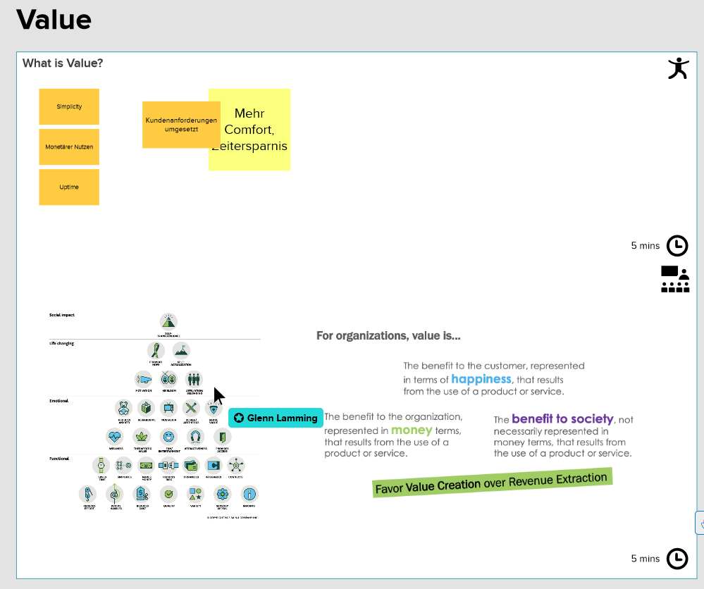

### What are you currently measuring.. Do you have metrics .. Are there any Incentives?
* EBM (Evidence based Management) - key value areas
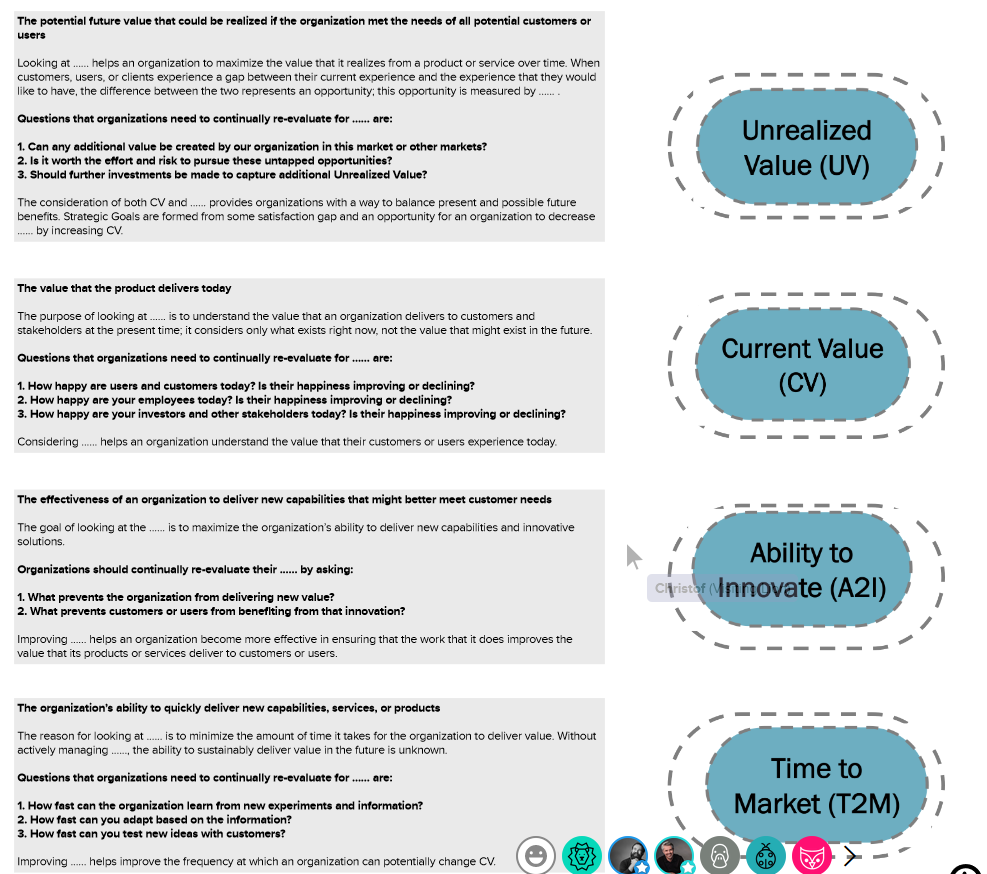

## Product Goal Canvas:
* vision/sense of belonging
* [check this again!]

[todo ]read for myself: <https://medium.com/the-value-maximizers/10-tips-for-product-owners-on-stakeholder-management-15376dae87e8>

--- end of day 1 ---

-----------------------------------------
## 20210326: PSPO day 2
-----------------------------------------
* walk the wall: Mural sichten
* zwei Assessments: Link in Mail hat einen Link
* Developer Open: assesment (Scrum Master & Produkt Owner)
* Tipps zur Assesmentvorbereitung am Ende des heutigen Tages

* Kachel 38 geht es weiter

### Agile Manifesto
* see: 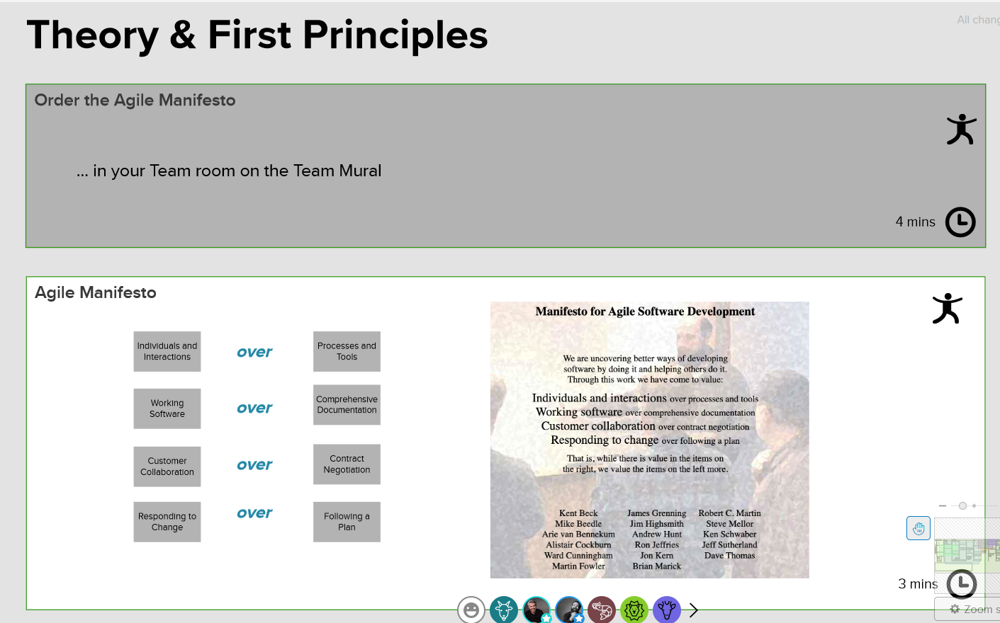
* die Schuhe, die ich anziehen kann zum Jogen, sind wichtiger als Dokumentation wie ich diese anziehen kann in der Box (ausrichtung des Fokus)
* Stacey/Cynefin chart/kennevian diagram: problem-lösung-diagramm
* Fläche zwischen chaotisch und einfach/kompliziert nennt man "" (Batman)
* komplexer Bereich: Lernen während man auf dem Weg ist
* see: 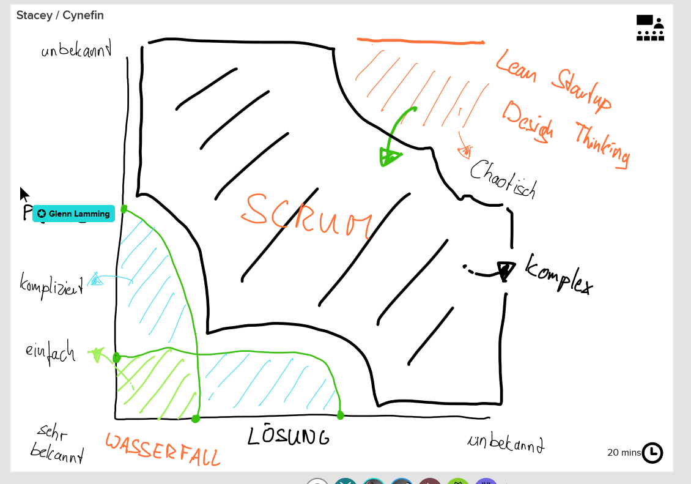
* man könnte auch SCRUM "unten" einsetzen, aber man wird nicht viele Überraschungen erleben
* Synonym für prädiktive Prozesse: Wasserfall
* "oben" könnte man Scrum nicht einsetzen: LeanStartup oder DesignThinking
* ScrumBan - als Mischung aus Kanban und Scrum; Menge der Arbeit im System reduzieren; Flow optimieren; System nicht komplett auslasten, sondern immer sauberen Durchfluß haben
* kom: plic - gefaltet, plex - gewebt (Gewebung bekommt man nicht mehr hin)
[break]
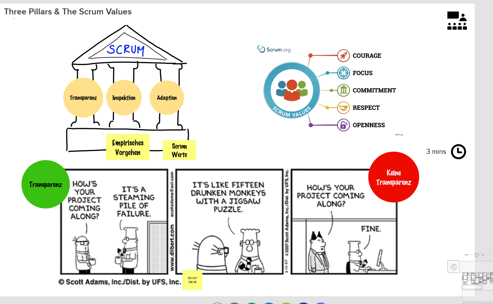
* mit steigender Hierarchieebene verschiebt sich das Verhältnis
* drei Säulen tragen das Dach Scrum
* wir lernen basierend auf de Erfahrungen, die wir sammeln
* empirisch vs. heuristisch

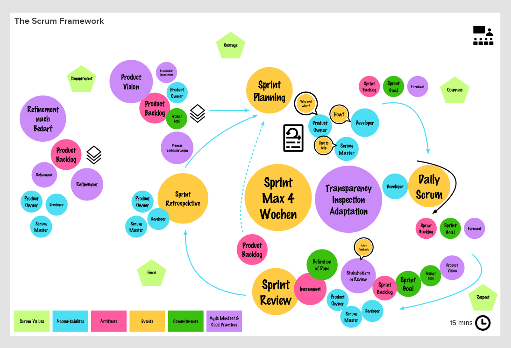
```
transparency, inspection, adaption
sprint: review: transparenz, inspektion?, adaption:
Scrum guide: inspection:

"Transparency

Significant aspects of the process must be visible to those responsible for the outcome. Transparency requires those aspects be defined by a common standard so observers share a common understanding of what is being seen.

For example:

    A common language referring to the process must be shared by all participants; and,
    Those performing the work and those inspecting the resulting increment must share a common definition of "Done".

Inspection

Scrum users must frequently inspect Scrum artifacts and progress toward a Sprint Goal to detect undesirable variances. Their inspection should not be so frequent that inspection gets in the way of the work. Inspections are most beneficial when diligently performed by skilled inspectors at the point of work.
Adaptation

If an inspector determines that one or more aspects of a process deviate outside acceptable limits, and that the resulting product will be unacceptable, the process or the material being processed must be adjusted. An adjustment must be made as soon as possible to minimize further deviation.

Scrum prescribes four formal events for inspection and adaptation, as described in the Scrum Events section of this document:

    Sprint Planning
    Daily Scrum
    Sprint Review
    Sprint Retrospective
"
```

-----------
Kachel 31

* lead time (von idee zu prdukt am markt), cycle time (innerhalb der lead time wievieil zeit ist man eigentlich produktiv auf unser tun fokussiert und wieivel in Halde?)
* [todo] Evidence based Management Guide! (sehr effektiv dies in Ruhe zu lesen)
* also read about technical debt and defect trends
* multitasking versus 100% commitment (video)
* bug: weniger ability to innovate weil amn etwas fixen muss

[break]
* Legacy-Application / Application

* Fallstudien: "LegacyLarry" und "missing PO"
* Miniteaching: warum ist es uns an dieser Stelle so wichtig? PO, PM und SM in einer Person? In Scrumteam hat man diese drei Accountabilities; falls eine Rolle nicht besetzt ist, fehlt eine bestimmter Kernaspekt
* man braucht alle Bestandteile um dieses Framework zu leben
* EBM soll man anwenden, heruasfinden was wirklich vom User benutzt wird (Usage)
* das, was man dort entdeckt, dient als Leitfaden
* Zahlen, Daten, Fakten ..
* TIA
* mehr Unternehmen sterben an Verstopfung als an Hunger
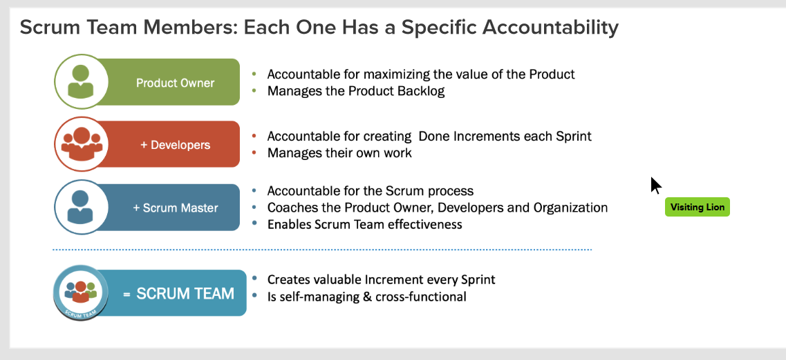

### case study: Judy and Dave
* task: demonstrate accountabilites in scrum: we as breakout-session had just question marks
* judy findet es mit scum super, hat aber keine zeit: was ist das produkt? das community-portal
* david wird als PO ernannt; team stellt product goal auf und backlog; sprint planning; 

### case study: david saves the day
* david ändert eigenmächtig das product backlog für die sprint planning
* hint: directoren sind die stakeholder
* sprint planning abbrechen; product backlog erneut erneuern;
* "The five Scrum values are commitment, focus, openness, respect, and courage. According to the Scrum guide, “Successful use of Scrum depends on people becoming more proficient in living these five values.”"
* David als PO sollte transparent arbeiten; falls man merkt, dass sich das Product Backlog drastisch geändert hat, sollte man Sprint planning abbrechen, 
* hat David das Recht das zu machen: ja; aber besseres Stakeholdermangement
* systemisches Problem: diese Belohnungssystem; deshalb hört die Arbeit des Scrum Masters nicth an den Teamgrenzen auf (Teaching for the Stakeholders)
[break]

## A sprint is a feedback loop
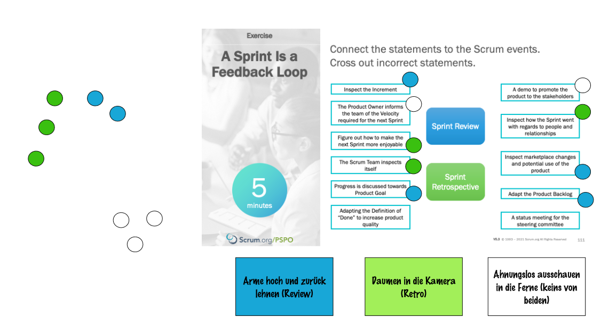
* progress is discussed towards the product goal
* "du suchst nur eine Antwort, die Antwort ist komplexer"
* Sprintabbruch hat recht geringe Häufigkeit; sprint ziele weiterhin relevant, bis zum start eines neues sprints arbeitet man weiterhin am product goal
* product goal ist zukünftigerzustand es produktes, welches einen gewissen nutzen bringt
* 
