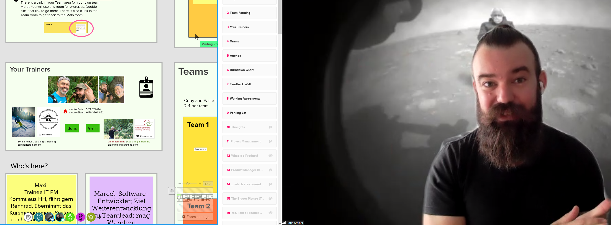

# pspo 202103

## 20210319: tech check
* presented by Glenn Lamming
* fünf Leute werden es sein; Boris derzeit anderweitig beschäftigt
* miro board für den lauf der schulung <https://app.mural.co/t/glennlammingcoachingtraining9759/m/glennlammingcoachingtraining9759/1615825149184/173e5fc577da8bb916861af700b5f49d958ed0d7>
* TODO: prepare some official login
* wird Schulung mit breakouts
* rechte Seite Hilfsnavigation
* team mural?
* viele Informationen in Registrationsmail
* Boris Steiner and Glenn Lamming are both PSPO trainers
* test der erneuten Breakout-rooms: zwei teams für zehn minuten
* the participants are Bogenschützen und Radfahrer xD
* kurze 10 min-Breakoutsession; lief gut

## topics
* todo: was bedeutet product ownership? was kann es bedeuten?
* ganzheitliche produktverantwortung, aber in agiler vorgehensweise entwickeln?
* herzstück: value (nutzen); das muss im Fokus stehen
* ! product backlog management
* working agreements
* ELMO: moderationsbegriff?
* "nicht alle fragen beantworten, aber man wird mit besseren fragen weggehen"
* wird sehr interaktiv mit dem Board
* 9 to 5; mittagspause 13 uhr; alle 50 min Pause über 10 min
* smily bis cryly?
* Sachen auf dem Board kann man sich bis dahin gern anschauen!

Frage: prüfungsthematik; wann und wie einschreiben?
* online; 80 fragen, 60 min; vorbereitung: open assessments of scrum.org;
* scrum product owner plus scrum master open assessment anzugehen (siehe email bzw chat):
<https://www.scrum.org/open-assessments>
* während/nach Schulung: mail von scrum.org mit password und link für Prüfung: ersten Versuch bitte bevor 14 Tagen herum sind; bei Nichtbestehen zweiter Versuch kostenfrei
* halbe Stunde vorher schon online in Zoom:

-- bis 0900 Donnerstag --

-----------------------------------------
## 20210325: PSPO day 1
-----------------------------------------
* Glenn Lamming and Boris Steiner

* Kennenlernen it Christoph in einem Breakoutroom
* Projektmanagement, Organisationsentwicklung, im letzten Projekt agil gearbeitet, 

* Glenn: Produktmanagement-Historie
* Boris: Informatiker; Entwicklung, schrittweise in die Scrum-Master-Rolle
* Training sind 30%, ansonsten weiterhin aktiv als Trainer für Agilität
* Teamforming
* first preparation
1. Identität: name photos purpose of scrum?
2. wie zusammenarbeiten? working agreements?
3. Fragen die uns umtreiben? z. B. Budgetierung? Top 1 Frage?

* agile projektmanagement-methode um mehrwert zu schaffen (value)
* PO sammelt requirements von stakeholdern; projektleiter?
* working agreements: be on time; ask constructive questions; ; try not to fail the certificate-exam (assessment)
* Scrum Framework; Kapitel 4 (wichtig); gemeinsames Verständis mit Begrifflichkeiten [check this]
* heute bis Ende Value-Kapitel
* heute: big picture auf die Sicht als Productowner
* Feedback wall auch als Übung im Sinne der Transparenz: eat your own dogfood
* "whispering out loud": live von dem Gedankenprozess teilhaben
* active checkout erlaubt
[break]

