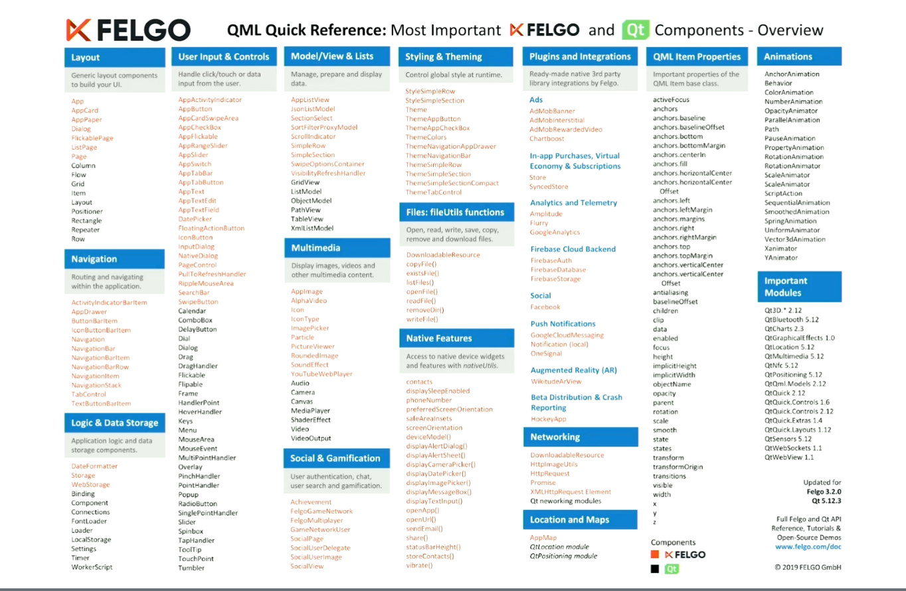

# Qt Embedded Days (13th and 14th of April 2021)

## Day 0 (20210413)

###  “Hands-On: The easiest way to set up a development environment and build a modern UI for Raspberry Pi” by Filippo Scognamio, FELGO 
[partially missed, because of parallel meeting]
* FELGO cloud builds? for deployment
* FELGO Live Client for the machines; deployment saves 10-20 hours per developer month

#### FELGO SDK
* provides functionality on top of Qt

* plugins for monetization, analytics, engagement, cloud
* example

* currently just Qt5; Qt6-transfer is in progress, but since Qt6 has some missing components, this is an ongoing task ..

### “Demystifying C++ for C embedded developers” by Giuseppe D’Angelo, KDAB

* quite easy-going approach: instead of fully diving into C++ immediately, just use it as "C with classes" first, maybe. Much advantage: inheritance, destructors, ..
* in C++ you don't pay for what you don't use
* also disable stuff you don't use, like RTTI (dynamic_cast), exceptions, ..: -fno-rtti; or -fno-exceptions
* shrink code-size

* maybe limit usage of templates: to fight code-bloat
* C99 can be ugly (name-clsah), C11 has generics, but super awkward!

### “Containerize your Qt embedded application” by Valter Minute, Toradex
[todo]

### “What to Do When It Is Already Too Late? – Crash Dumps in Embedded Projects.” by Christoph Sterz, KDAB
[todo]

### “Maps, Routing and Navigation with QML” by Justin Marina, General Magic
[todo]
