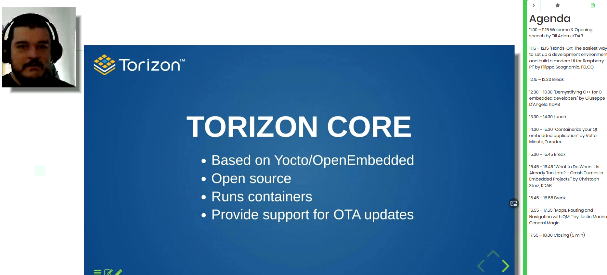

# Qt Embedded Days (13th and 14th of April 2021)

## Day 0 (20210413)

###  “Hands-On: The easiest way to set up a development environment and build a modern UI for Raspberry Pi” by Filippo Scognamio, FELGO 
[partially missed, because of parallel meeting]
* FELGO cloud builds? for deployment
* FELGO Live Client for the machines; deployment saves 10-20 hours per developer month

#### FELGO SDK
* provides functionality on top of Qt

* plugins for monetization, analytics, engagement, cloud
* example

* currently just Qt5; Qt6-transfer is in progress, but since Qt6 has some missing components, this is an ongoing task ..

### “Demystifying C++ for C embedded developers” by Giuseppe D’Angelo, KDAB

* quite easy-going approach: instead of fully diving into C++ immediately, just use it as "C with classes" first, maybe. Much advantage: inheritance, destructors, ..
* in C++ you don't pay for what you don't use
* also disable stuff you don't use, like RTTI (dynamic_cast), exceptions, ..: -fno-rtti; or -fno-exceptions
* shrink code-size

* maybe limit usage of templates: to fight code-bloat
* C99 can be ugly (name-clash), C11 has generics, but super awkward!

* auto-destruction on leaving a scope .. prevents resource-leaking

* "the ability to define destructors is one of the most important features of C++"
* several return-paths inside a function are allowed and possible without any resource-leakage
* manage failures also by exceptions (but this would more bytes to the code; around 100 byte for one function, i386 - opt-in or opt-out, if affordable)

* type-system: casting is given to make the human aware of what it does; the compiler would not need it .. C assumes stuff (and  let's things explode; C++ requests affirmation)
* helpers for comfort .. grouped digits, ranges

* conclusion

* C will prevail due to the interoperability .. there is for almost all languages an API to interace with C

### “Containerize your Qt embedded application” by Valter Minute, Toradex
* containers are not virtual machines
[not much time to listen..]

!![TODO] check this talk later, because it is also about the containerization of Qt5

### “What to Do When It Is Already Too Late? – Crash Dumps in Embedded Projects.” by Christoph Sterz, KDAB
!![TODO] check this talk later

### “Maps, Routing and Navigation with QML” by Justin Marina, General Magic
[todo]
