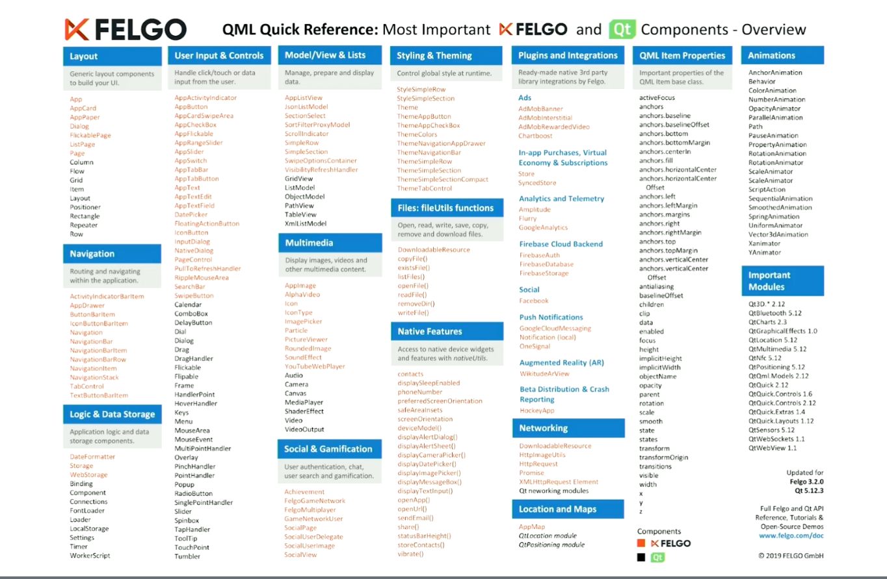

# Qt Embedded Days (13th and 14th of April 2021)

## Day 0 (20210413)

###  “Hands-On: The easiest way to set up a development environment and build a modern UI for Raspberry Pi” by Filippo Scognamio, FELGO 
[partially missed, because of parallel meeting]
* FELGO cloud builds? for deployment
* FELGO Live Cient for the machines; deployment saves 10-20 hours per developer meonth
### FELGO SDK
* provides functionality on top of Qt
* 
* plugins for monetization, analytics, engagement, cloud

### “Demystifying C++ for C embedded developers” by Giuseppe D’Angelo, KDAB
[todo]

### “Containerize your Qt embedded application” by Valter Minute, Toradex
[todo]

### “What to Do When It Is Already Too Late? – Crash Dumps in Embedded Projects.” by Christoph Sterz, KDAB
[todo]

### “Maps, Routing and Navigation with QML” by Justin Marina, General Magic
[todo]
