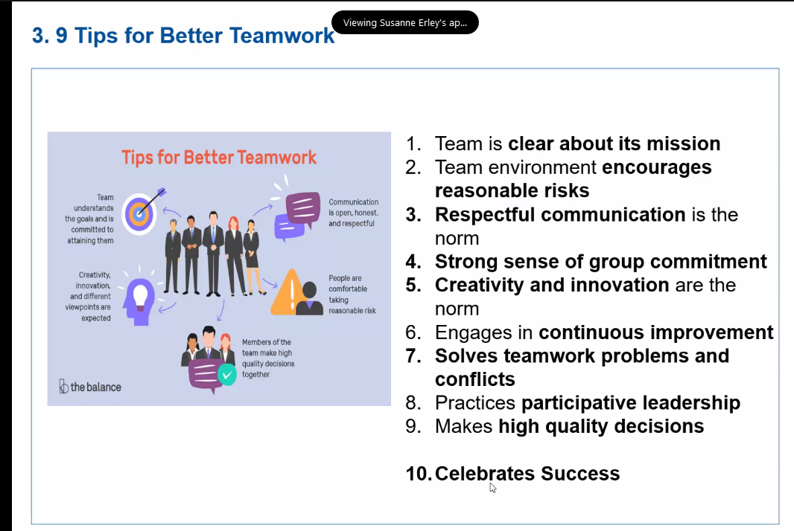

# 20210626 M440543 Programme in English: Project Management - Leadership and Team Development
* Susanne Erley is the host
* PMI Project Manager Germany, Crisis Coaching, Business Coach, Change Management
* <www.the-milestoner.de>
* Online Flipchart: with Mural
* <https://app.mural.co/t/mvhspmbasis8519/m/mvhspmbasis8519/1624687968130/168e9870c238c95297e0289da6fad42bec8541b5>
* Please treat each other and comments with appreciation.
* lunch 12:30-13:30; Coffebraks after each 1.5 h; same for Sunday

## task: PM  Bazaar
* groups of two
* name, experience with projects, leadership, expectations for the training
* then sell this person as the perfect PM for my next project
* [working in groups]
* *presentation and communication* as one of the most important skills
* well done in that team interviews; the presenter takes all four people

* recommendation VHS: basic training: follow this?
* motivation is another factor for being eager to get something done
* difference between leader and manager?

## Agenda

### agenda for Saturday
* motivation
* leadership
* team
* repetition PM basics

### agenda for Sunday
* success factors for projects
* conflict management
* change and opposition to change
* communication

* conflict model from "Glasow"? Austriann; nine stages of conflicts
* side notes: she will set up a google drive with the documentation

## motivation
* 'I am always doing that which I cannot do in order that I may learn how to do it.# Picasso; he was motivated to learn
[break] until 1040
* 1. Leadership - Motivating Vision: create a motivating vision
* it is important to understand the motivation of other people
     * easier to inspire them to support the project goal
     * when needed extrinsic motivation can be used
     * but rather work on the intrinsic motivation
* motivation factors change over time Generation XYZ are less  motivated by rules and clear vision; more by enjoyment and work-life-balance
* this means that the leadership approach needs to change

Motivation: official term
* direction, intensitiv and endurance  of the willingness to move towards or away from a targt
* there is ex- an intrinsic motivation
* oftne MOTIVES as basis for motivation; single, isolated reasons for human willingness to behave in a certain way
* NEED: more likely related to the lack of something
[insert Steva Jobs quote ..]
  # 1. Intrinsic motivation
* 
* curiosity, challenge, control, recognition, cooperation, competition, fantasy
* has to be satisfying and imaginable
* 
# 2. Extrinsic motivation
* gain a specific reward or steer clear of punishment
* reward: bonus, salary, promotion
* fear: don't want to lose your job
[task: group activities]

* TODO: what does motivate you?
* what was missing as motivation?
* how to add that little sparkle of motivation yourself to make the day a good day?
### Maslow's hierarchy of needs
* humang being is a group being: wants to be part of a group, sports team, friends, any other group* Maslow says that you have to finish one layer before you can ove up; later refined to "work on different layers at the same point of time"
* You cannot motivate anybody to do something he does not want to do.; but if you mange to revive intrinsic motivation - for example by fun and play - then you will be successful
* example: chalk number on the floor; factory; 5, then 6 ..

* Transcendence (like: improve the world)

* Maslow's pyramid adjusted for employee commitment
###  Herzberg's Motivation Hygiene

### McClelland ned theory
* need for achievement: give challenging tasks; give feedback
* ned for power: maintaining the leader-follower-relations
* neeed for affiliation: want to be accepted, have group feeling, other employees are highly motivated for them; often conform to the wishes of colleagues; tipp: they look for people; helpful for organising for team meetings 

[break] until 1145
## Leadership
* get extraordinary achievement from ordinary people; Brian Tracy
* "An army of sheep led by a lion beats an army of lions led by a sheep" Arabic proverb
* ability of group or individuals to influence and guide other members of an organisation
* bad leadership: shouting, asking for the impossible; good: having a clear vision where to go
## responsibility of a leader: provide a framework
* define a guideline for orientation
* Eisenhower: "leadership is the art of getting someone else to do something you want done because he wants to do it."
* convince others to follow those decisions

[task: mural page 5] Define examples for good and bad leadership

* bad: showing no interest in tasks, not people; don't share important information; egocentric; indecisive
* reliability
* *what defines a good leader: ability - willingness - opportunity*
* leadership style used reflects his idea of man and his own self-.image
* which leadership style is used: depends on several factors:
  ** the superiors
  ** the employee(s)
  ** the situation
  ** the type of work
* so we need a toolbox of leadership styles
* styles: controlling, coordinating, delegating, conducting, steering, motivating, directing, collaborating, participating,
* Kurt Levin: leadership styles

  maturity of the leadership
  
  
  
* take the ultimate responsibility

* the aphorism "what gets measured gets done"; is aligned with the MBO philosophy (KPI) [todo]
* Leadersheep (sic!)- Lead by example (if you can't do it, who else should?)
* work on yourselves
* Teamwork: start together to work as a team; individual conflicts shall step back;

* giving the benefit of the doubt
* solve conflicts when they arise
* [todo] marshal rosenberg: nonviolent communication
* feedback should not target the person; separate the personality from the task; mention positive and negative things
[task on mural]:
* 
* icebreaking session; let people flow, accept more
* track the idea of the current state

## Belbin's 9 Team roles:
* important to have all nine roles in the team

## 9 Tips for better teamwork

## basic parameters for successful team work
* you should come in when the team staffing is still happening
## non violent communication
* giraffe or wolf way?
## how to communicative with non-violent way? [task]

