# I am a leader - now what? Developing leadership skills in tech
* session from "Teamleadsky München" via meetup; online broadcast via Zoom
* you are promoted, but lack support for the transition successfully
* **Ronaldo Chicareli** presents: he made the transitions and also wrote a book
* TeamLead Gamesys Group
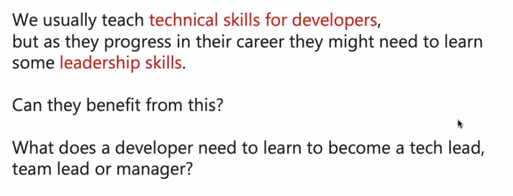
* usually technical skills are taught for developers, but leadership skills are missing
* situational leaders
* fluctuation in team, before some good technical results, so obviously stepping up ...
* situations: no time to think about all the bugs and features; no time to review everything, how to look for a mentor?
* he got then some 6 month-mentorship, where he visited different locations

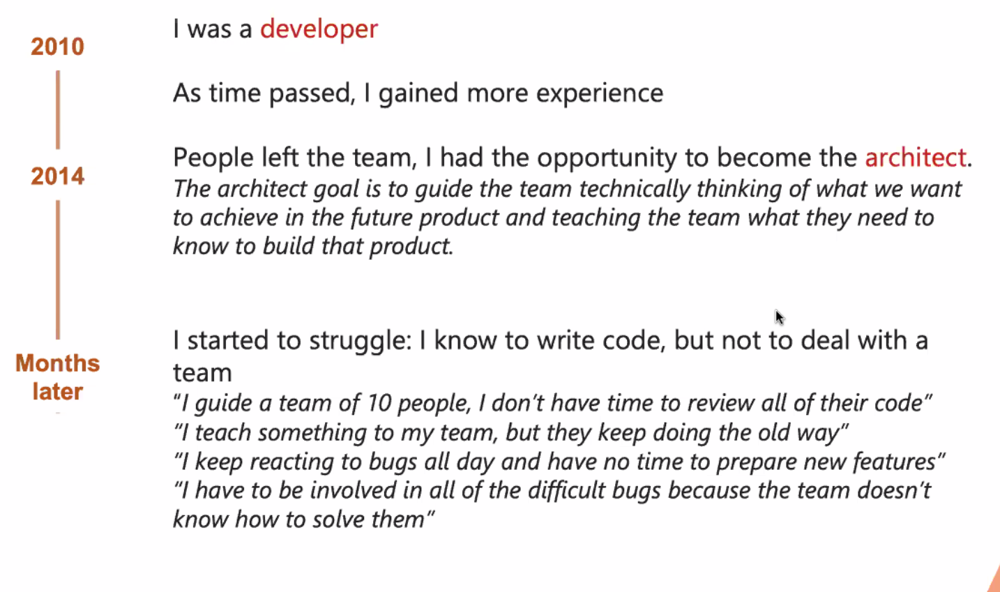
## 1. change happens in YOU
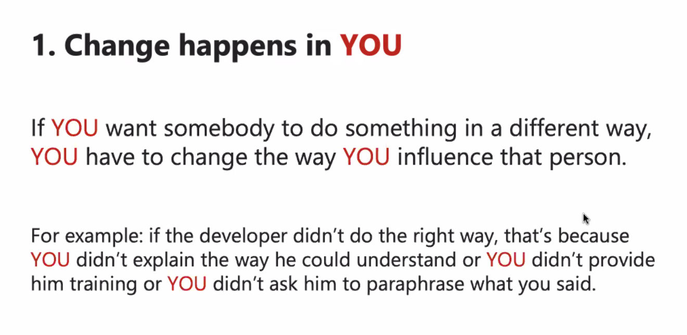

## 2. It's your fault if you don't have time
* delegate stuff and prioritise stuff
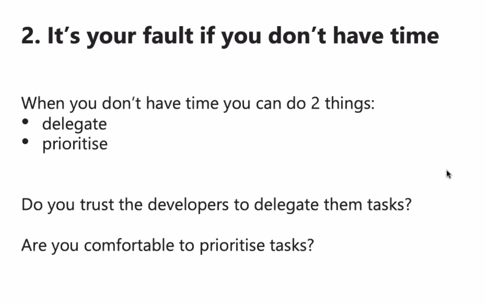
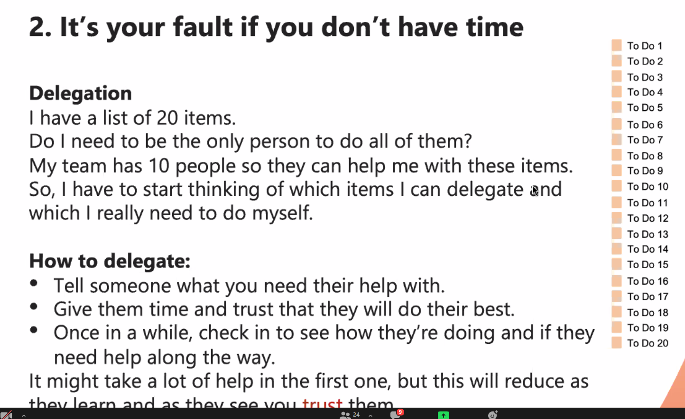
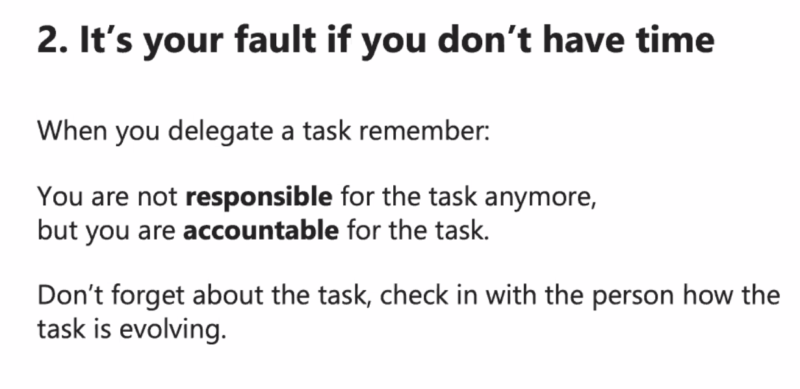
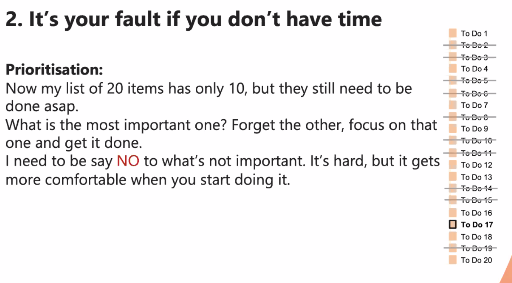

## 3. Be patient
* behavioural changes take time
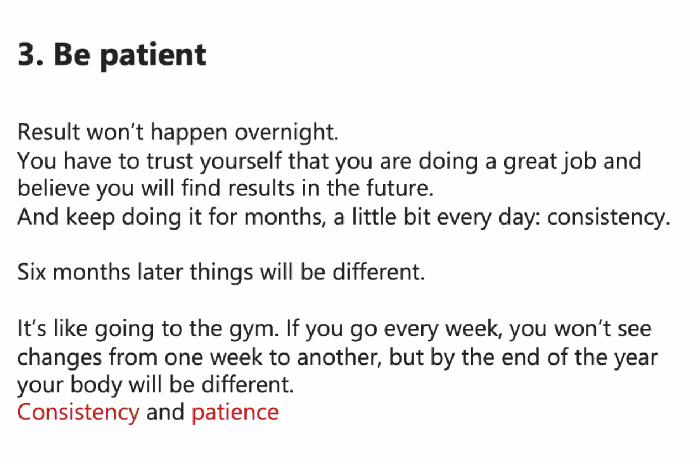

## 4. Listen. And then talk
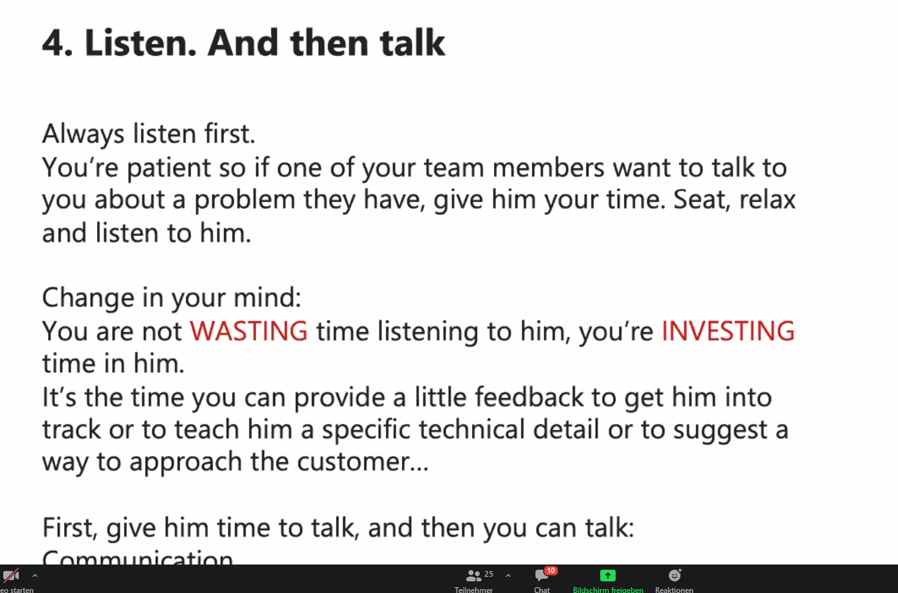
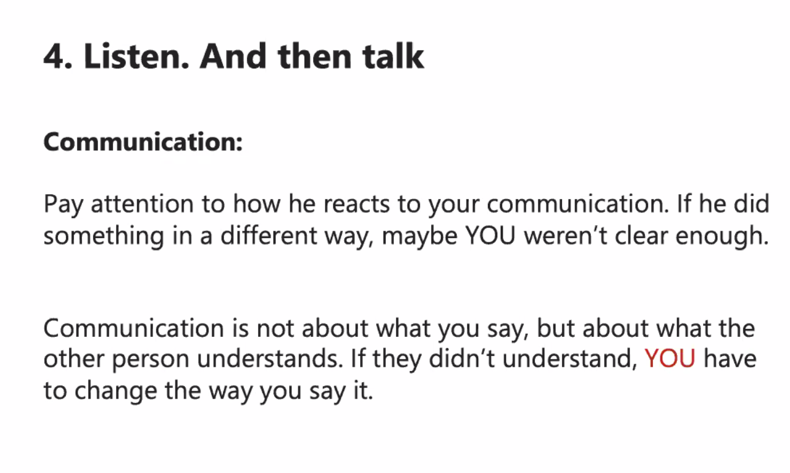

## 5. Team is the decision maker
* trying to create trust; and independence
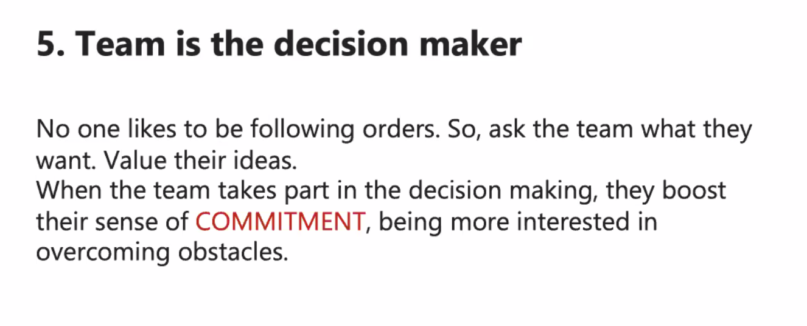
  
## 6. Feedback
* no avoidance, no "someone told me.."
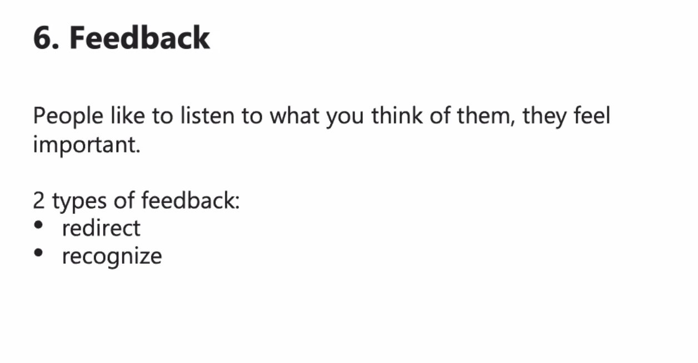
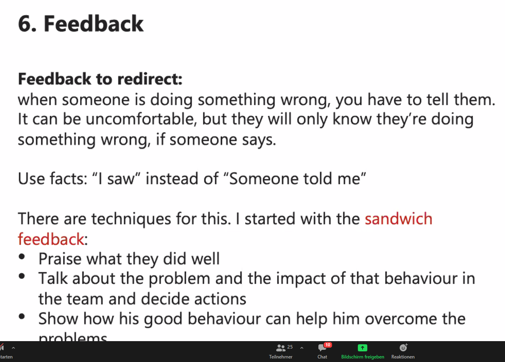
* redirect: tell them they do nice
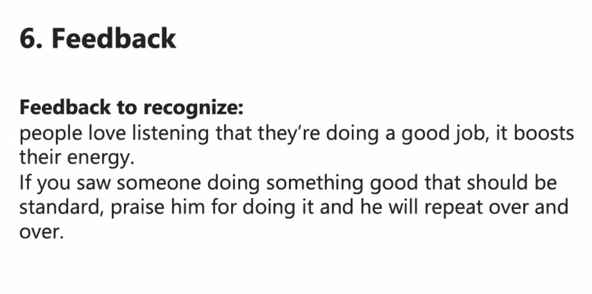
  
## 7. Celebrate
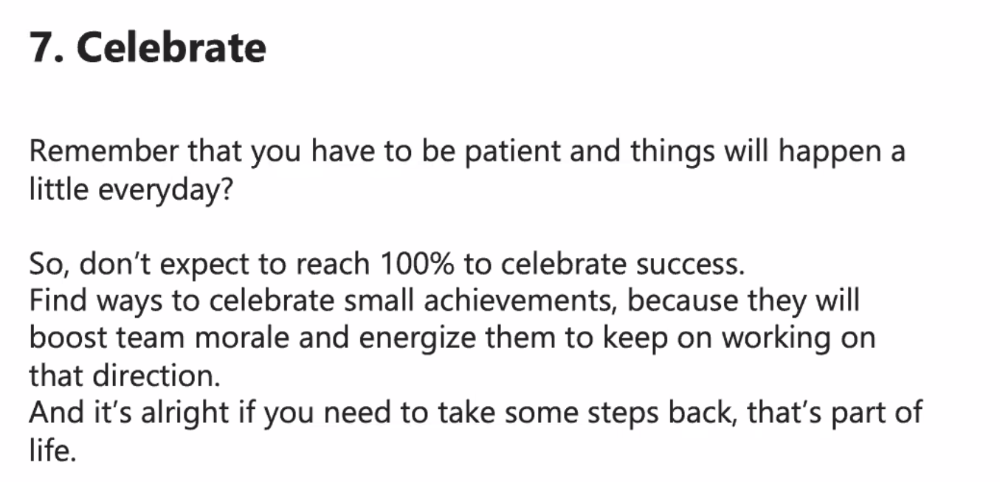

----------------------------------------
* applying those changes allowed him to breath a bit; and to share workload with the team
* moved to team lead because he liked people more than code
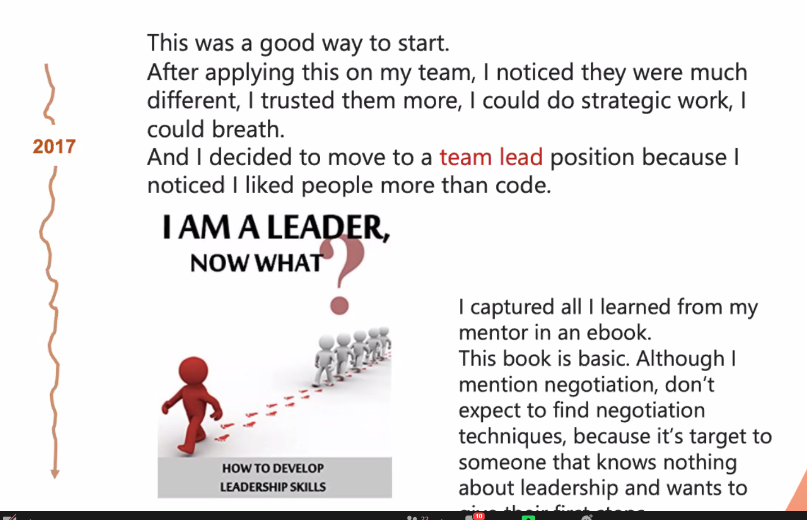
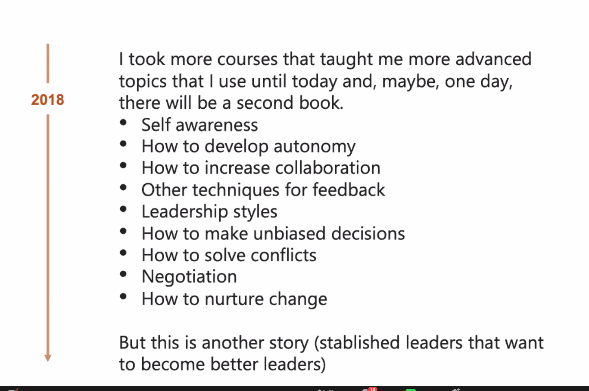
  
## Reminders:
* there is a bigger range than just 0 or 1!
* leader = servant
* to lead = to influence
----------------------------------------
[shorturl.at/pAN25](shorturl.at/pAN25)

* whow to ask for help