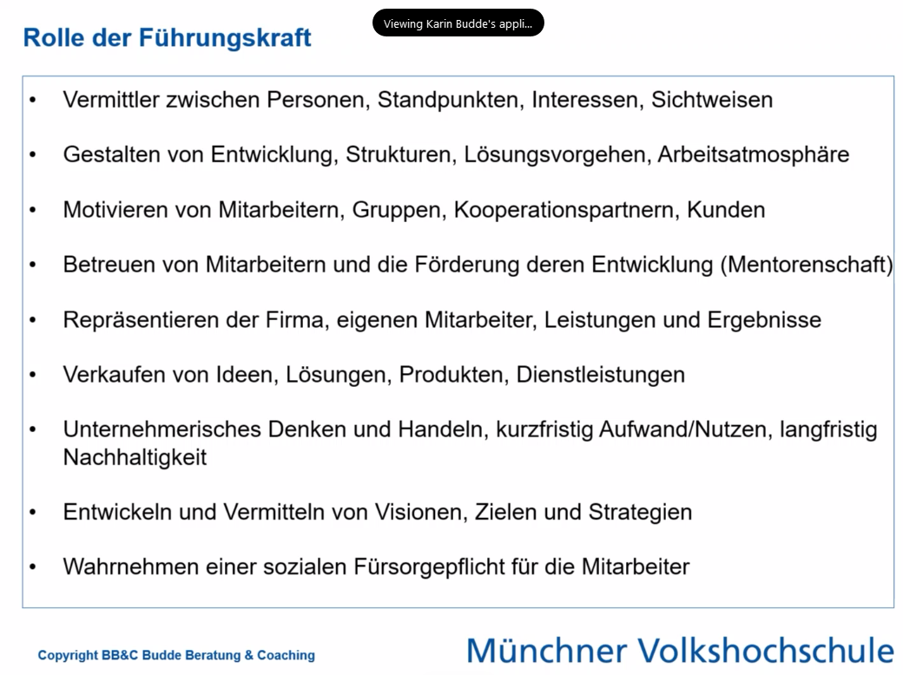
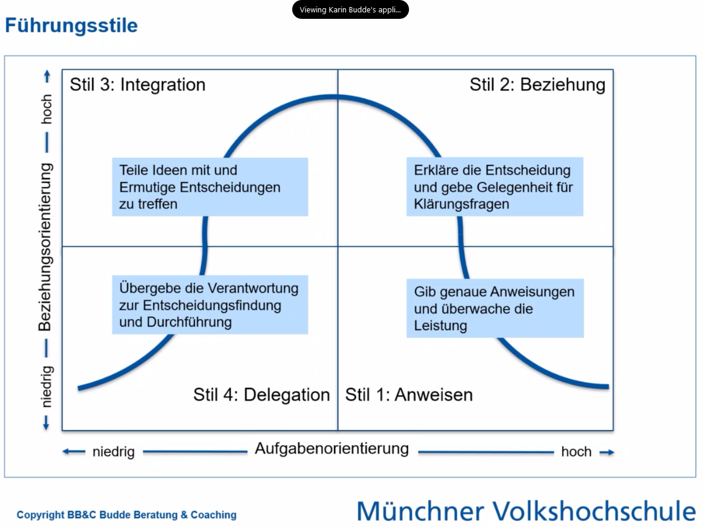
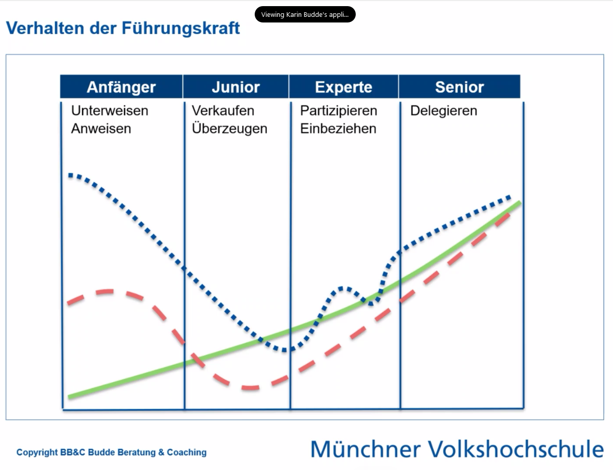
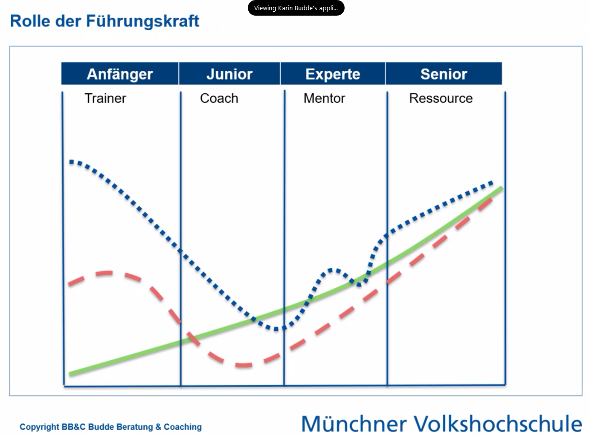
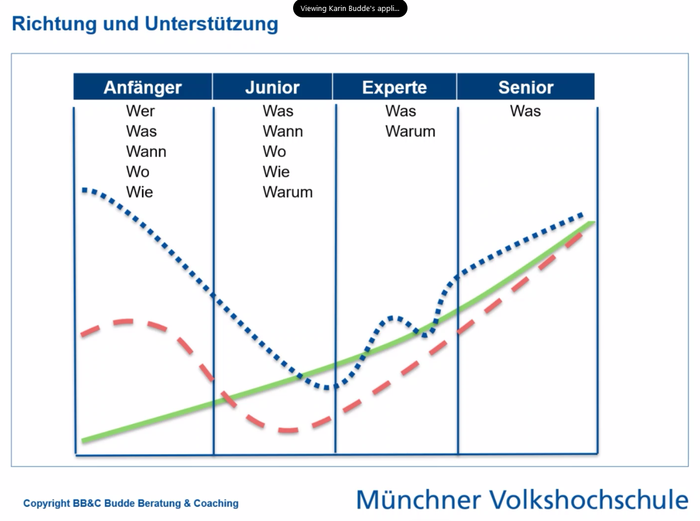
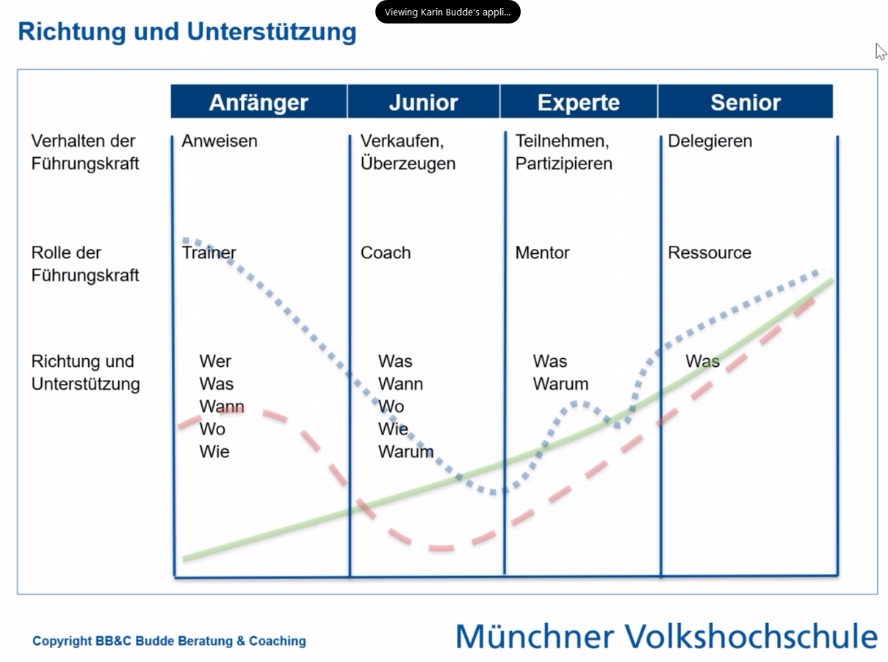
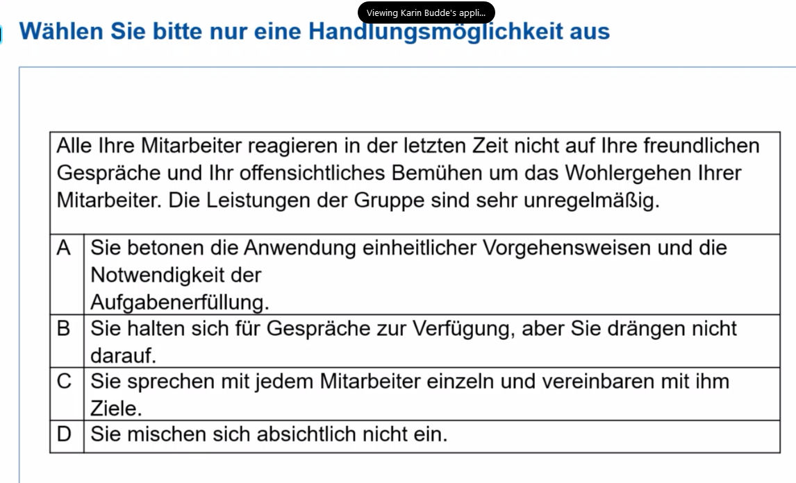

# Richtig führen (MVHS Kurzseminar) 20211021
(N451700: kurz&gut - richtig führen)

* Karin Budde als Host

[.. missing first 12 min ..]

## Führungsstil

* Dimensionen: Aufgabenorientierung und Beziehungsorientierung

## Coach oder Führungskraft?

* wie ist denn der Qualifizierungsgrad der Teammitglieder?
* Selbstwahrnehmung der Kompetenz 

## Rolle der Führungskraft

* Einsortierung anlegen; dies dem Mitarbeiter auch darlegen und Feedback einfordern
* bei Teamübernahme: erst Mitarbeitergespräche führen, danach mit vorheriger Führungskraft besprechen wer was kann (und ist); ansonsten steckt man Leute vorschnell in Schubladen und verpasst Chancen
* es gibt keine schlechten Mitarbeiter, sondern nur Mitarbeiter an falschen Positionen!

