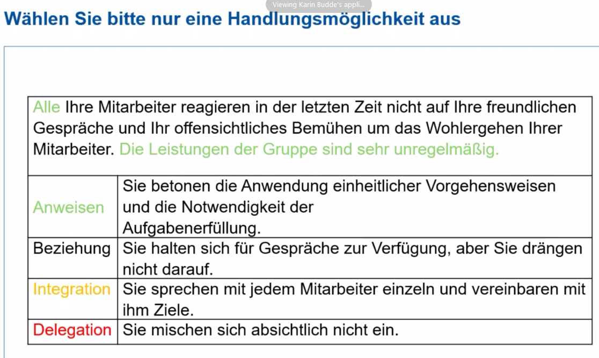

# Richtig führen (MVHS Kurzseminar) 20211021
(N451700: kurz&gut - richtig führen)

* Karin Budde als Host

[.. missing first 12 min ..]

## Führungsstil

* Dimensionen: Aufgabenorientierung und Beziehungsorientierung

## Coach oder Führungskraft?

* Wie ist der Qualifizierungsgrad der Teammitglieder?
* Selbstwahrnehmung der Kompetenz

## Rolle der Führungskraft

* Einsortierung anlegen; dies dem Mitarbeiter auch darlegen und Feedback einfordern
* Bei Teamübernahme: erst Mitarbeitergespräche führen, danach mit vorheriger Führungskraft besprechen, wer was kann (und ist); ansonsten steckt man Leute vorschnell in Schubladen und verpasst Chancen
* Es gibt keine schlechten Mitarbeiter, sondern nur Mitarbeiter an falschen Positionen!

### Frage 1
* 
* 

### Frage 2
* 
* 

### Frage 3
* 

### Frage 4
* 

## Richtig delegieren
* 
* 

## Weitere Seminare: wichtig zu sichten
* 

### Wie als Greenhorn ein Team übernehmen? Komplettes Neuland?
* Wie eigenen Fußabdruck hinterlassen?
* Schwierig, wenn man nicht im Thema ist
* Einzelgespräche: Wie macht ihr es gerade, warum macht ihr es gerade so?
* Prinzipiell ins Thema einarbeiten: aber nicht ins Detail gehen
* Weil, wenn man sich zu stark ins Detail einarbeitet, wird es problematisch, da man gleich eine Lösung anbietet
* "Je weniger man vom Thema weiß, desto besser ist man als Führungskraft"
* Antrittsrede; in diesem Meeting auch fragen, "was erwarten die Mitarbeiter?"
* Alles kann man auch nicht erfüllen, aber man hat wenigstens eine Basis, auf der man kooperieren kann
