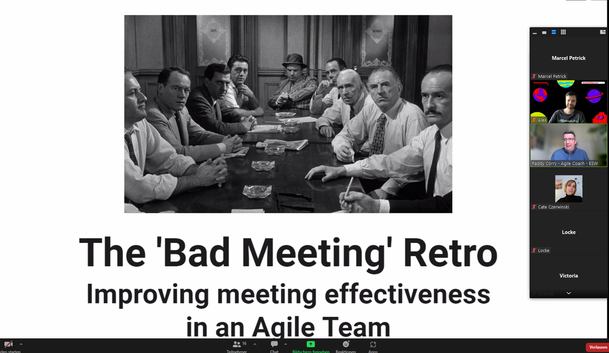
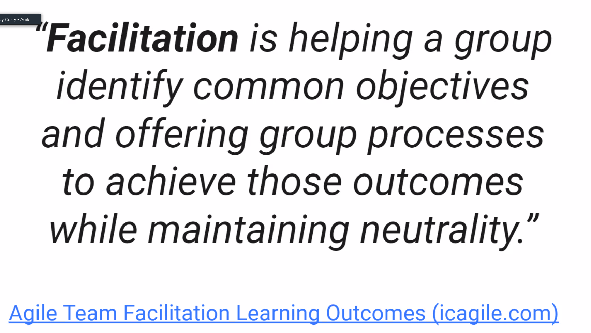

# A Bad Meetings Retrospective 💔
* improve meeting effectiveness in an Agile team
* Paddy Corry is an Agile coach; writes for "Serious Scrum"

```
ABOUT THE TALK Bad Meetings don't have to be a fact of life. With facilitation techniques, Agile teams can avoid some pitfalls that make meetings really bad. Retrospectives for example. While the meeting is good, Retrospective formats can get repetitive. In this talk, Paddy will share some techniques to help with facilitation of any event, and some Retrospective formats to give you some ideas. The Bad Meeting Game is one of those Retrospectives that can pull all these ideas together, and help inspire an Agile team on how to make meetings better! ABOUT THE SPEAKER Paddy Corry is an Agile Coach at ESW, in a Lean-Agile Centre of Excellence team, based in Dublin, Ireland. ESW is a fast-growing Irish global e-commerce business, and the LACE team is helping ESW to grow, adapt and learn as smoothly as possible. With nearly 20 years experience in software development, Paddy has previously worked as a Scrum Master and a developer. Paddy is on a journey to the Scrum Alliance Certified Team Coach certification, and the ICF's ACC certification. https://www.linkedin.com/in/paddycorry/ 
```



* talk about facilitation skills, how to develop them, share tips
* meeting as euphemism for "unproductive collaboration"
* we are all made of stories

* icagile team facilitation learning - strongly recommended

  * preparation
  * role of the facilitator
  * time-keeping
  * involvement
  * wrapping up
* cameras off is ok, using chat is fine - but how to encourage participation?


---------------


