# N451702: Führung auf Distanz – in und aus dem Homeoffice

## copy&pasted Seminarbeschreibung

```
Führung auf Distanz – in und aus dem Homeoffice

Als Führungskraft im Homeoffice müssen Sie Ihr Team aus der Ferne steuern und dennoch jedes Mitglied unterstützen, motivieren, informieren und entwickeln. Das Online-Seminar vermittelt wertvolle Praxistipps, wie trotz räumlicher Entfernung eine persönliche und wirtschaftlich erfolgreiche Führungs- und Zusammenarbeit möglich ist.
Sie erlernen Erfolgsfaktoren effektiver, virtueller Führung zu den Themen: Methoden und Tools im digitalen Raum, Aufbau von Vertrauen, Entwicklung offener Kommunikationswege und Meeting-Routinen und behalten dabei den Überblick über die Performance Ihrer Mitarbeitenden. Checklisten und kollegiale Beratung runden das Seminar ab.

N451702 – Online-Kurs                                                                Online

Karin Budde · Online · mi bis fr 18.00 bis 21.00 Uhr · 12.1. bis 14.1.2022
```

## Intro
* Frage wegen Vorverlegen: bitte nicht ..

* eigene Erwartungshaltung: Kontakt aufbauen; mehr Antworten, Feedback, Input bekommen - ohne gezwungen zu wirken
* Karin Budde recht viele Remoteteams bei MS betreut; Vorstellungsrunde: alles was schnell it, nichtvegetarier, kindergeschichtenschreiberin
  * Ansatz um zu polarisieren und Anknüpfungspunkte zu bringen
* !! aktive einfordern die Kamera anzuschalten?
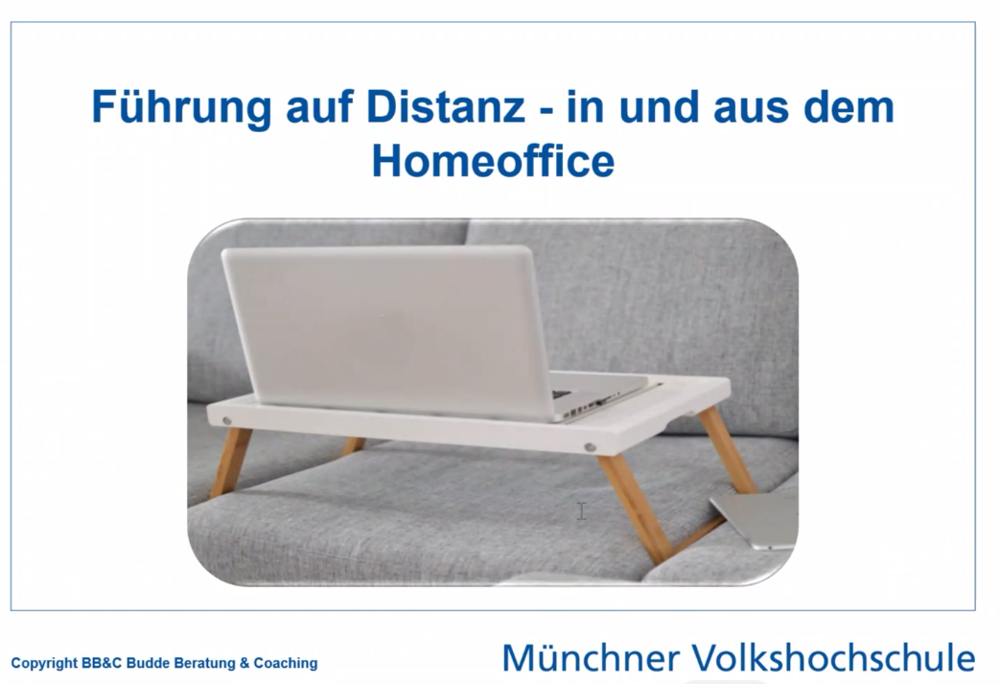

MP:
* teamlead, frisch zu unternehmen gewechselt (firmenkultur, projekt und leute unbekannt): verbindungsaufbau aktiv; kollegen & externe bilden gesamtes Spektrum ab, aber eher introvertiert; wie führen, wenn man sich nicht technisch-hervorgehoben fühlt? teammitglieder wären auch mit ticketbasierter arbeitsorganisation "zufrieden" daher gefühlt nur meinerseits 

* !! feedback: nicht in die Kamera zu gucken; falls man zu Leuten spricht, dann auch die richtige Kamera mitbringen

### andere Leute
* wie kann man die leute motivieren und vernetzen?
* onboarding-prozess; teamintegration (am besten die Leute fragen, die schon dabei sind zwecks Feedback)
* Teamgrößen bei den anderen: meist 4

* guter Tipp: "Unausgesprochene Erwartungen von heute werden die Vorwürfe von morgen"
* deshalb Feedback aktiv abholen: entweder als Einzelgespräche oder Teammeeting

### HomeOffice: Studie
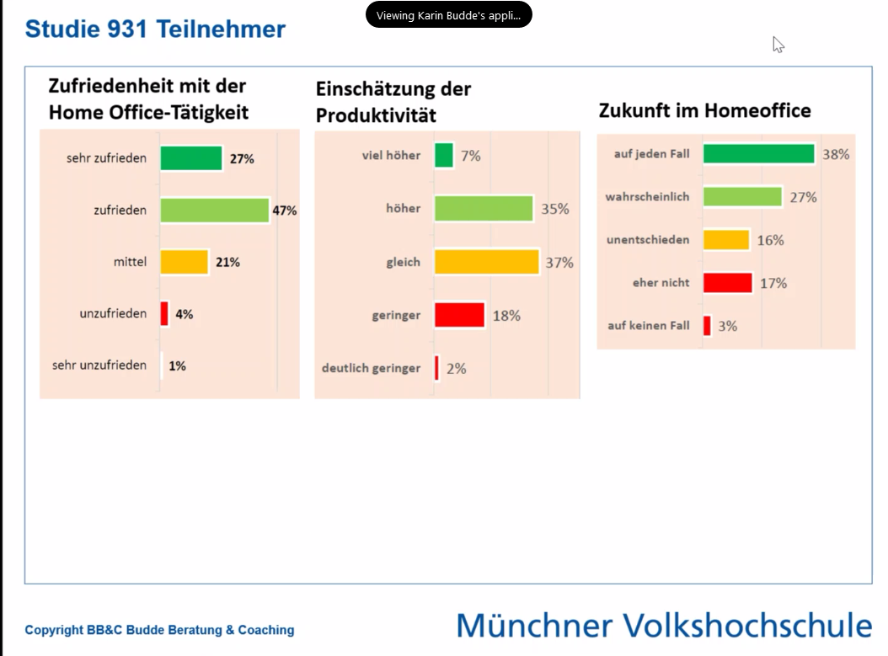
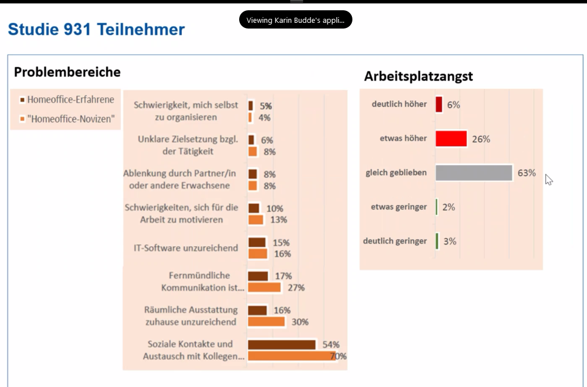

* der Plan sieht die direkte Verbindung zwischen Start und Ziel vor, Realität hat Fallstricke und Löcher
* Studie[n] zeigen, dass recht viele zufrieden mit Homeoffice sind und sehen auch darin eine Zukunft

* wenig Homeoffice -> wenn man Kontrolle haben will
* Zielvereinbarung als Formulierung und Hilfe, so dass es wurst ist, wo der Mitarbeiter sitzt (am See oder im Office)
* lieber Vorschusslorbeeren verteilen und falls notwendig eingreifen; Mikromanagement wird nicht liebgewonnen
* HO mangelt es an Kollegenaustausch und Ausstattung
* Arbeitsplatzangst ist etwas gestiegen, weil Mitarbeiter meist wenig Feedback bekommen; gerade Stars vernachlässigt man dann einfach
* falls es zu Problemen kommt, gehen die Fähigsten als erste

## Übung: Sind sie ein Home Office Typ? (Handout Seite 6)

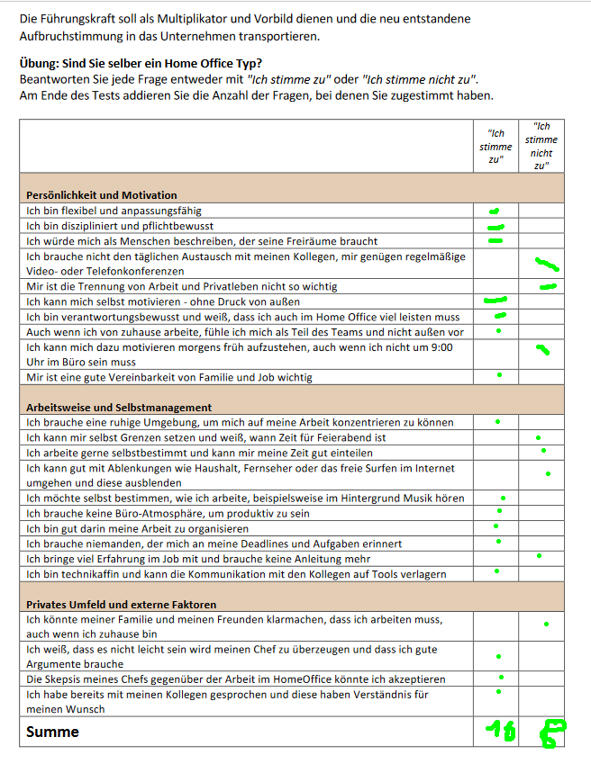
* für mich: Ich stimme zu: 16; nicht zu 8
* Empfehlung: auch mit den Mitarbeitern durchspielen

## Infrastruktur
* wie arbeiten die Leute zu hause? Arbeitsplatz; welche häusliche Situation (Kinder, Familie im Haus); wie kann man unterstützen
* Technik: gegebenenfalls mit IT und HR dafür sorgen, dass es Rechner, Monitor, Maus, Tastatur, Drucker, Smartphone gibt; wie können die Leute bei technischen Probleme den IT-Support erreichen?
* Zusammenarbeit fördern: Task-Management-Lösungen wie Slack, Asana, Trello, Meister Task, Monday ..
* Datensicherheit gewährleisten durch technische Hilfsmittel und Mitarbeiterschulungen

## Rolle der Führungkraft
* Orientierung geben, Rahmen setzen, Unterstützung leisten, Handlungsspielräume schaffen
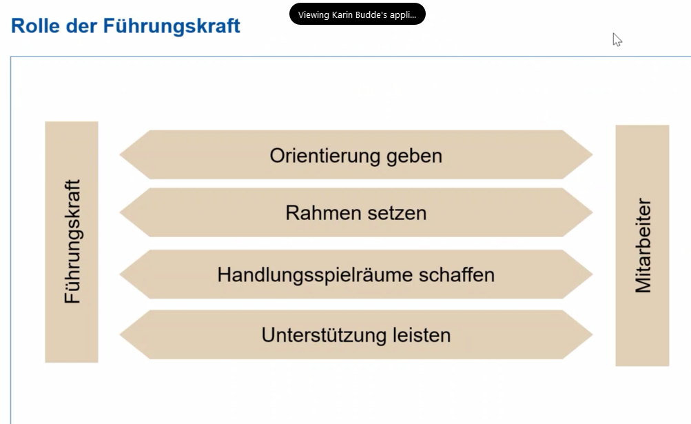

### Orientierung:
* Prioritäten setzen
* anspruchsvolle, erreichbare Ziele setzen: und auf was zahlt das Erreichen des Zieles für das Unternehmensziel ein?
* Ziele setzen, aber eher um Plan den Mitarbeite fragen: wie würde er/sie es erreichen wollen?
* !! Leistungserwartung transparent machen
* Kommunikationsstruktur und Spielregeln festlegen
* falls Einarbeitung, dann muss man das auch verkraften, dass die Einarbeitung nur ein kleineres Ergebnis hervorbringt
* Fördern und Fordern: Mitarbeiter zum Denken anregen; Chancengleichheit wahren
* Handlungsspielräume schaffen: Fehler akzeptieren; am Entscheidungsprozeß teilhaben lassen
* maximal 4-5 Ziele pro Jahr einem Mitarbeiter geben (Frage: braucht er gegebenenfalls ein Training dafür?)
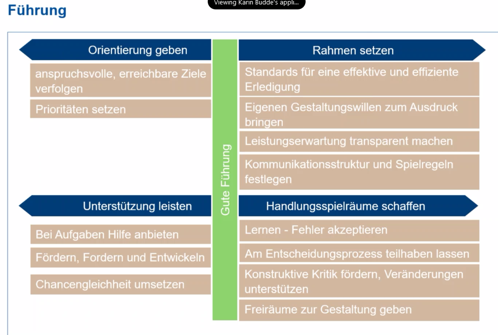

## Spannungsfeld der Führungskraft
* Vertrauensaufbau/Wertschätzung vs. Herausforderung

## 8 Säulen von Digital Leadership
* weniger Kontrolle
* mehr Vertrauen
* Verantwortung abgeben statt Delegieren
* Empowerment
..
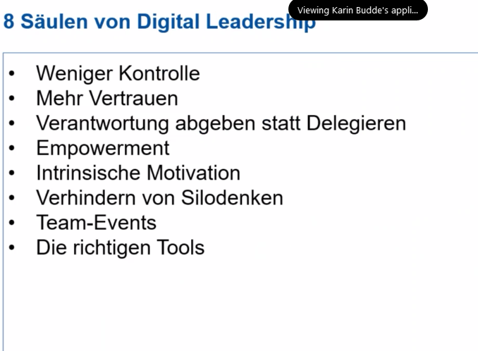

* (Kollegen auch sagen, dass sie in der Pause aufstehen, das Fenster aufmachen und frische Luft schnappen sollen.)

## Nähe im virtuellen Raum schaffen
* Welche Medien wollen wir für welchen Zweck nutzen?
* Welche Netiquette soll für uns gelten?

[Pause]

### Padlet: zwecks Netiquette-Abstimmung

### mein Teil:
#### Webex, Teams, Rocketchat, Jabber, Skype, Jitsi (und klassisch Telefon und Mail)
* jede Firma bringt ihr eigenes, bevorzugtes Tool mit
* keine direkten Spielregeln vereinbart (speziell Anwesenheitsmarker), aber höflicher, respektvoller Umgang
* bei einigen Meetings konkret vorgegebene Struktur; andere eher "frei"

### Was bedeutet das?
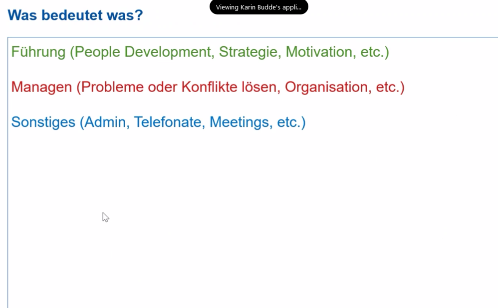
* Führung (People development, Strategie, Motivation): 10%
* Managen (Probleme lösen, Konflikte lösen, Organisation): 45%
* Sonstiges (Meetings, Telefonate): 45%
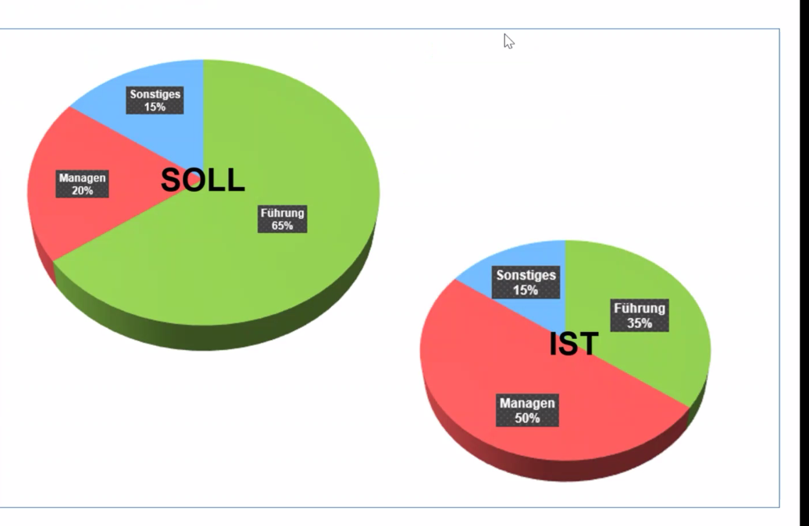
* Führung sollte eigentlich größter Teil der Zeit sein (siehe 35% IST zu 65% SOLL)

## Führungsstile
* vier unterschiedliche gibt es (Dimensionen "unterstützendes Verhalten, anleitendes Verhalten)

* anweisen notwendig, auch bei hoher Kompetenz: Beispiel Feuerwehreinsatz (Konsenslösung wer Wasser holt, etc.. ) das bringt nichts
Siehe: delegieren <-> partizipieren <-> überzeugen <-> anweisen
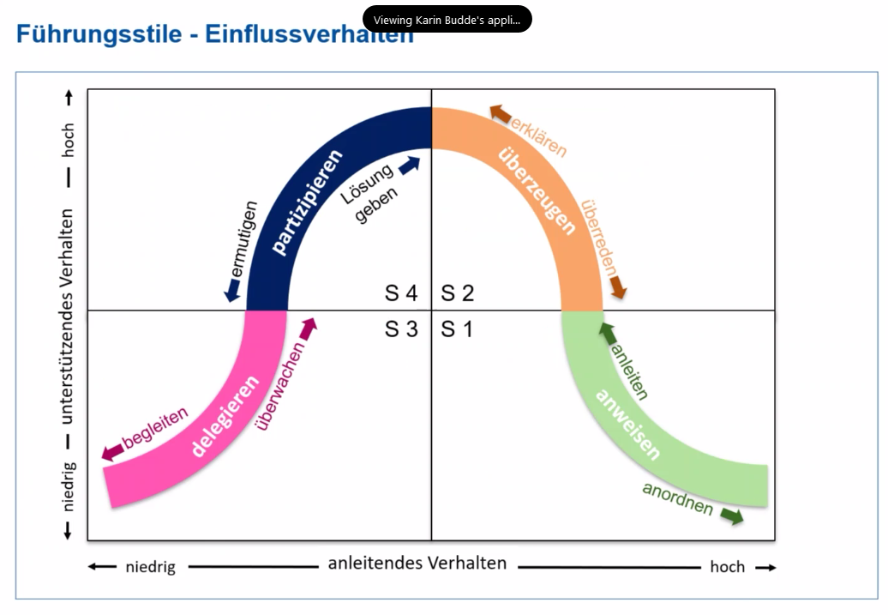

* Übung im Handbuch auf Seite 8: Welchen Führungsstil haben Sie?
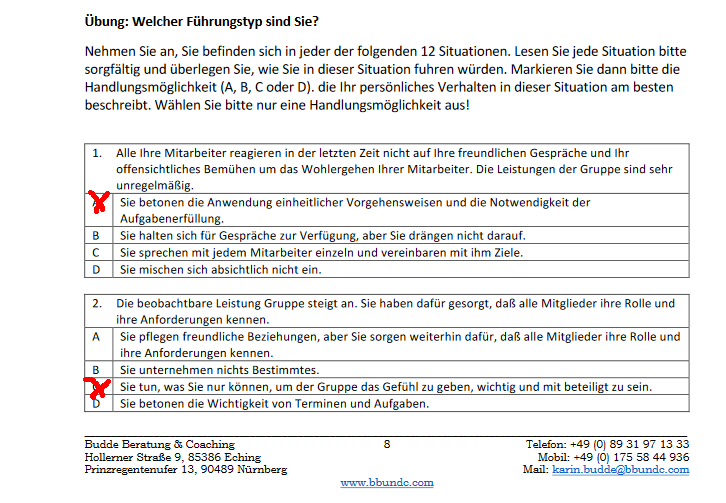
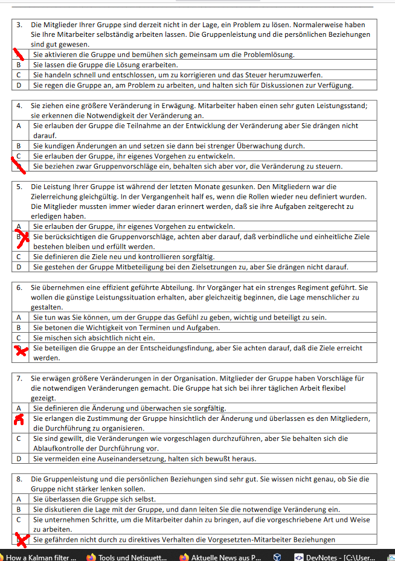
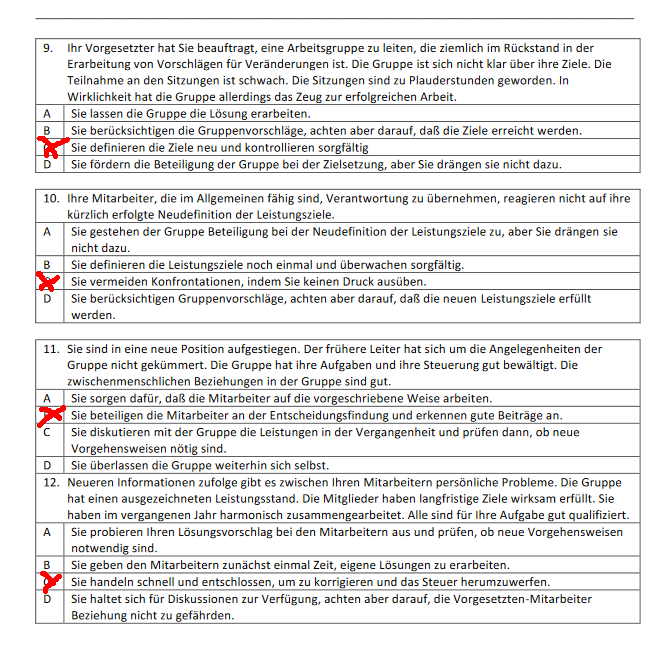

## Auswertung:
* bei mir: 3 anweisen, 3 partizipieren, 4 überzeugen, 2 delegation -> also gar nichts richtig hervorstechend
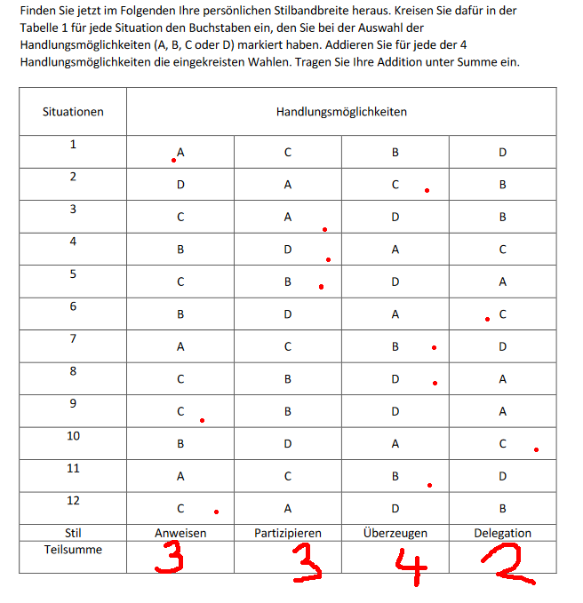
* bei mir: 8 von 21 Effizienzpunkten -> also hohes Verbesserungspotential
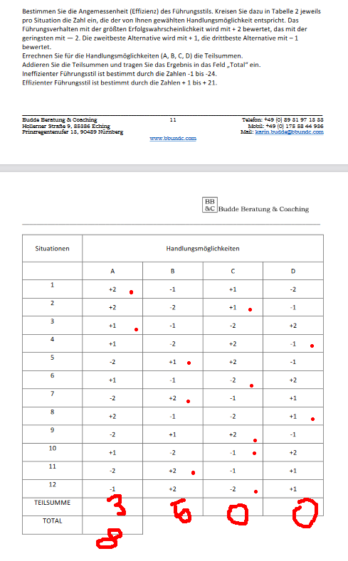

* !! best practice-Lösungen: diese noch einmal mit dem Blick auf die rot markierten Teile durchgehen
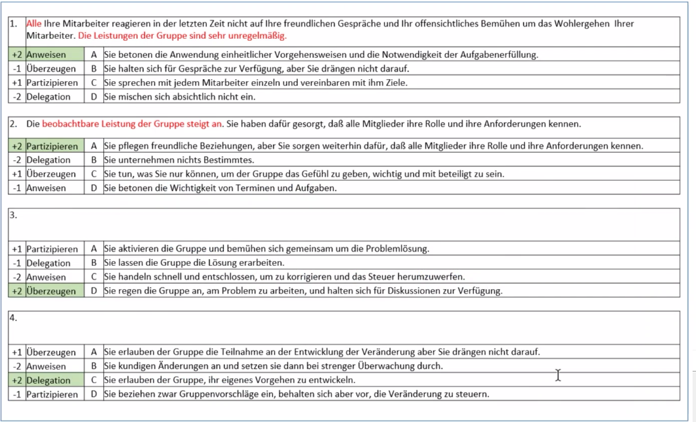
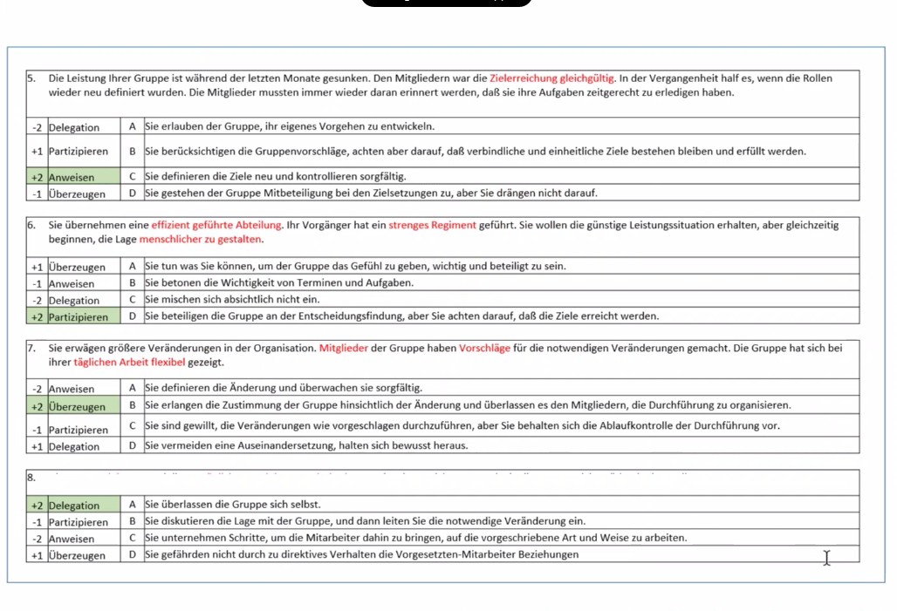

* "Ein guter Manager weiß nicht zu 100% bescheid, was der Mitarbeiter macht." Weil sonst könnte man es auch gleich selber machen.
* falls Nachfassen: Milestone-Meetings zwecks Zwischenstand
* falls man sich involviert, dann wird es echt Kontrolle

## "Coach oder Führungskraft?" - was will man sein?

[Pause bis 20:15]

[to be continued]
