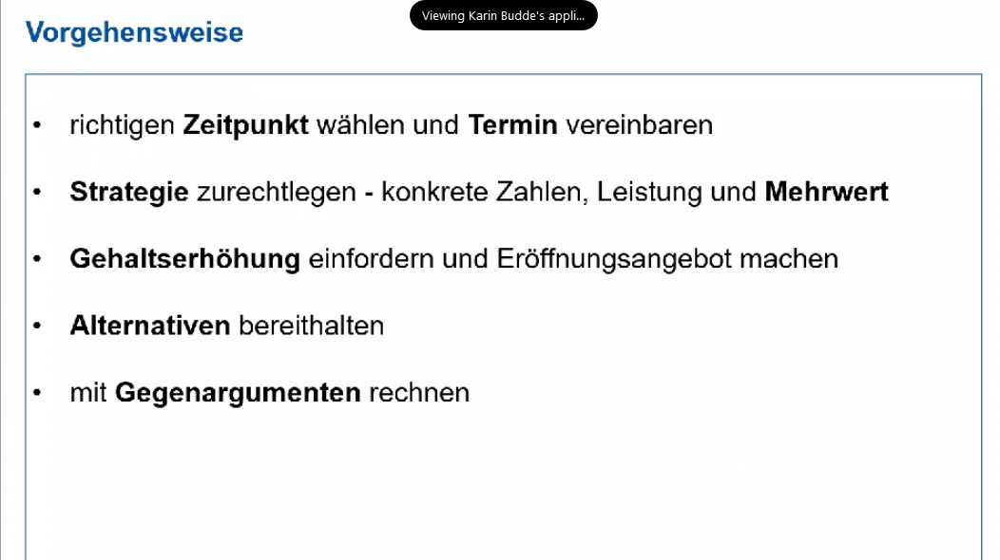
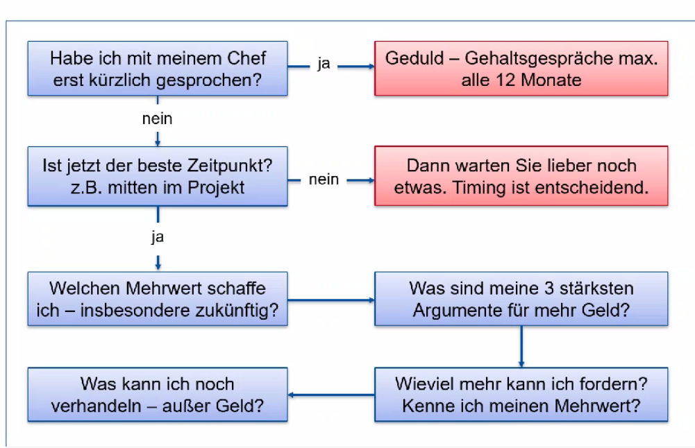
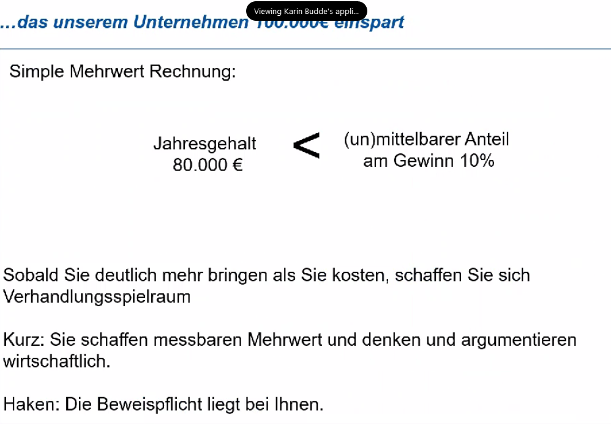

#  N440182 Die Gehaltsverhandlung - mehr Geld von der Führungskraft

## Info
* Dozent*innen: Karin Budde
* Datum: 05.FEB.2022   
* Zeit: 10:00 bis 17:30 Uhr   

chef fragen, wann werden die budgetrs verteilt. wann wird geplant

wir machen erstes angebot
nicht der chef
wenn es unternehmen gut geht, meie beteiligung
nachfragen, was man denn tuen musste um eine gehaltsverhöhung von x prozent zu bekommen? neue aufgaben uebernehmen?

* leistungmappe: zahlen, daten, fakten
* erfolge ichtbar machen: besser nach oben herauskommen; mehrwert
* drei bis vier gute argumente anbringen
----
beförderung anbringen
teamkoordination:
dreimal gezahlter bonus wird gewohnheitsrecht
* merry increase: inflationsausgleich bei internationalen firmen (microsoft, apple,..): alles darübe rhinaus ist reale gehaltsanpassung

hinweise für mich:
* wissensverteilung im team: dokumentation und auch aktives heranführen von leuten an die aufgaben
* massnahmen wie lessons learned
* qualitätssicherung: interner testplan definiert
* mehrwert durch neue prozesse: spart mindestens einen junio sw entwickler ein durch QS
quarterback bekommt nicht so viel geld, weil er so viel spielt, sondern weil er da team koordiniert,zusammenhält und den projekterfolg sichert
-> commitment
nicht härte roder mehr arbeiten, sondern effektiver
wahrnehmung fur den nutzen

testimonials einsammeln: * wie war die zusammenarbeit auf einer skala von 1 bis 10, reaktionszeit bei problemen? wo war ich der treibende faktor?
feedback von kunden esammeln: zwecks best practices;
kosten gespart; prozesse verbessert

anbringen der persönlichen ziele fuer die nachsten sechs monate: was will ich leisten
wie wird das unternehmen davon priofitieren
positive woerter
img03
----
eigenes selbstmarketing aufbauen
wer bin ichm wofuer stehe eich?
in welchen bereichen?

* reaktionszeit beim kunden: detailierter anmerken, wie wir entgegenkommen
*storytelling zwecks detailierung
*elevatorpitch
img04

agenda fuer das gesprache vereinbaren
todo: vorab schonmal dem gegenüber bescheid geben
dies auh bei mir am 15.02. machen
vorab leistungsmappe schicken

erstmal aufmekersamkeit vom chef haben, wahrnehmung, nicht direkt mehr geld
wie wäre esd denn, wenn das ziel erreicht ist?
img05
img06
img07
was kann ich alles? dort auch sw-dev leistung auflisten (trotz elternzeit und kurzarbeit); auf gleichem level wie andere entwickler commits geliefert!

status in proejktleiste aktuell halten
kpis für einen projekterfolg vorschlagen: so dass man sie dann nachträglich reflektieren kann

## !! erstellen der leistungsmappe

was macht man denn so den geanzen tag?
hat man KPIs dazu?
12:00 uhr - vorschlag jetzt 14 Uhr wieder zu treffen; somit 1h paus eund 1h erstellen der mappe
img10 als template nutzen
letzte 12 monate als basis verwenden

strategisch vorgehen, dass man eher normale arbeiten abgibt und sich auf das planen konzentriert
---------------------
* upsale potentiale: kunde weiter binden; wird die kundenzufridenheit erfasst? wie wird das reportet. erwartungshaltung vs. realität
* Kunde verstehen vor der Beratung
beispiel frau C.
img11

* erst ziele definieren. in der gehaltsverhandlun dann nicht über die ziele sprechen, sondern sie als begründung für die vergangenheit
* neue aufaben, neue skills -> mehr geld bekommen

bei mir:
* koordinierung von eigenen team und zweiten internen; extern design; extern stakeholder als kunde; extern dritte softwarekomponente
* prozesseinführung
* QA intern aufbauen und durchführen
requirements vom kunden abholen: mit domänenwissen und vorformulieren
* "Der Köder muss dem Fisch schmecken und nicht dem Angler." - adressatenspezifisch aufbereiten
* nicht nur was man gemacht hat, sondern auch wie - ganz neue art der kundenansprache

* falls die aktuellen KPI nicht passen, dann sollte man sie anpassen nach besprechung

nicht gehaltswunsch, sondern gehaltspaket als wording verwenden
* "mein gehaltspaket ist 80.000 euro"
* gehaltspaket: tankgutscheine, firmenwagen, weiterbildungne mit zweimal 5ke pro jahr, damit spart der arbeitgeber die sozialabgaben - mit wertsteigerung

* "eigene schmerzgrenze finden, dann verdoppeln"
* falls man eine zu schnelle zusage bekommt, dann "winner's curse"
* falls firmen sagen, dass das einfach der prozess ist, dann anmerken, dass es schon um mich persönlich geht

* ! falls vorher in runden ein budget oder gehaltsanpassungen besprochen wird, man dann aber ar nicht gehört wird, sollte man pressieren und dem eigenen chef argumente liefern. selbst wenn er sie nicht will und sich aus der verantwortung stehlen möchte
* nicht geschimpft ist gelobt genug
* falls man wegen einem "namen" im lebenslauf etwas in kauf nimmt, also gehaltseinbussen, dann muss man dafür selber vorab eine abwägung treffen

* !! todo: anmerken, dass man blauäugig reingegangen ist, weil ich vermutet habe, dass das im ersten jahregespräch dann auch behandelt wird. jetzt habe ich es aber verstanden, jetzt will ich reden

* !! todo: fragen, wann die budgetverhandlungen sind; wann wir das "jahr" festgelegt

## marktwert ermitteln
img12
transparenz verschatffen

* todo email signatur anpassen!

* in münchen 17% mehr als in anderen städten in dtl.
* vorab informieren
img13
img14
* linkedin nutzen

* "ich entwickele mich weiter also muss mein gehalt angepasst werden."
* wie gut kennen sie mich: an welchen kriterien wurde das gemessen?
* "Was müsste man konkret erzielen um einen erhöhung um 10 prozent zu bekommen?"

Pause: bis 15:35

## auf karten vorbereiten - anhand des leistungsbogens
* übergreifende Zusammenarbeit: ... meine gschichte dazu ..
* Kosten sparen: ... meine gschichte dazu ..
img15

* kooperativ vs. kompromissler
* Einzelübung: Setie 13 im Handbuch

* verhandlung: zwei reaktionen: flinch (reaktion wie herzanfall) oder crunch (gesicht verziehen, schwierig, geht gar nicht)

* todo for myself: elevator pitch: 60s vollgas! (Elevator Pitch - überzeugen Sie mit Ihrer Kurzpräsentation!)

* hinzugewonnen kompetenzen ausweisen

img16
* bei einer offenen frage immer den mund halten
* "Das kann ich jetzt nicht beantworten.  Falls es superinteressant für sie ist, werde ich es herausfinden und per Mail nachliefern."

[Pause]

* statt nur einfach einen kompromiss festzulegen, sollte man die Interessen (der gegenseite) ergründen
* Orangenbesipiel mit zwei kindern. mutter halbiert es einfach, aber eines wollte nur saft, eines nur die schale. so haben beide am ende das nachsehen.

* nicht vergleichen mit anderen Bewerbern/Kollegen. wenn man sich auf eine stelle bewirbt, dann ist man sich ja sicher, dass man auch der passende Kandidat ist
* Gesprächsverlauf: je mehr "JAs" man bekommt, desto schwieriger wird es für den gegenüber am ende abzuwinken

* Gefühle verbalisieren um auch der Motivation eine Grundlage zu schaffen: am Ende der Probezeit wegen Einarbeitung
* Martin Schranner als Vortragender für Verhandlungstechniken
* falls die Emotionen hochkochen Abstand schaffen. Lieber um Vertagen bitten.

Ablauf:
* Zahlen, Daten, Fakten vorbereiten
* Strategie zurechtlegen
Gehaltsanpassung zuerst als Zahl setzen

* Reihenfolge der Argumente: 2-3-1 vielleicht am besten: mittel anfangen, schwach, stark enden

## 6 typische Fehler vermeiden

* mein eigenes Gehalt verhandeln, nicht für Kollegen
* keine Erpressungsversuche

* todo: Anmerkung von: Übernahme von Verantwortung

### simple mehrwert rechnung

* Bitten sie um einen GEfallen: Fragen um mit 99% Anfrage ein ja zu erzeugen
* todo: was wäre das dann bei uns?

Gehaltsanpassung:; mit meiner Leistung zufrieden?
Passen die WEiterbildungen im SW-Bereich? ISAQB, PSPO?
Sehen sie einen Mehrwert durch die Verbesserungen?

* positive Handbewegungen; handfläche nach oben
* immer über der Gürtellinie
* großmachen, also auch auf dem Stuhl
* gespräche vielleicht auch im stehen machen, damit auch teil vom oberkörper nutzbar
* rhetorische pausen nutzen

* Nachfrage für Coaching: 45 min mit 95€

* Finaler Tipp: auf eine Stelle zwei, drei Level über eigenem Knowhow bewerben ... das schlimsmte was zurückkommen kann, wäre ja ein Nein

