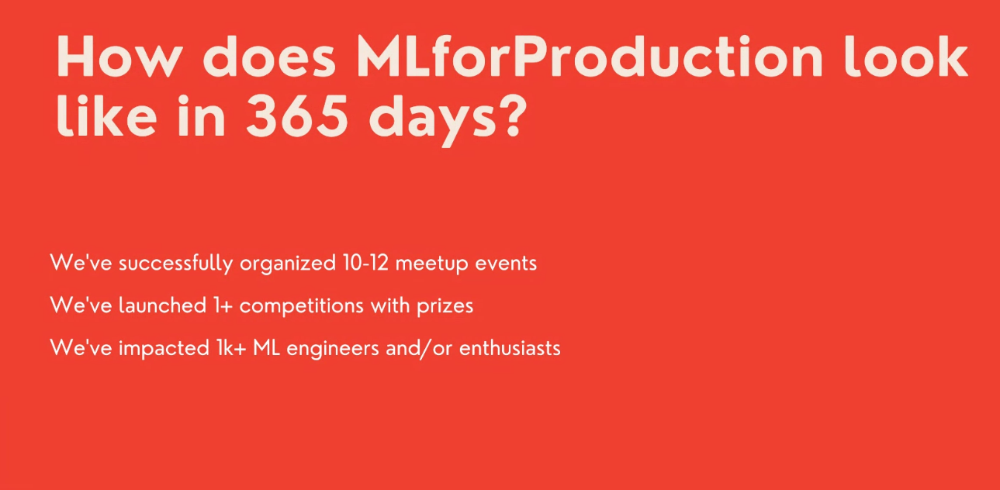
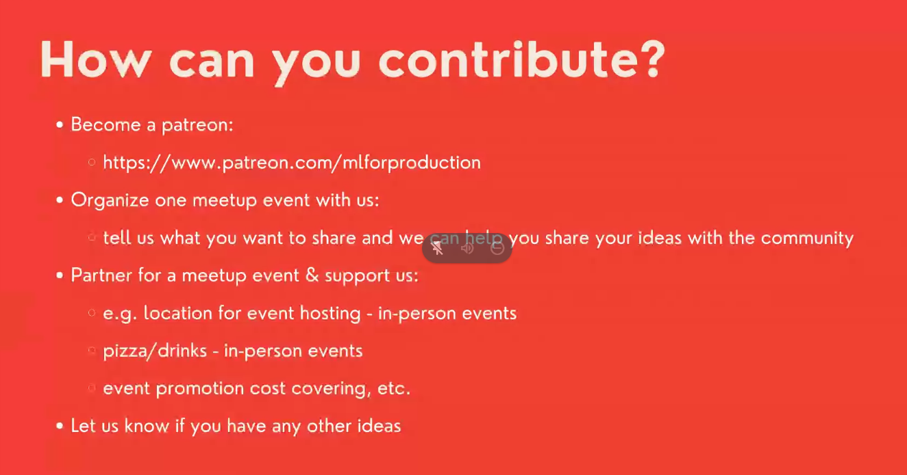
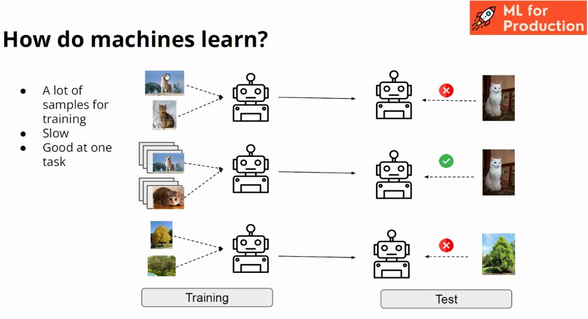
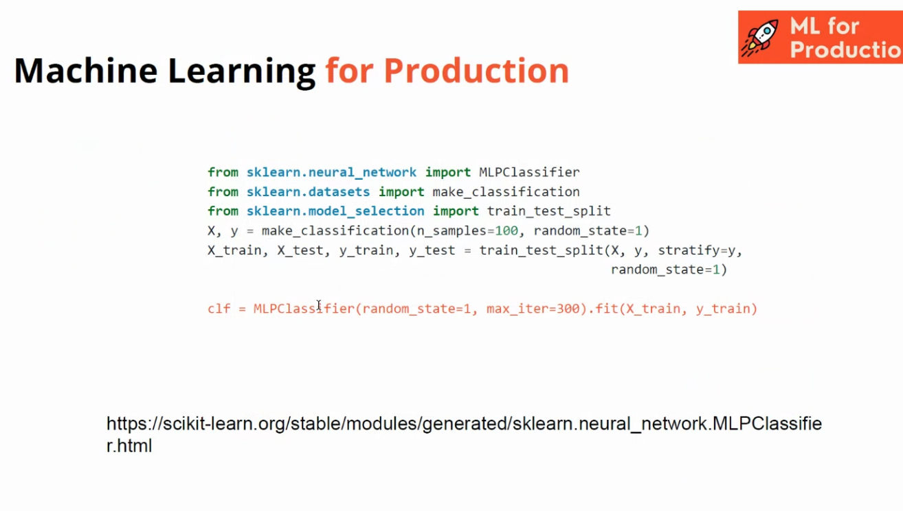

# 20220610: Automated Machine Learning
* powered by machine learning for production

* presenter Diana Artiom
* 19:00-21:00
* Sebastian Pineda Arango is the teacher

## motivation
* 80 % of DS/ML projects dont make it to production
* different kinds of specialists are necessary for various steps of the ML pipeline

## mission
* wanting to grow and host a lot of events ..

## ice breaker
* How are you feeling today?
* go to: ahaslides.com/8GORB

## now the "real" speaker takes over
* presenter Sebastian Pineda Arango

* humans do classification, but also uses previous knowledge

### how do machines learn?

* one shot learning as another technology
* or signature-learning (like a cat is like a small tiger, cute, ..)
* or transfer-learning: use pre-trained models

* simple example: 
  * only one line of code will already achieve good performance
  
* automatic hyperparamter-optimization:

* autoscaler: best combination of models, scalers and [?]
* pipeline-optimization works very nice; better than just choosing a random model

## meta-learning: analogy with the evolution

* brain is changing and previous knowledge forms it: better adapted
* level over the machine-learning
* umbrella of AutoML

* Meta-training
* example application: self-driving cars under different conditions
* cars usually trained in a boring, empty road, good lighting: problems with changes (snow, many cars, weird background, ..)

---------

