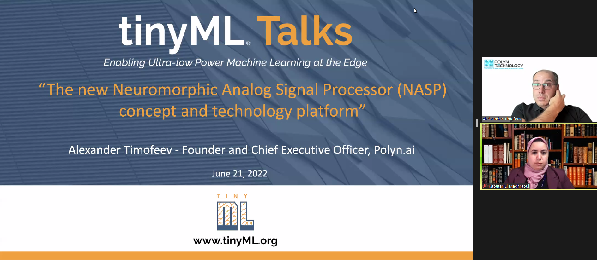
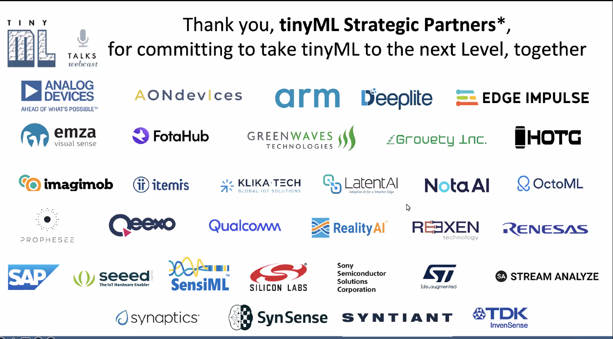
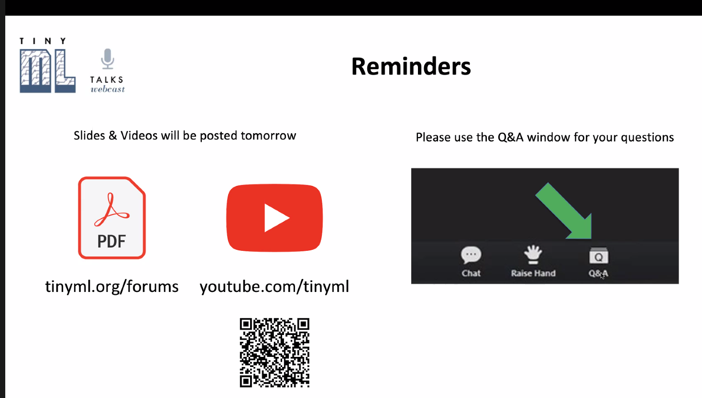

# 20220621 TinyML_NeuromorphicAnalaogSignalProcesseor - AleksanderTimofeev from polyn.ai

* (todo) tinyML on linkedin
* also on Meetup
* also the youtube-channel offers all the recordings - great ressource

* June 29: smart weather station (tinyML challenge)
* slides and videos will be posted tomorrow: see tinymy.org/forums and youtube at 

