# 20220621 TinyML_NeuromorphicAnalaogSignalProcesseor - AleksanderTimofeev from polyn.ai

* (todo) tinyML on linkedin
* also on Meetup
* also the youtube-channel offers all the recordings - great ressource

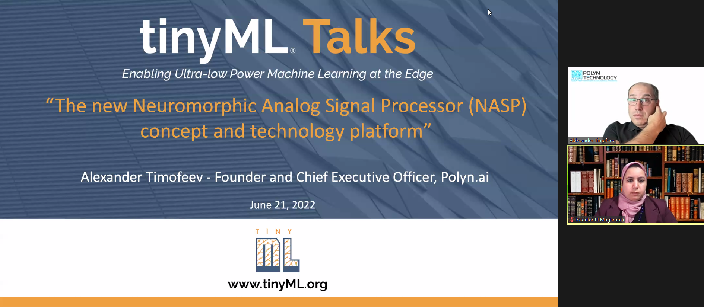
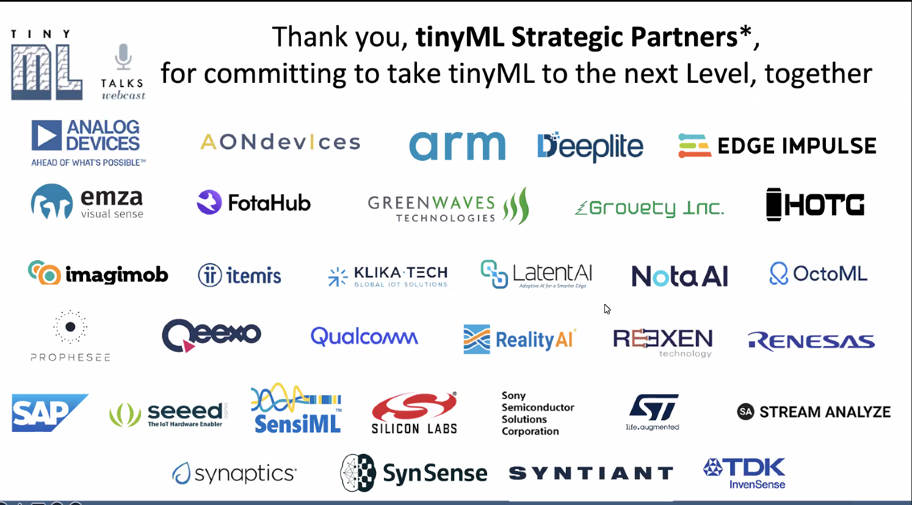
* June 29: smart weather station (tinyML challenge)
* slides and videos will be posted tomorrow: see tinymy.org/forums and youtube at 
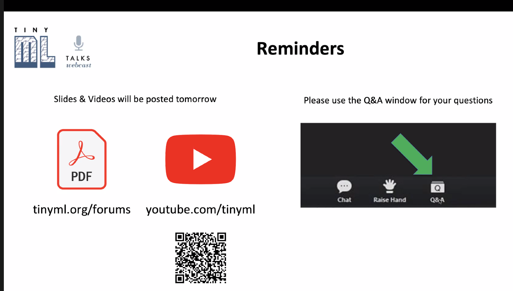
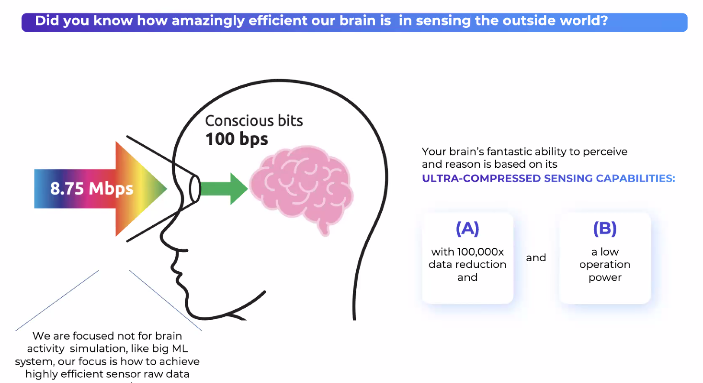
* sensory data preprocessing!
* convert the math model into chip layout!
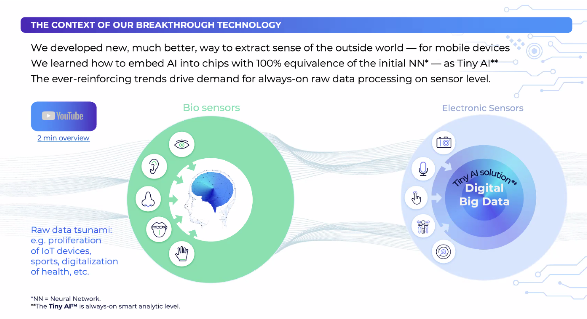
* split the network between the fixed and dynamic part
* data flow through the fixed part is much lower (1000x less)
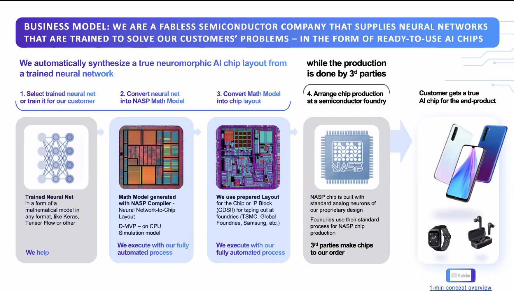
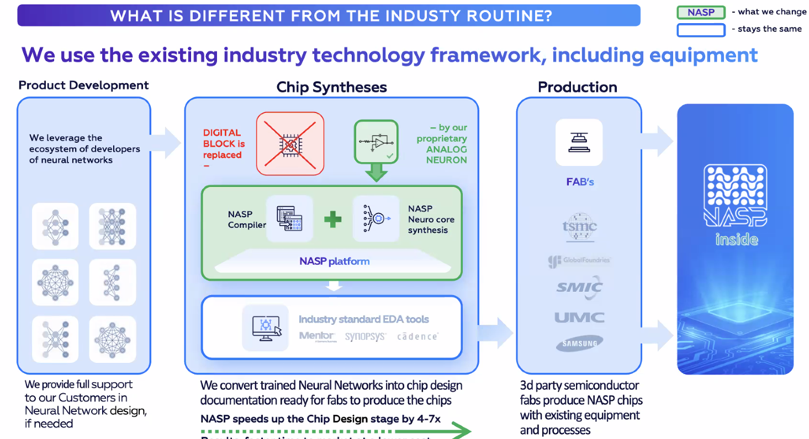
* final NASP core has no specific hardware requirements, so it can be taped out in any fab!
* final size and structure not predictable
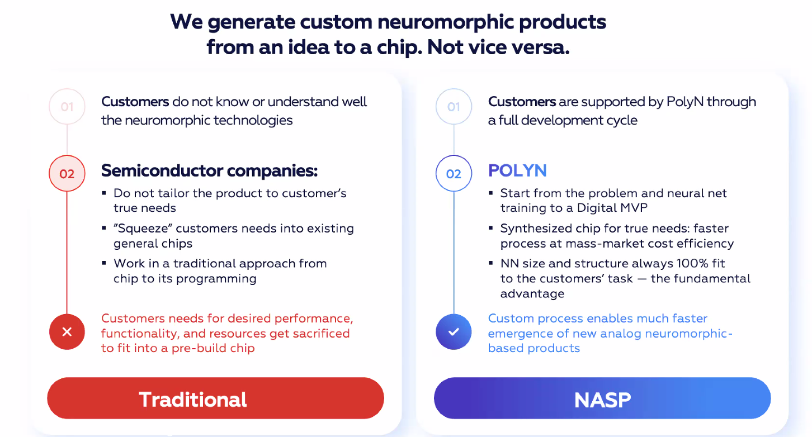
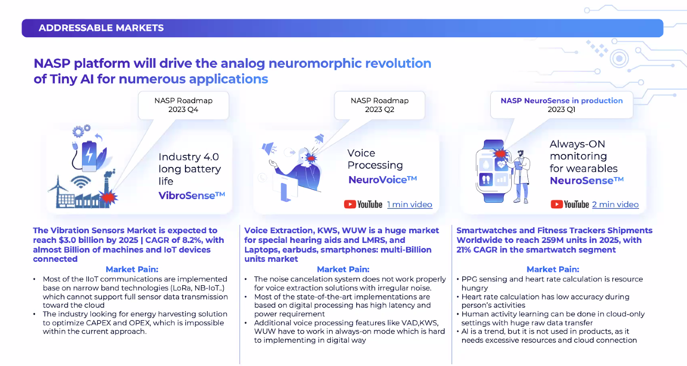
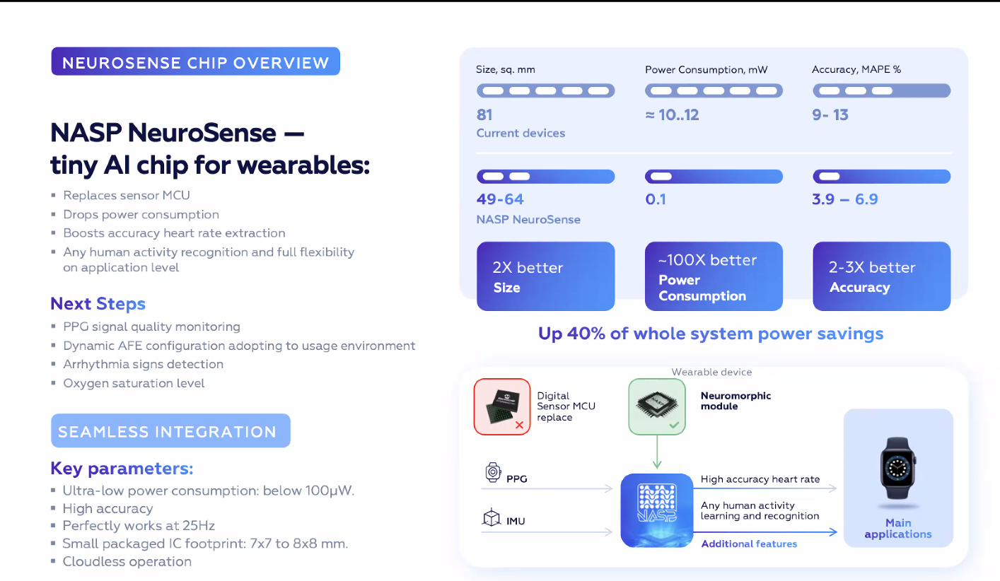
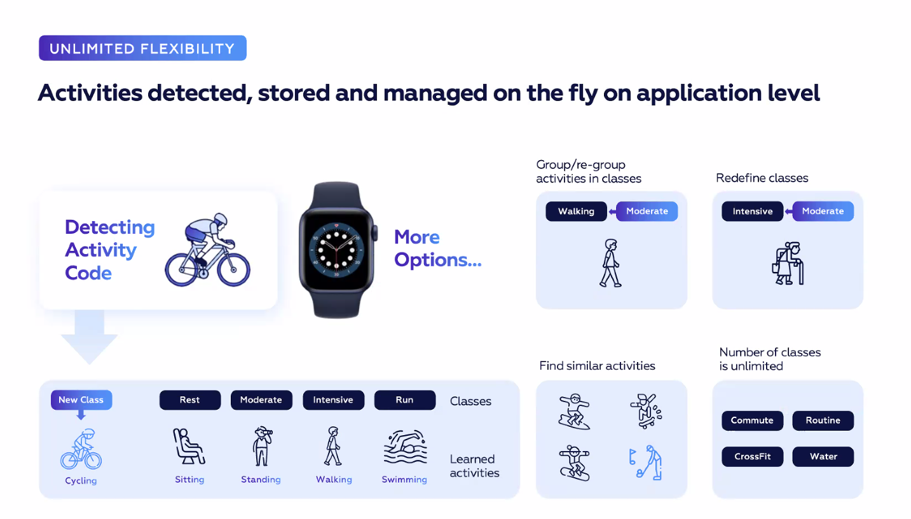
* pattern from any application in 20 KiB of Data
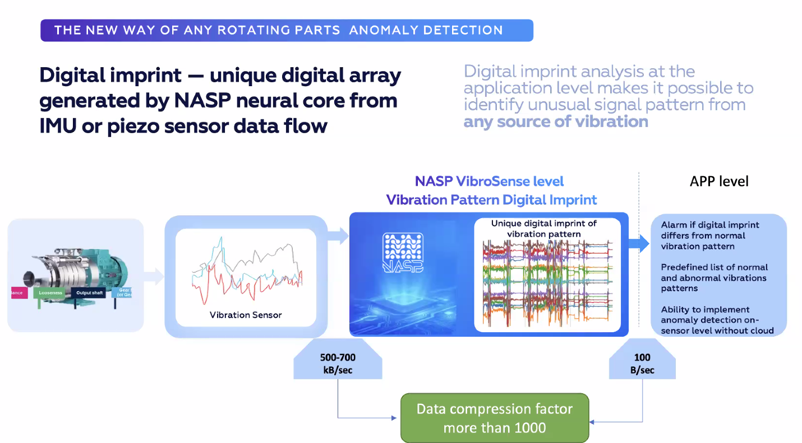
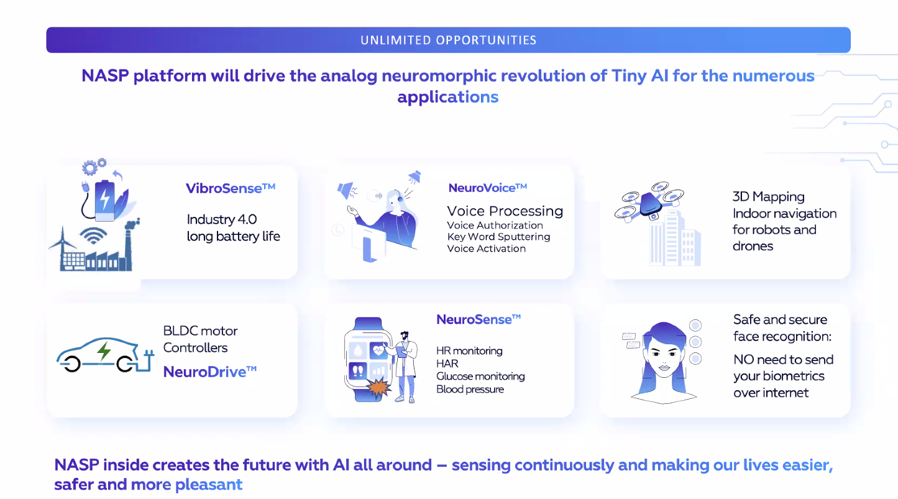
