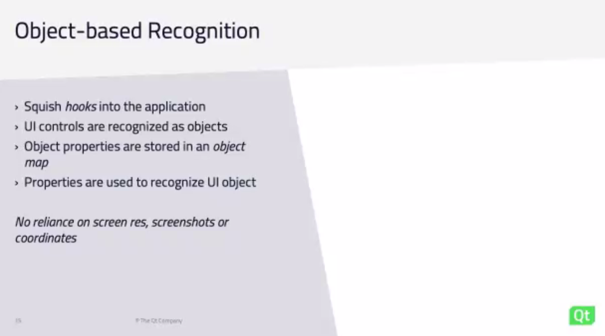

# 20220628 Squish Webinar: How To Create Automated GUI Tests for Your Embedded Application
* Sebastian Polzin; Marketing
* Jakub Topolski for test engineer
* two parts: demo (pre-recorded to show squish and device at the same time, then live Q&A)

## setup
* ARM imx6
* Squish GUI tester

* only-manual-testing is insufficient to maintain pace for short
* automated speed increase with ui-tester; run test faster and when you are not around
* extensive CI/ALM integration support
* can be used with Coco or TestCenter (other Qt QA Tools) - jenkins, azure, teamcity (question was answered: gitlab as well)
* scripting support, python, JS, ruby, perl, tcl
* reuse of existing tools and packages possible

## test creation
* recording
* scripting
* hybrid method

## IDE
* eclipse based
* !! first create test suite, then give it a name, then choose Qt, then chose any of the supported languages (use python)
* choose "no application"
* click then BDD or script: chose script -> is empty, then click record button, then all the actions on the device are recorded
* then click stop in the recorder

* robust tests due to being based on properties even when product evolves
* even if the text is changed, then it does not matter
* object-repository tracks changes: object-map is just a text-file

* squish picker-tool: activate to find items, then click in UI
* !! take screenshot in case of failure for further debugging!

## image based testing (also possible)
* not bad, have also their reason for existence
* or custom controls are otherwise not recognized
* spying the application is also possible
* further sources (will be moved to qt.io until end of the year)

## Q&A
* as long as the CI-tool allows to run commands, it should be possible to run squish
* tests will be replayed as fast as possible, but only so fast that they can run properly
* does squish provide some way to control analog-controls, sensors? yes, has CAN-support; for further info question the squish-support
* access-rights: no, does not have to run as root
