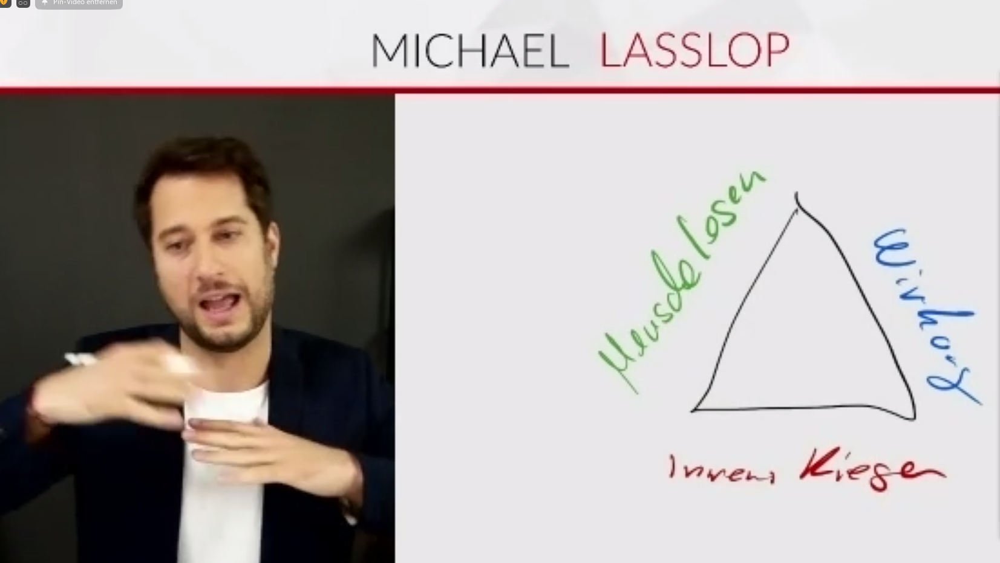
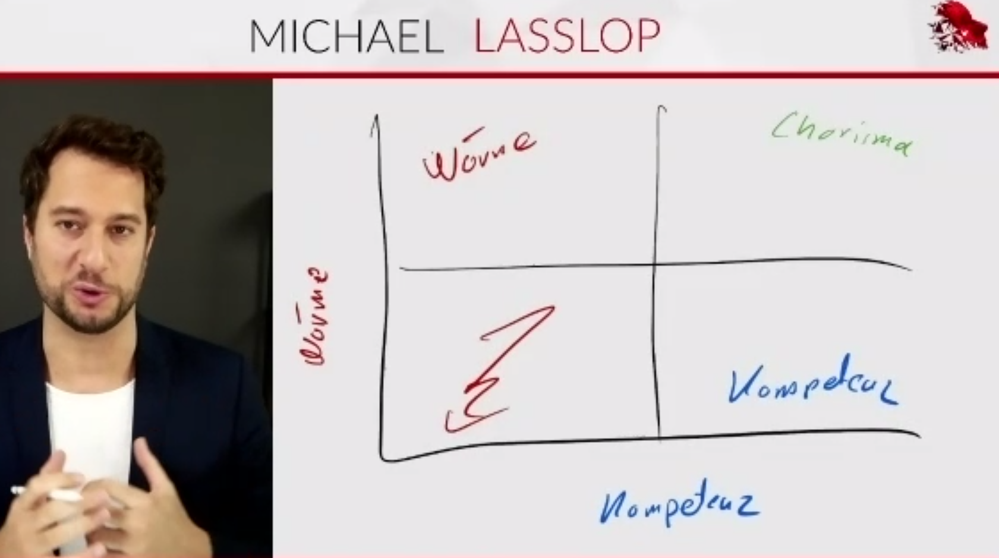

# 20221107 Die Macht der Körpersprache im Business
* Ingrid Janssen als Host
* Michael Lasslop als Referent: BWL & Wirtschaftspsychologe

* es gibt keine Präsentation zur Anfrage, weil "Learning by doing"

* alles ist Kommunikation im Business; 
* gute Verbindungen aufbauen
* falls man eine Sprache lesen kann, heißt das natürlich nicht, dass man sie gut sprechen kann
* zwei Ebenen: das Verbale und auch das Nonverbale: Mimik, Gestik, Stimme, Schnelligkeit des Sprechens; Kleidung, Schmuck, Örtlichkeit
* nonverbal macht 60-90 % der Kommunikation aus

Kommunikation hat vier Säulen:
* eigene Wirkung steuern können: etwas sympathischer wirken, oder dominanter wirken? wenn man Beziehung mit Kunden aufbauen will, dann auch businessmäßig flirten können; Körpersprache anpassen
* Menschen lesen können; Kunden verängstigt, Mitarbeiter überfordert?
* Innerer Krieger (die Motivation; Gedanken und Gefühle)

## Was kann man steuern?
* die eigene Wirkung
* entscheidend ist immer, was das eigene Ziel ist: Spektrum an Standort - diesen Ort erweitern
  * Charisma: Wärme (kann ich dir vertrauen?) - oberste Prämisse des Gehirns ist ist Sicherheit
  * Kompetenz - kann ich auf dich vertrauen?
  
* Gestik ist ein starkes Kompetenzsignal
* Berührungen lassen warm wirken, aber maximal Hand und Arm berühren
* NLP sagt: Bewegungen der Personen spiegeln
* falls notwendig: auch Raum einnehmen; sich größer machen (kann man auch nutzen)
* Körpersprache für die eigene Wirkung nutzen

## Menschen lese
* Tipp:

* Überleben
  * Gefahr und Unbehagen verhindern
  * Sicherheit und Behagen suchen: die Behagens-Waage
* Beruhigungsgesten: stammen aus der Kindheit, sollen uns beruhigen (Endorphine)
  * sind Zeichen für emotionalem Stress (Verlegenheit, Scham, Angst); auch Langeweile; Männer spielen mit dem Bart herum; Frauen tendenziell anders; auch Nacken massieren, Lippen lecken, über das Bein streichen
  * es gibt auch statt persönlichen auch Objektgesten (Handy checken, mit Wasserglas spielen, Stift drücken, ..)
  
* innerer Krieger: eine Person, die sich selber erobert
* Wirkung hat viel mit Selbstbewusstsein zu tun: jeder hat Pokerchips und um seine Idee loszuwerden, muss man fünf davon in den Pot werfen, keine Chips aus dem Fenster werfen, wenn man negativ zu sich selber spricht; lieber sich innerlich selber loben und Erfolge herausarbeiten und sich so einen großen Stack an Chips aufzubauen

* initial kann es aufgesetzt wirken, aber das liegt daran, dass es etwas neu ist, was man lernt
