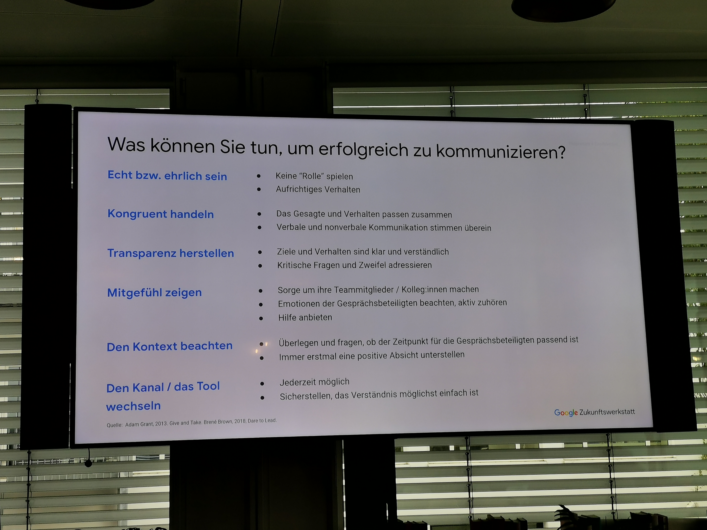

# 20221116: Google Zukunftswerkstatt: Alles was sie über die Führung im Homeoffice wissen müssen
* TODO check later: zukunftswerkstatt.de seit 20214, nicht nur Deutschland - hat auch E-Learning-Angebot
* München, Berlin, Hamburg live
* Innovationstechniken und kollaborativer Zusammenarbeit
* komplettes Seminarangebot auch auf youtube
* TODO: Zertifizierungen möglich!
* Konfliktmanagement, Design thinking, ..

* Dozent: Oliver Weber, MunichMarketing

## Agenda
* Grundlagen, eine gute Führungskraft, das Team
* Sicherheit schaffen
* den Rahmen abstecken
* eine gute kommunizierende Person sein
* datenbasiert, Google-intern und auch McKinsey

* offene Kommunikationskultur, Mitarbeiter unterstützen, fachlich
* gemeinsame Ziele als Führungskraft
* passende Delegation; kein Mikromanagement

### großartige Führungskräfte
* kriegen Dinge geregelt
* regelmässiges Feedback holen
* Teamentwicklung
* begleiten, entwickel, füreinander da sein

#### Großartige Führungskräfte kriegen Dinge geregelt
* haben eine klare Vision und Strategie für das team
* sind produktiv und ergebnisorientiert
* sind stark darin, Entscheidungen zu treffen
* kollaborieren im gesamten Unternehmen
* verfügen über die zentralen fachlichen Fähigkeiten um das Team zu beraten - nicht nur immer "primus inter pares" sein; Arbeit der Mitarbeiter auch wertschätzen zu können

* 

* lieber auch einmal das Risiko gehen eine falsche Entscheidung zu treffen, als gar keine #schieberitis, aber sehr offen
* Halt geben
* heutzutage durch NewAge und NewWork anderes, offeneres Kollaborieren. Früher: Wissen ist Macht

### gute Führungskräfte entwickeln das TEam
* sind ein guter Coach
* ermächtigen ihr team und micromanagen nicht
* schaffen ein inklusives Umfeld, das Erfolg und Wohlbefinden vereint (Entscheidungsrahmen, räumliche und Arbeitsplatzsituation)
* Unterstützen Karriereentwicklung und besprechen Leistung
* Sind gut kommunizierende - hören zu und teilen Informationen

TODO: von handy
!()[img01.png]

* Feedback geben, nebenher reden - das geht durch die Videocalls nicht mehr wie früher, was man vorher auf "dem Flur" machen konnte
* push versus pull Marketing - Kommunikation heißt nicht, dass man nur selber redet, sondern auch mal Fragen stellt

### Mehr als die summe seiner Teile
* Teams sind in hohem Maße voneinander abhängig: sie planen Arbeitspakete, lösen Probleme, treffen Entscheidungen und kontrollieren den Fortschritt eines bestimmten Projektes. Die Mitglieder eines Teams brauchen einander, um ihre Aufgaben zu erledigen.
* bis zu 75% der Projekte gehen kaputt (scheitern) - Hauptgrund mangelnde Zusammenarbeit
* wenn es nicht stimmt im Team, wird es nicht viel bringen (die fachliche Kompetenz)

#### insgesamt
* psychologische Sicherheit
* Verlässlichkeit
* Struktur und Klarheit
* Bedeutung
* Einfluss

## Sicherheit als Fundament
* wie geht das Team mit Fehlschlägen/Fehltritten um? Wird sich schützend vor einem gestellt oder noch draufgehauen?
* bei Sicherheit kann man auch mal ein Risiko gehen und etwas ausprobieren, gegebenenfalls bringt es das Team weiter

* analog zum Kaizen-Gedanken (ständige Verbesserung)
* Experimente ansagen und auch einen Rahmen stecken; als Gruppe das Risiko einschätzen, ob es gerade passt

### Psychologische Sicherheit schaffen
* erreichbar und ansprechbar sein: digitale Sprechstunden, 1:1 mit den Teammitgliedern, sich selbst einbringen (auch aktiv einfordern, so daß man sieht: wo steht man denn?)
* Interesse zeigen: Fragen stellen, um von den Teammitgliedern zu lernen; sich auf das Gespräch konzentrieren; Input geben
* verständnisvoll sein: gehörtes zusammenfassen und fragen, ob es richtig verstanden wurde; Körpersprache beachten

* als Opener etwas persönliches bringen; was man macht, was schief lief in der aktuellen Woche?
* Struktur: mit Socialising beginnen; dann Perspektive reflektieren (Du, ich weiß nicht, wie es Dir geht? Aber mein letztes Teammeeting war nicht so toll.), auf Leistungen eingehen "ich habe das Gefühl, das hat dir Spaß gemacht", "ich habe den Eindruck, du wartest noch auf eine neuer Herausforderung"; bei manchen LEtuen kann eine Agenda helfen - sollte aber individuell entschieden werden; eventuell keine feste Agenda, sondern "ich hätte gern mit dir folgende Punkte besprochen?"
* persönliches Interesse an den Leuten zeigen: nachfragen, wenn Details bekannt sind
* in kleinen Gesprächen eher nicht hart "Company - Projekt - Person" rangehen, sondern es eher um die Person drehen
* wiki page pro Mitarbeiter; CRM-System; OneNote .. dann elektronisch verschlüsseln; mindmap tool - Wohlfühlfaktor de sMitarbeiters spielt größeren Raum als Datenschutz
* TODO: Struktur überlegen
  * Mitarbeitergeburtstage im Kalender eintragen
  * als Vorgesetzter darf man gewisse Daten über die Mitarbeiter haben
* verständnisvoll sein, Nachfragen um zu zeigen, dass man etwas verstanden hat

### pt2
* wertschätzendes Umfeld schaffen: Dankbarkeit für Lösungen, Beiträge aus dem Team zeigen; sich einschalten, wenn negativ über einander gesprochen wird; eigene Erfahrungen teilen
* Entscheidungen treffen: Input und Feedback des Teams suchen; Input von anderen anerkennen und kennzeichnen; erklären, wie die Entscheidung getroffen wurde
* Sparring anbieten und einfordern: Teammitglieder um Feedback bitten; Sparring durch Team einfordern; kontrovers und sachlich diskutieren

## Wie sie gemeinsam zum Ziel kommen
* Infrastruktur
* Methoden
* KPIs

* Konflikte lösen: Mediation - erst einmal auf die Definition eines guten Konsens zu einigen: gut umsetzbar, trackbar, .. im Vorfeld entscheiden, was ist wichtig
* goo.gle/zw-note TODO check the offered tools, which maybe improve collaboration and make it more transparent

### Agile Methoden testen
* Überprüfung: Fortschritte werden regelmäßig überprüft
* Anpassung: kurze Intervalle ermöglichen jederzeit Anpassung im Hinblick auf das Ziel
* Transparenz und Kollaboration: gemeinsames Verständnis und Standards für die Zusammenarbeit erarbeiten

### Messen, wo Sie als Team stehen
* In Bezug auf das Ziel des Teams
* regelmäßige, anonyme Zufriedenheitsbefragung im Team durchführen
* Feedback-Kanal einführen und nutzen

* Methode diskutabel, aber der Ansatz ist der richtige
* vielleicht eher aus dem 1:1 rausholen, oder im Großen machen
* bei großen Firmenbefragungen sollte es auch Resultate geben, also was sich basierend darauf tut?

* mit Verbesserungsansatz aus Lean auch Kummerkasten einrichten

#### Retrospektive
* vier Quadraten: ..

## Erfolge feiern, auch jetzt!
* statt einer Rund-Mail gemeinsam remote feiern
* zeigt Wertschätzung und Dankbarkeit
* Fördert den Zusammenhalt im Team
* Gintasting, Guglhupf.de - one man Guglhupf (nicht das billigste)
* Warum nicht den Einzelpersonen mal etwas schicken? Mit dem, was es bringt, kostet es im Vergleich nichts --> schafft ein psychologisch sicheres Umfeld

* Kudo-Karten, sammeln - dann in Box, ziehen, ein Gewinn - gewisser Zufallsaspekt
* Management3.0-Umfeld - Jürgen Apello? Wie arbeitet man im neuen Management zusammen?
* Rundmail als gutes Mittel auch noch einmal die Anerkennung zu verteilen bzw. an ein, zwei Managementebenen höher die Sichtbarkeit zeigen
  * Benchmark-Sharing; auch Rolle als Führungskraft nutzen und Erfolge entsprechend teilen

## Was können sie tun, um erfolgreich zu kommunizieren
* Echt bzw. ehrlich sein: keine "Rolle" spielen, aufrichtiges Verhalten (Loyalität beibehalten, herausstreichen, dass man nicht herauskann, weil man im Kontext handelt)
* kongruentes handeln: das Gesagt und Verhalten passen zusammen; verbale und nonverbale Kommunikation stimmen überein
* Transparenz herstellen: Ziele und Verhalten sind klar und verständlich; kritische Fragen und Zweifel adressieren
* Mitgefühl zeigen: Sorge um Ihre Teammitglieder/Kolleginnen machen; Emotionen der Gesprächsbeteiligten beachten, aktiv zuhören; Hilfe anbieten
* Kontext beachten: überlegen und fragen, ob der Zeitpunkt für die Gesprächsbeteiligten passend ist; immer erst einmal eine positive Absicht unterstellen
* Den Kanal/das Tool wechseln: jederzeit möglich; sicherstellen, dass Verständnis möglichst einfach ist

## Wer trifft welche Entscheidung?
* Entscheidungen:
  * die ich selbst fällen möchte
  * die jeder selbst treffen kann
  * die wir im Team gemeinsam treffen
  * die das Team one mich trifft
  

### Wie werden Entscheidungen getroffen?
* Konsens: nimmt die Ja-Stimmen in den Fokus
* Konsent (Abgrenzung zu Konsens): nimmt nur die Bedenken/schwerwiegenden Einwände in den Fokus (Beispiel: Bedenken äußern, aber auch festhalten, dass es Leute gibt, die es anders sehen)
  * Widerstandmessung (Wo geht man Mittagessen? gibt Bedenken vom Trainer); kleinster-gemeinsamer-Nenner
* (Quelle: New Work Glossar 2021)

## Feedback geben und einfordern
* Situation: beschreien die sie Situation um die es Ihnen geht und seien sie konkret
* Verhalten: welches Verhalten haben sie beobachtet? Was hat ihr gegenüber genau gemacht?
* Auswirkung? Welche Auswirkungen hatte dieses Verhalten auf das Team oder Sie selbst

### Remote 1:1
* unsere Zusammenarbeit: gut so/so; ändern
* Agenda: text, text, text, ..
* Verpflichtungen & Todos: to do; in progress, done

### Adaptieren:
* Facilitator (Moderator)
* Kollaborationskarten
* Pausen (Halbstundenpause oder einfach mal eine Woche ..)
* Keine back-to-back-Meetings (45 min instead of 60?)
* Energizer

### Check-in Runden
* Was habe ich geschafft? Was werde ich heute erledigen? Welche Hindernisse gibt es?
* Stimmung vorab: als Präfix
* Anpassungen: als Suffix?

### Digitale Alternativen zur Kaffeeküche
* Analoge Aufmerksamkeit
* virtuelle Kochevents
* After Work Events
* Sportliche Mittagspause

### Zusammenfassung

#### Key Takeaways
* ein psychologisch sicheres Arbeitsumfeld fördern
* klare Rahmenbedingungen für eine produktive Zusammenarbeit im Team schaffen
* Effektiv kommunizieren
* Überprüfung, Anpassung und Kollaboration als Maxime

* Google Feedback ausfüllen (TODO)

