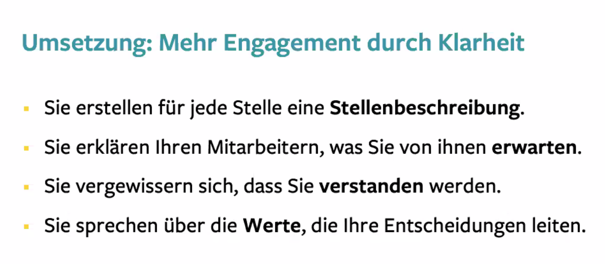

# Stephan Kowalski (Kulturgut) - Erfolgreich führen (Webinar, impulse akdademie)

Systematisch Kompetenzen aufbauen, was klaren und souveräne Führung aufbaut
* klar trainierbare Kompetenzen
* wie man die emotionale Verbundenheit im Team erhöhen kann

## wie entsteht Motivation?
* innere Bereitschaft sich voll reinzuhängen:
  * "sei doch mal motiviert", das funktioniert nicht; kann eher sogar Widerstand hervorrufen
  * es gibt keine Motivationsmaschine, wo man nur Knöpfe drücken muss
  * Statussymbole? Incentives?
	* extrinsische Motivation nur kurzfristigen Motivationsboost; Firma Gallup 
  
## 4 Erfolgsfaktoren für mehr Engagement
### Klarheit
* es geht um Klarheit von Erwartungen; nur jeder zweite Mitarbeiter stimmt dort zu; "Das muss man nicht erklären, das muss man sich denken" - NEIN! Mitarbeiter können nicht die Gedanken lesen.
* drei Ebenen bei den Erwartungen
  * **Was** soll ein Mitarbeiter tun?
    * stimmen auch die Aufgaben damit überein? Wenn ja, steigt die Motivation um 2,5x
    * Unstimmigkeiten sind gut bei Übergaben zwischen Personen erkennbar
   * wie schnell, wie sorgfältig? was darf man selber entscheiden? ("Muss ich mal meinen Chef fragen" will man vermeiden)
  * **Wie** soll die Arbeit erledigt werden?
    *  Grund, warum Mitarbeiter in der Tür stehen.
	* eigene Masterclass in deren Onlinekurs
    * als Führungskraft nicht nur der Job Aufgaben zu verteilen, sondern auch das ankommen sicherstellen. Welcher Arbeitsauftrag? Am Ende vom Meeting machen? verhindert Missverständnisse und Enttäuschungen und schlechte Arbeitsergebnisse
  * **Wie** geht man im Team miteinander um?
    * Duze/sieze, Kleidungsstile
  * Werte sind eine Hilfe um das Miteinander zu regeln: Respekt, Wertschätzung, Vertrauen, Verlässlichkeit
    * Werte sorgen für Klarheit
	* sprechen Sie mit ihrem Team darüber, was ihnen wichtig ist
	* begründen Sie ihre Entscheidungen
  * Wer weiß, was von ihm erwartet wird, wird motivierter und produktiver sein. Weniger Kündigungen und Sicherheitsvorfälle inklusive.
  
  
### Erfolgsfaktor 2: Anerkennung
* Übung: denken sie an jede Person im Team. Wann das letzte Mal gesagt, dass sie gute Arbeit leistet?
* "Ich habe in den letzten sieben Tagen Log oder Anerkennung für gute Arbeit erhalten." - Wer zustimmt, ist messbar engagierter

#### Wenn man seine Stärken einsatzen kann, dann macht die Arbeit Spaß
* Talente und Stärken jeder Person im Team erkennen
  * Job-Person-Passung: sind die richtigen Leute an der richtigen Stelle?
* auch Aufgabe der FK die Personen mit den richtigen Aufgaben zusammenzubringen
* fördert das Engagement, wenn die Leute jeden Tag bei der Arbeit das tun können, was sie am besten können
  *  Anerkennung aussprechen, dafür sorgen, dass jeder MA seine Stärken ausspielen kann
  
### 3. Zugehörigkeit 
* Menschen sind soziale Wesen und sie möchten auch als Individuen wahrgenommen werden
  * wie viel Zeit seiner Arbeitszeit sollte/kann man mit MA ohne direkten Arbeitsbezug verbringen? (Frau, Kinder, Verein, ...)?
  * eine Beispiel-FK hat 25% verwendet, zum Teil auch Notizen gemacht
* Interesse zeigen, ehrliches Interesse - man kann es nicht heucheln
 * erhöht das emotionale Engagement
* als FK kann man diesen Rahmen gestalten: falls sich MA gegenseitig herunterziehen, sollte man dies nicht dulden "Mach mal nicht so schnell"
* schließen sie **Teamvereinbarungen** ab
  * lassen sie das Team entscheiden, was passiert, wenn sich jemand nicht an die Regeln hält (Lied, Sparschwein?)
* Liebesentzug durch die Gruppe ist für Mitarbeiter schlimmer als Liebesentzug durch Sie als FK

### 4. Entwicklung des Mitarbeiters
* Menschen dort entwickeln, wo sie gut sind
* viele FK doktern an den Defiziten der MA herum anstatt die Stärken auszubauen
* Das ist Gift für das Engagement
* "Ich werde in meinem Unternehmen ermutigt und dabei unterstützt meine Stärken zu entwickeln."
[kurze Abwesenheit meinerseits]
* statt Knoten im Bauch ein Team, welches aufblüht
* unangenehme Botschaft: nicht ganz leicht für die FK
* **Aspekt der Selbststeuerung ist der zentrale Punkt**

#### Ausblick auf den angebotenen Kurs - über 6 Monate
* souveränes Auftreten in heiklen Situationen
* wie Stärken und Potenziale der Mitarbeiter erkennen
* sie wissen, wofür sie als FK stehen wollen
* man erhält überschaubare Aufgaben, die man in den Führungsalltag integrieren kann
* richtiger Kurs, falls man ein mittelständische Unternehmen oder (Team in einem ..) führt
* ungünstige Situationen vermeiden ..

* in Homeoffice-Situationen muss man sich bestimmte Dinge, die regulär sich einfach so entwickeln, vornehmen und direkt initiieren
* Entwicklungen der Mitarbeiter sollten von diesen auch gewollt werden
  * Technik des "Visionings" (TODO check this)
  * Erfolgsbilder sollten auch ambitioniert sein (ohne in die Panikzone abzudriften)
