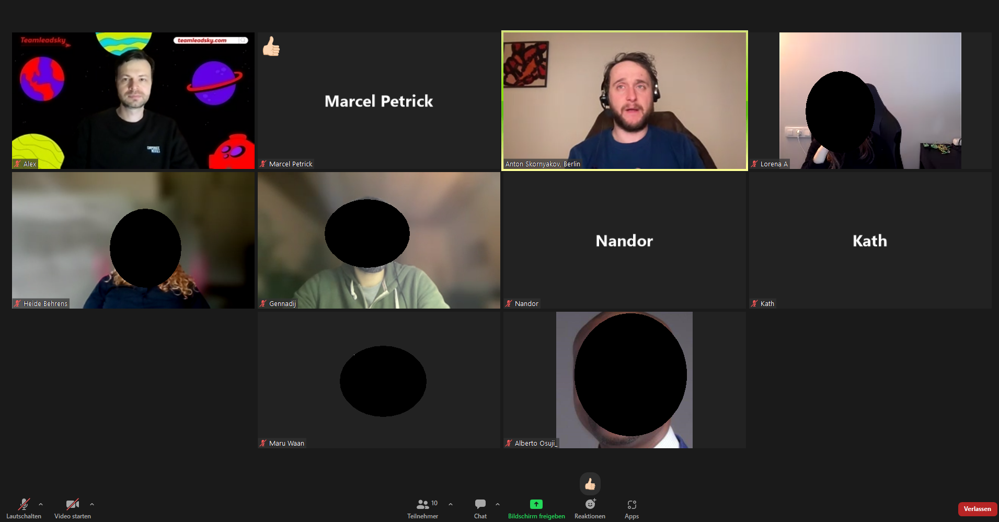
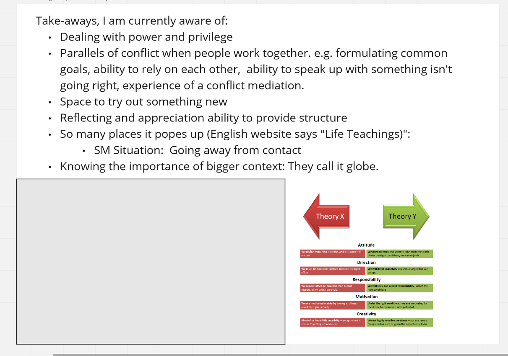
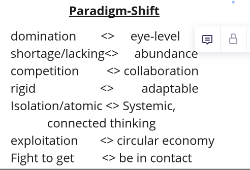
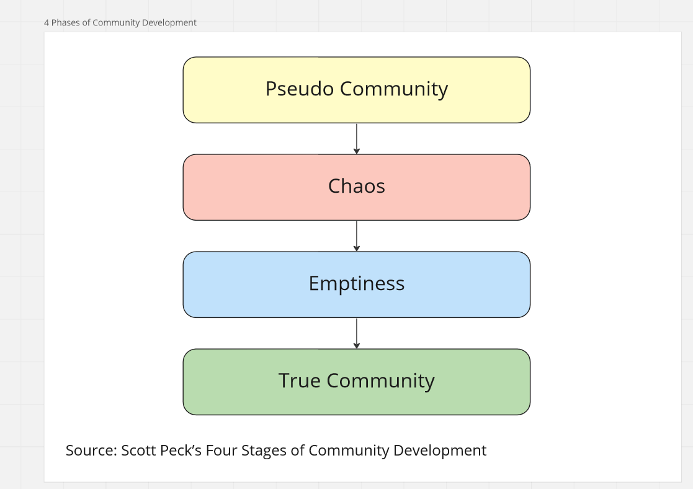

# 20230126 Agile Lessons from Intentional Communities ✨

* speaker: Anton Skornyakov 

* dealing with privileged power
* alternative forms to organize groups
* how to get along even with friction?

* there are always power differences and privileges
+ to learn about those differences is easier with intentional communities, instead of at work - because there the stakes are higher
* miro board for more information: https://miro.com/app/board/uXjVPtn4Ydg=/
* double the need for Product Owners than for Scrum Masters
  * even when you need just one PO per product, but more SM!
* theory X and theory Y: x - need direction; Y for "give it the right conditions, people want to work and will look for something whcih interests them"

* depending on the belief-system you have, you create structure
* management and organizational theory
* going from a culture where we try to dominate things to some "eye level culture", place to be
* exploitation vs. circular economy

* just a shift in the center of gravitas - does not mean you never have to fight
* [breakout sessions]
* 
## to check
* nonviolent communication
* process work - arnold mandel(?)
* the privilege walk
* .. better presentations with miro ..
