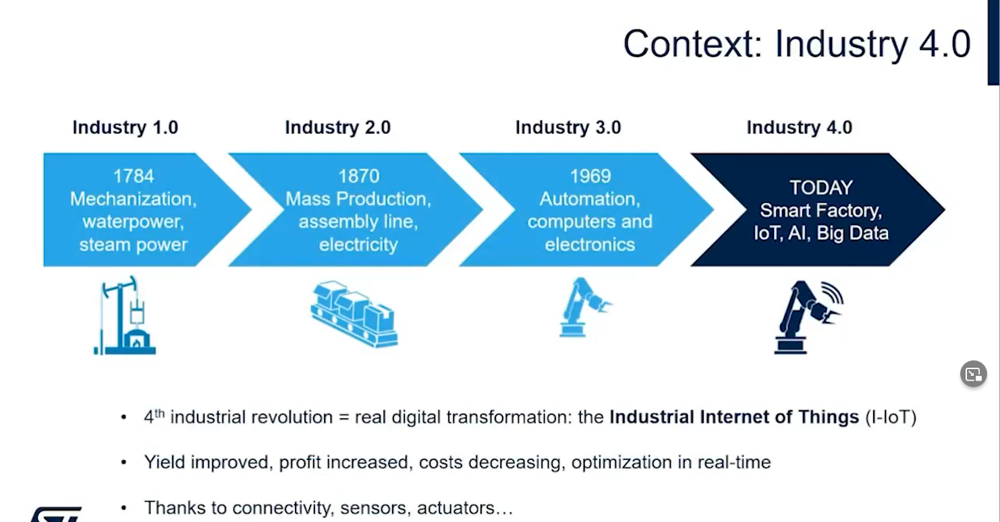
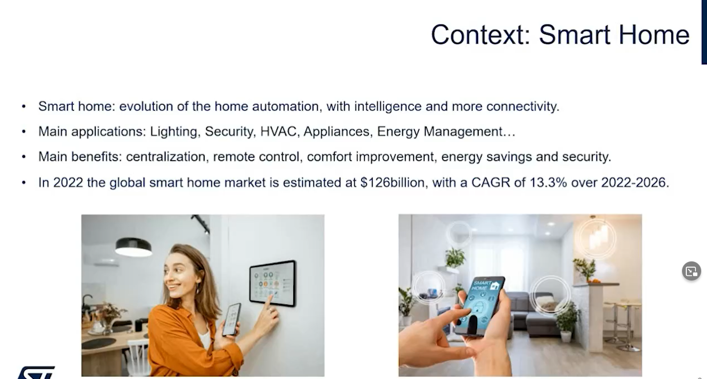

# 20230207: ST's webinar on NFC dynamic tags for simplified commissioning

* how to add new devices to an existing network?
* NFC for simplified commissioning

* two steps: configure the new device, then connection to the network
* usually pressing two buttons, waiting until a led is flashing ..
* users do not want to read catalgoues to connect a smart home device
* plan: keep the commissioning easy
* in industry: industry 4.0

* increase productivity, yield, reduce costs

* smart home and centralisation
* CAGR (compound annual growth rate) of 13% 2022-2026
* 

-------------

