# 20230223 - Why a large product backlog is pointless

## Intro from teh meetup-description
```
Product management is about getting the right things done. It is easy to come up with a list of things to add to make something better. It is much harder to decide which things to leave out to make something better. *"The things you own end up owning you." - Tyler Durden* The same logic applies to your Product Backlog. In this session Maarten Dalmyn will tell us, how do we prevent it from happening and what we could learn from Marie Kondo when it comes to tidying up our Product Backlog. Never heard about Marie Kondo? Her Marie Kondo Principle, also known as the KonMari Method, provides her followers with a model for making tidying up a fulfilling and meaningful task. **About our Speaker** Maarten Dalmijn has worked with many award-winning start-ups, scale-ups and corporations in various roles before taking the leap as an independent Product Management, Agile and Scrum consultant working with companies all over the globe. By blending the world of Product Management and Agile, Maarten helps teams to beat the Feature Factory and uncover better ways of delivering value together. **General Information** * We are happy to do this session in english. * We will start at 4pm * After Maartens Session there is time for Q&A * 
```

* why it is important to keep a short product backlog?
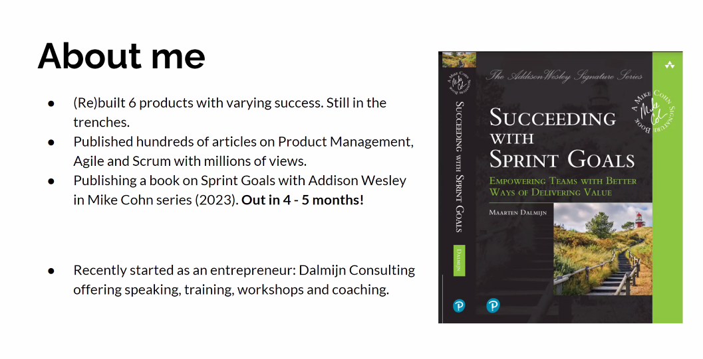
* Audience question: how would you describe scrum in a single sentence?
* `working with what you do know to discover what you don't know`- the host's honest opinion

* tickets spoil over time (like moldy bread)
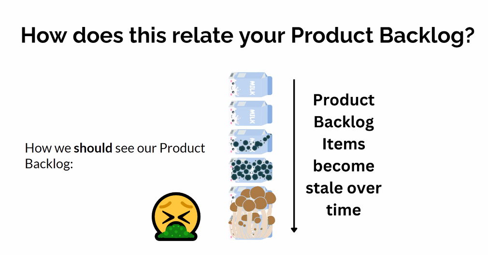
* just because we don't see the sprinkler water, does not mean it is not stale
* recently created tickets are fresh, because share the latest insights
* become stale over time, because company or product changes direction
* fixed as part of some other issue
* technical architecture has changed
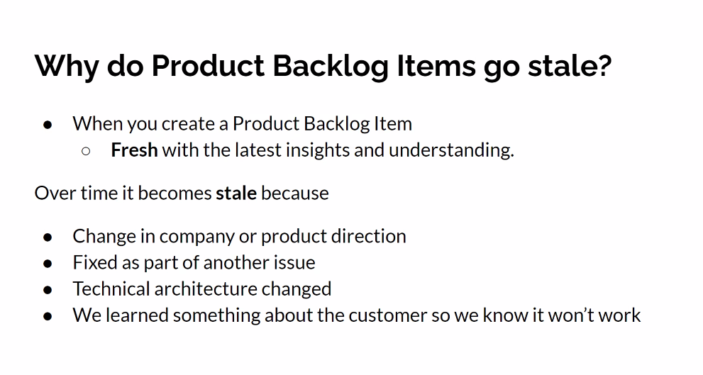 - really great slide
* the longer the backlog becomes, the more effort is needed to maintain it
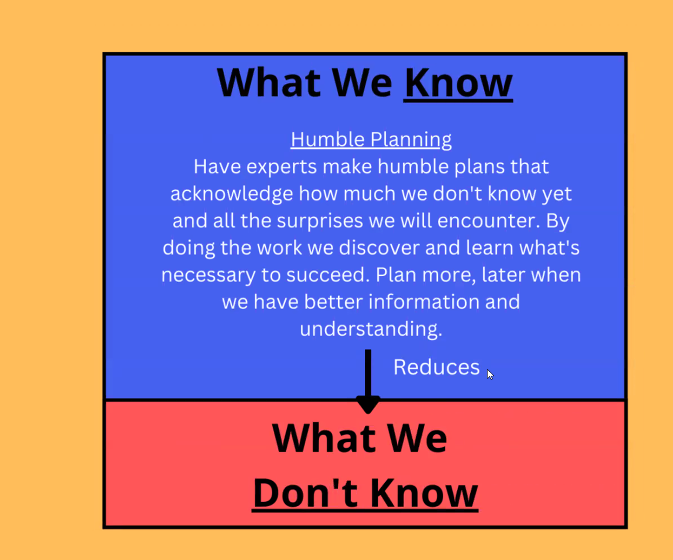
* complex work is not following some given path 

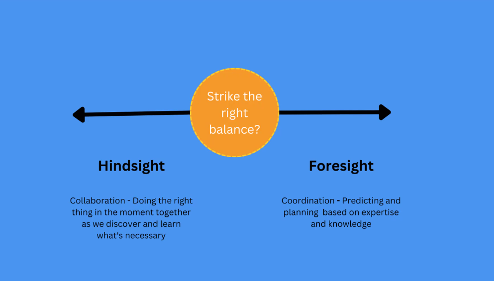
* hindsight versus foresight
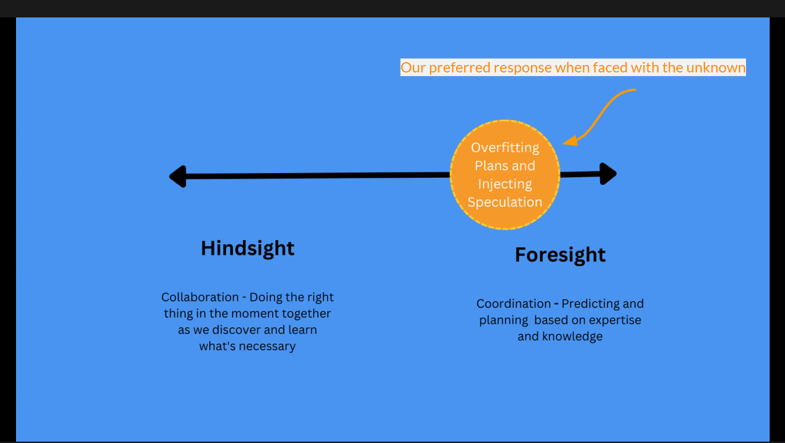
* typical behavior is "more planning" in case of uncertainty; but actually we should do more things
* you cannot rely on 9 months roadmaps
* key takeaway: humble planning
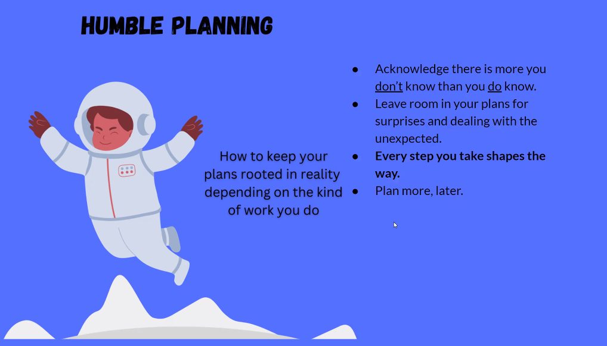
* every step you take should shape the way
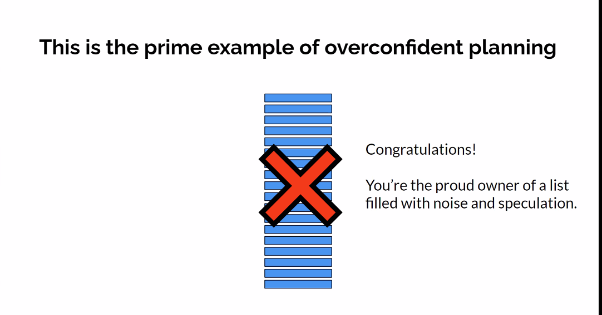
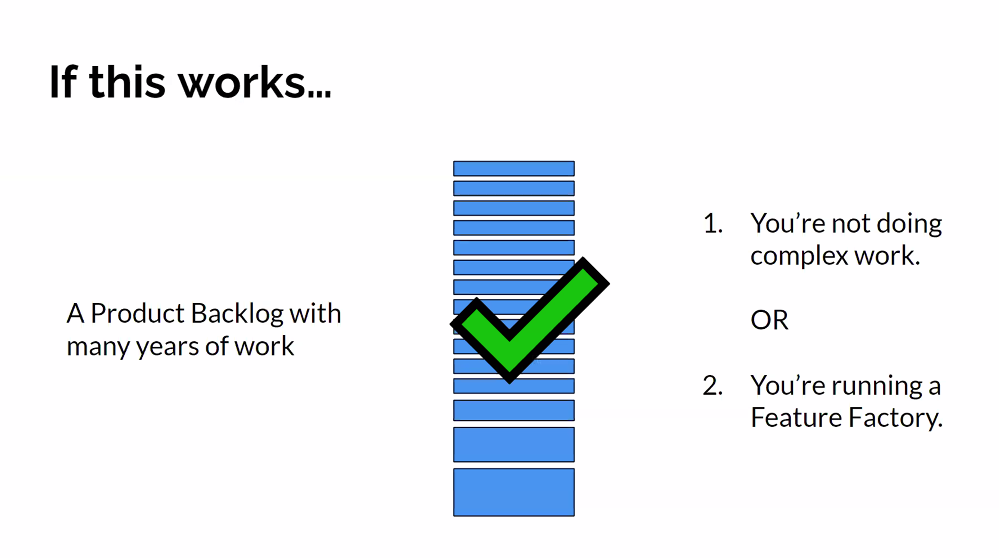
* either you have a feature-factory or are in a late stage of the development
* he removed all tickets with no activity in the past three months: because he did not make any commitment
  * because they were noise

* don't feel obliged to honor commitments
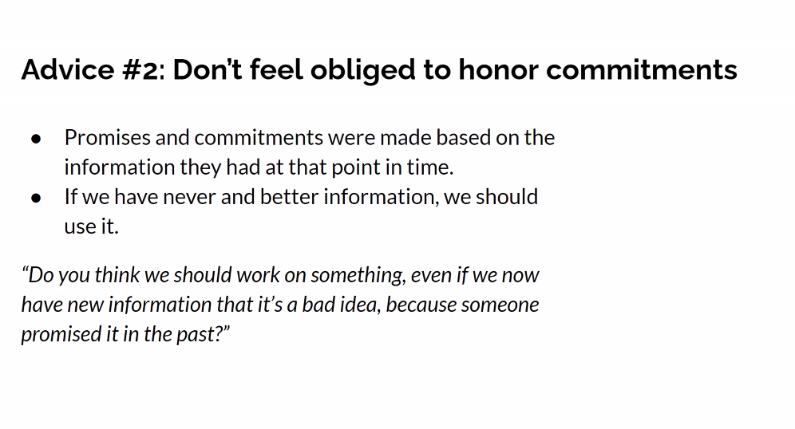
* even when things are written into a contract, it can be changed and negotiated
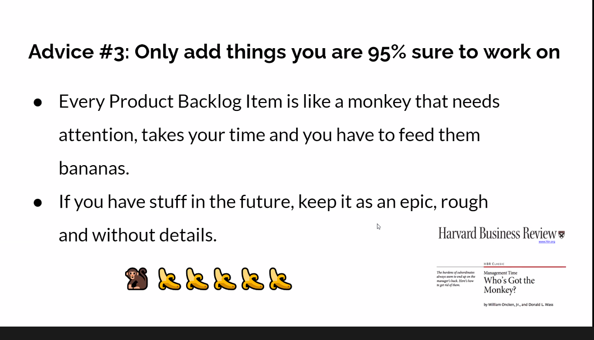
* another reason why we have big backlogs: too much focus on the features and delivery
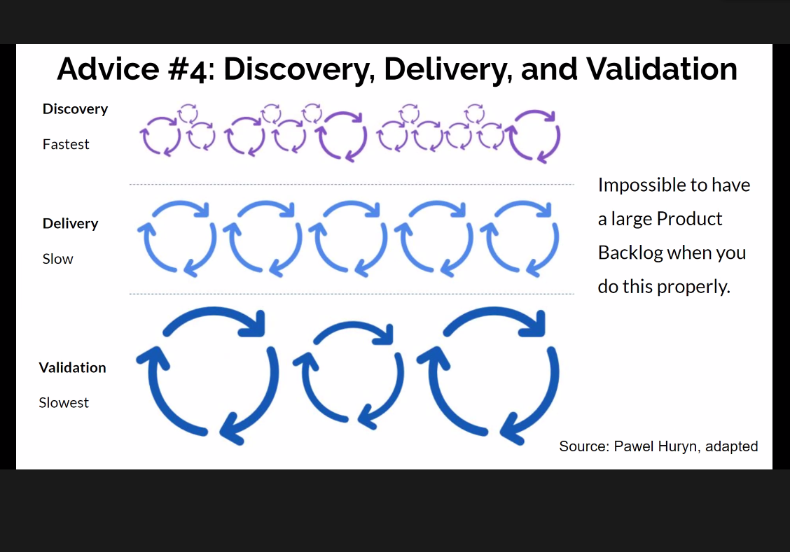
  * building is slow and expensive; validation even more expensive
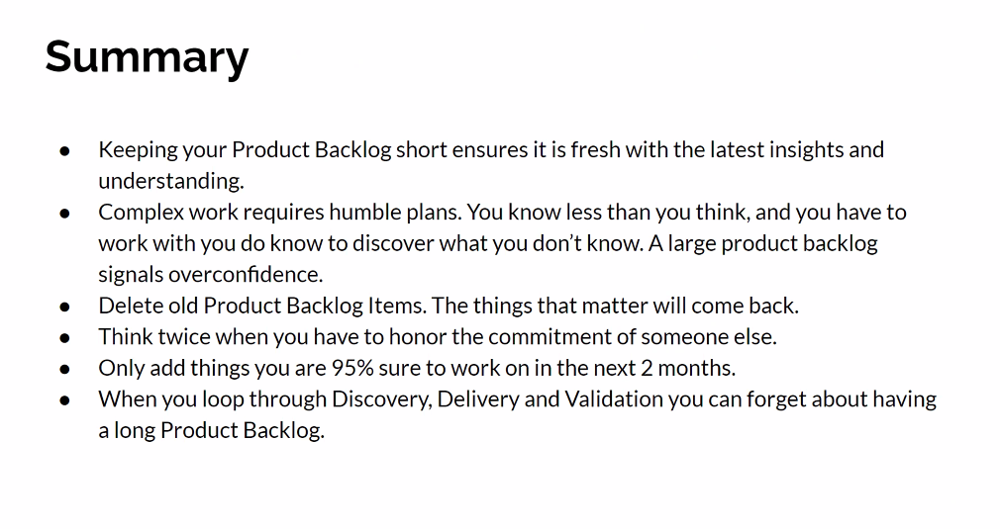

-----
### Discussions
+ What is the best timeframe got the backlog(3 month?)
* they should have enough work for the current sprint and the next sprint, but not more than that
* the later you can do it, the more waste you add
* as short as possible

* so also the dependencies like UX-design, etc. have to be incorporated
