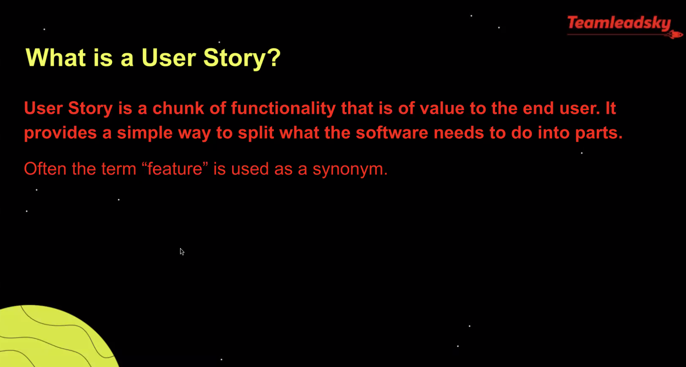
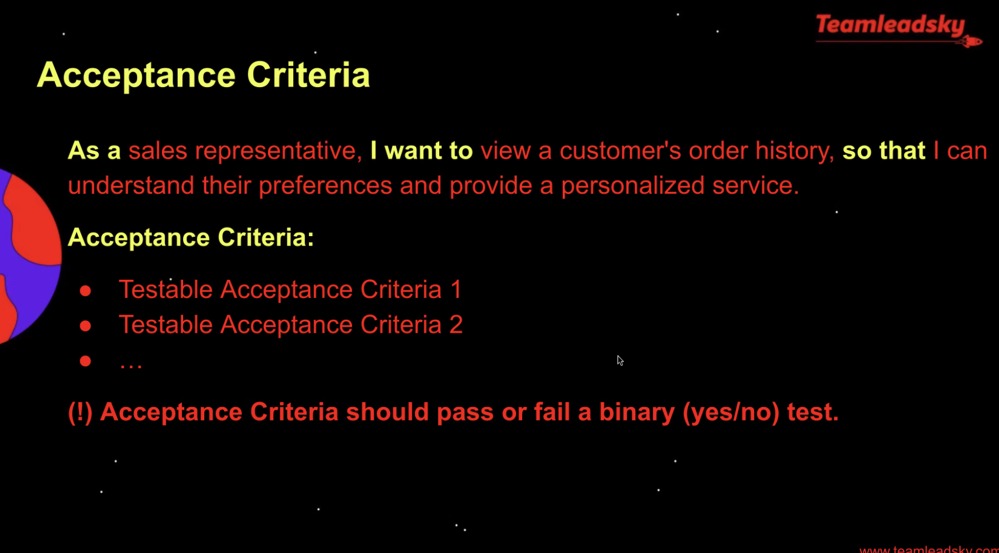
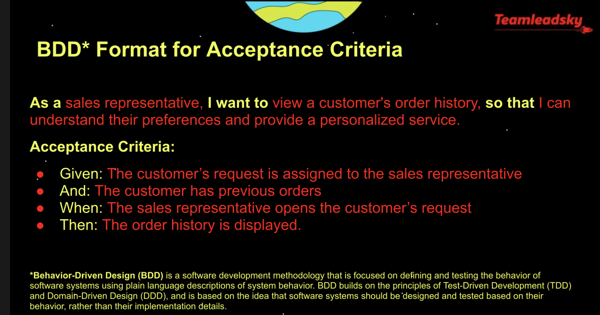
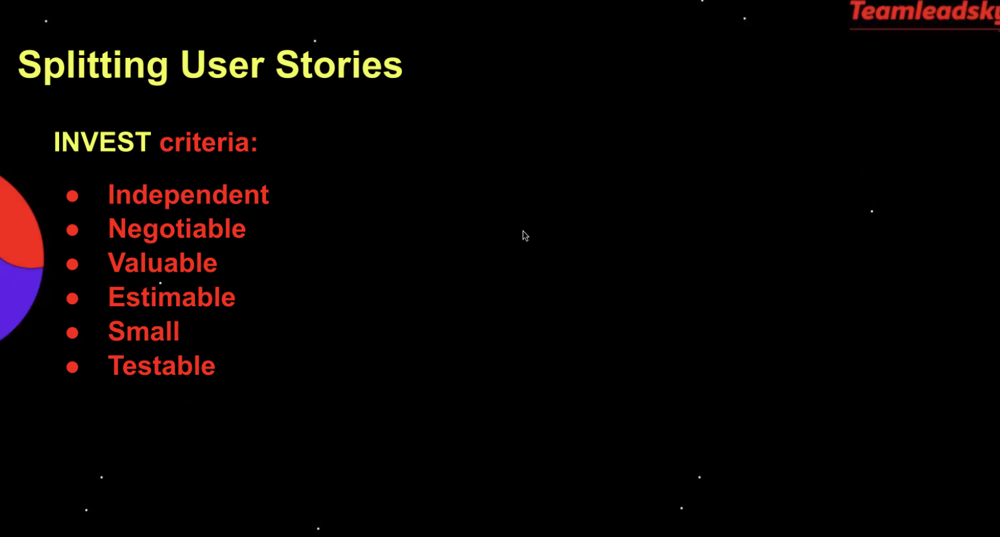
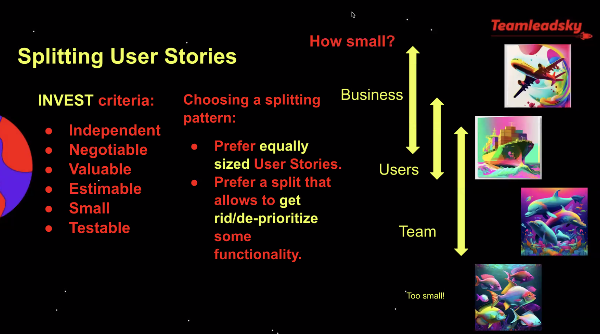

# 20230306 Agile 201 - User Stories

```User Stories are a usual technique for communicating requirements to the development teams. They are also used for planning and prioritization purposes. User Stories are easy to understand, however writing good stories may be challenging.

Let's recap on the fundamentals such as different formats and splitting patterns, and discuss different challenges and opinions Lean Coffee style.

---
Teamleadsky Agile 201 - Discuss Agile concepts in simple terms with other practitioners. Recap, share knowledge, get advice.
```

* Lean Coffee miro board: https://miro.com/app/board/uXjVPnyOtM8=/?share_link_id=180853301459




How to split?


* something like the perfect user-story are nothing which exists - just a tool for communication with stakeholders

