# 20230321 How to Use ChatGPT and AI to Become a Better Programmer

* Tiff Janzen - @tiffintech
```
🚀 ChatGPT and other AI tools are here to stay!

In this webinar, Tiff will cover how to embrace these tools to help you become a better programmer.
Learning how to best use ChatGPT and other AI tools for coding, debugging, and continuous learning is now essential to succeeding as a developer.
```
* hosted by IronHack

* alterantive to cpgt: github co-pilot
* can help to dtect flaws in yoru code, highlight it
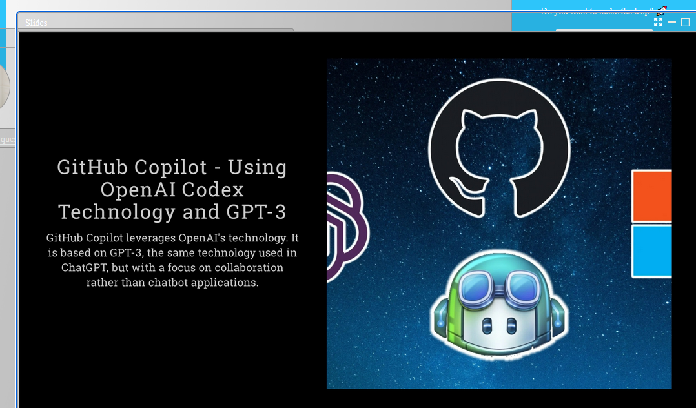
* tabnine - another tool (TODO: check this)
* help to complete quickly coding tasks
* get random-forest model
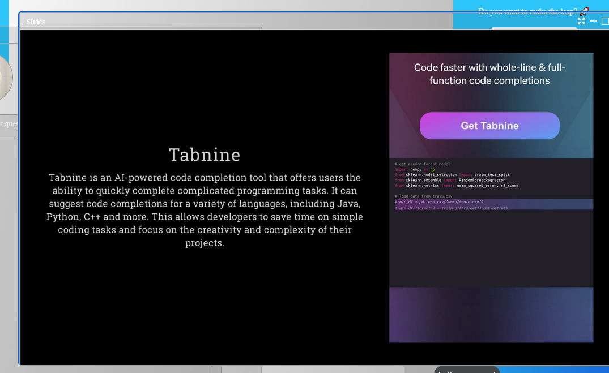
* try out cpgt4 ..
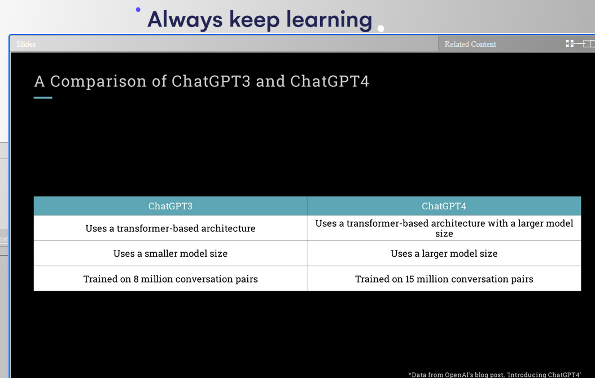
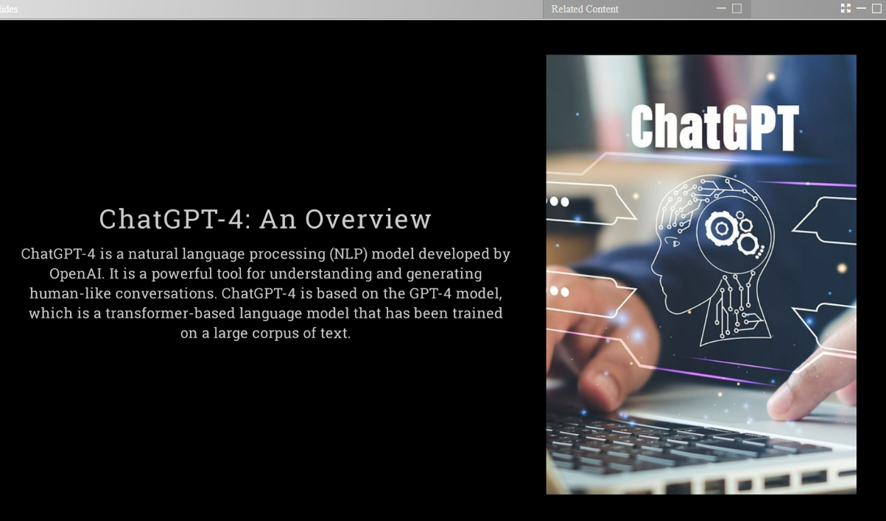
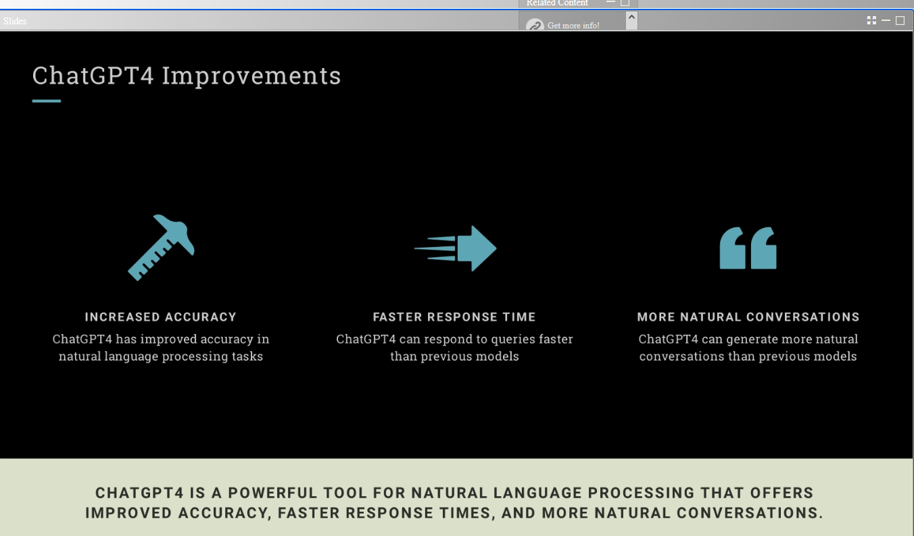
* cgpt had alsways a lag in response, also needed sometimes several hints to get to the correct answer
* with cgpt this changed drastically
## how not to use it ..
* "bad code can be cleaned zp, but it is very expensive." robert c. martin
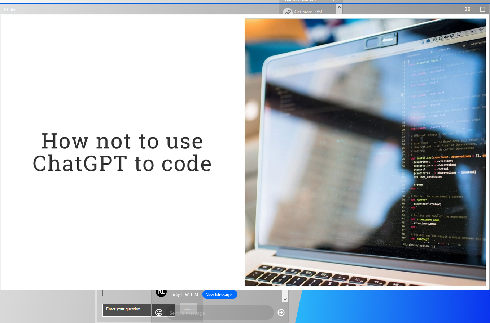
* backtracking and clarifying existing bad code is expensive in time and money, should be avoided
* don't rely on it to learn to code
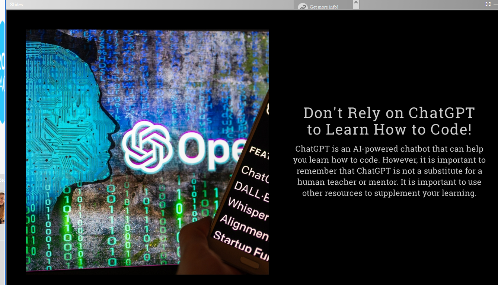
+ don't build code whiche needs lots of context
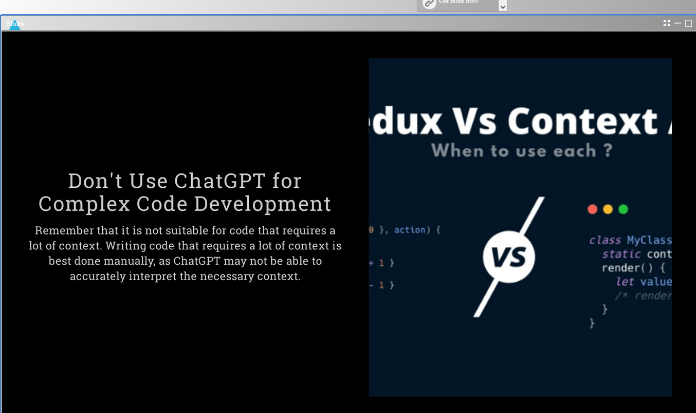
* code needs to be readible for other developers
* take the error message, also add 2-3 lines of code to cgpt, then the result should give you some insight: but you can also infleucne it by "eplain it to me like i am a child" or "like i mam a software engineer" (haha)
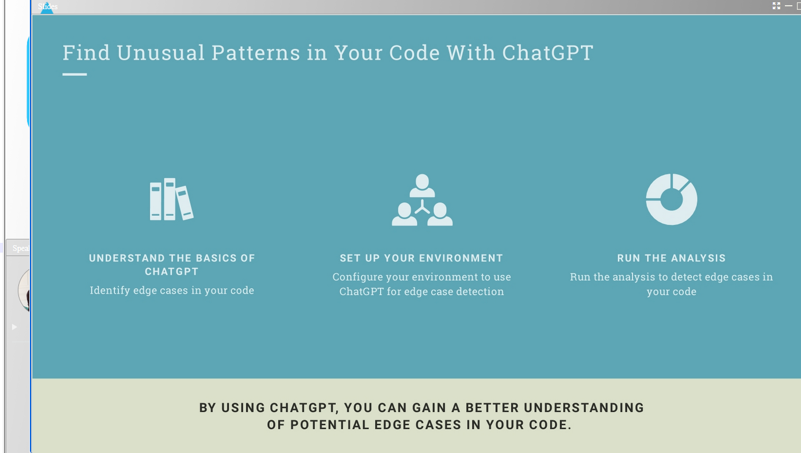
* find unusual patterns in your code
* use it for architectural and infrastructure options
  * provide ideas for infrastructure changes
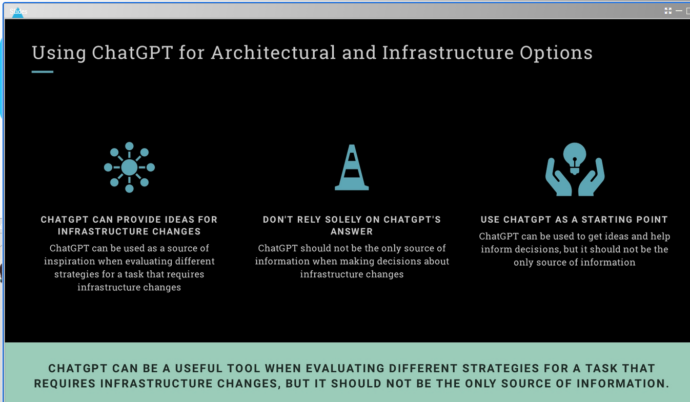
* example: someone use cgpt to find vulnerabilities in their solana contract
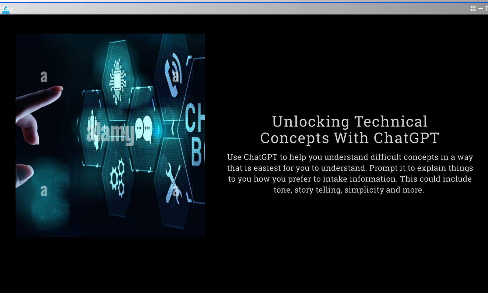
* use it to explain technical concepts to you: for instanec quantum computing ..
  * "with a story like for a child" - this is quite memorable
  * easier than googling and going down that path
* chat prompts for developers:
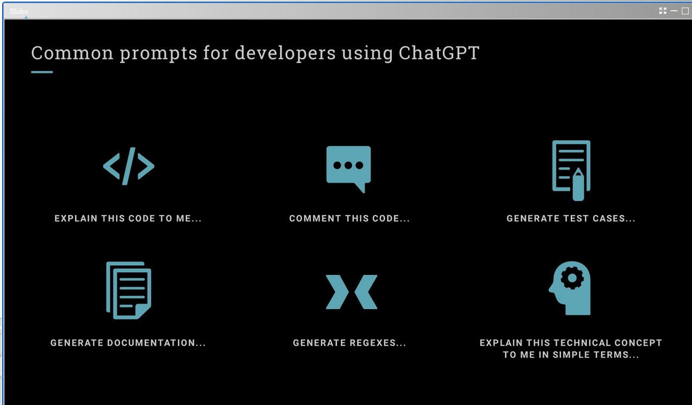
* comment this code
* generate test cases
* explain this code to me
* generate documentation
* generate regexes
* explain tzhis technical concept to me in simple terms

## Is AI going to take over developer jobs?
* Tiff has no crystal ball
* programming still needs exercise and reflection
* just relying on the output of a tool won't allow you to grow

* chatpgpt should just be used in the company with permission from manager! (concerns commercial businesses); for freelancing it should be allowed
* 
