# 20230324 Meeting the Challenge of OTA for Embedded Linux Systems

* hosted by Doulos & Toradex

## requirements for an OTA system
* security & integrity
* integration
* usability
* fault tolerance and recovery
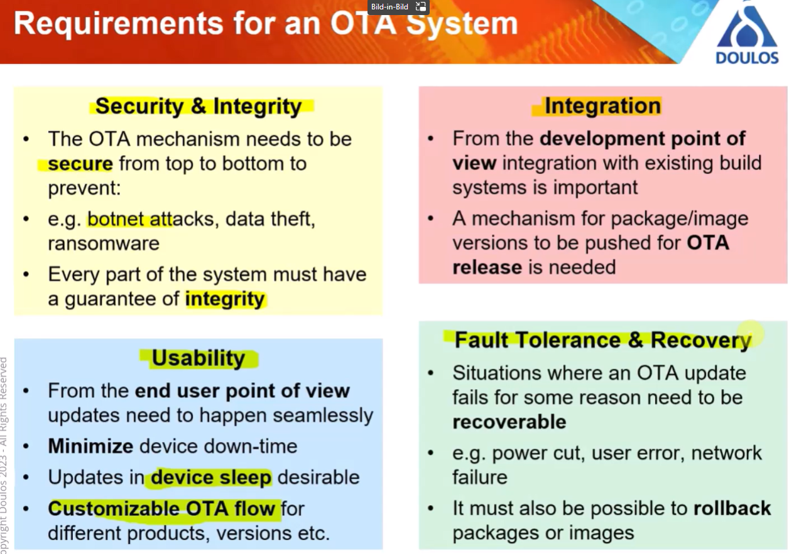

## mechanisms
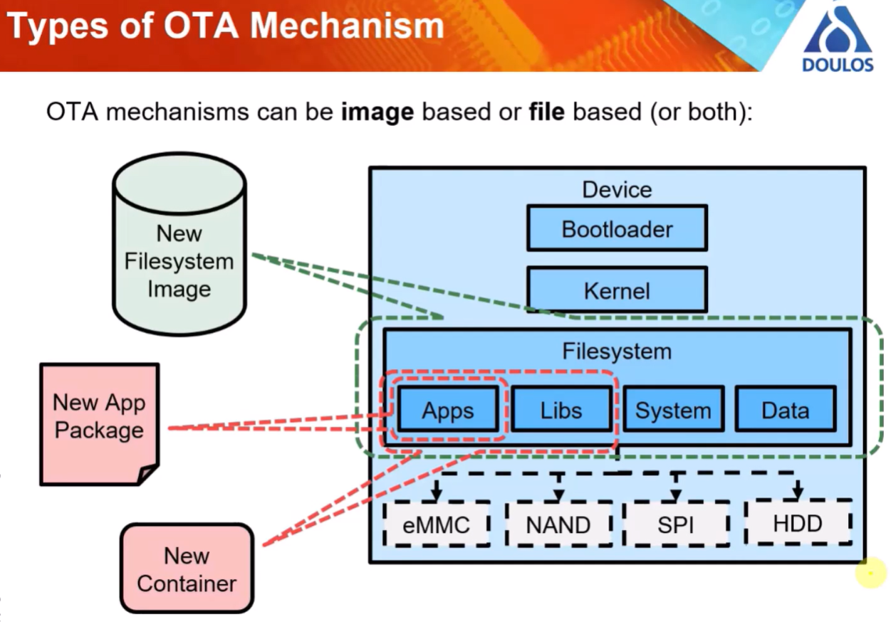
* image based
  * block based - update all the blocks in the current partition - just treat as set of data which has to be written into the device
* file based
  * new app packages or new containers (rather than using single files, the stuff for each particular use case is put into a restricted environment)

## challenges
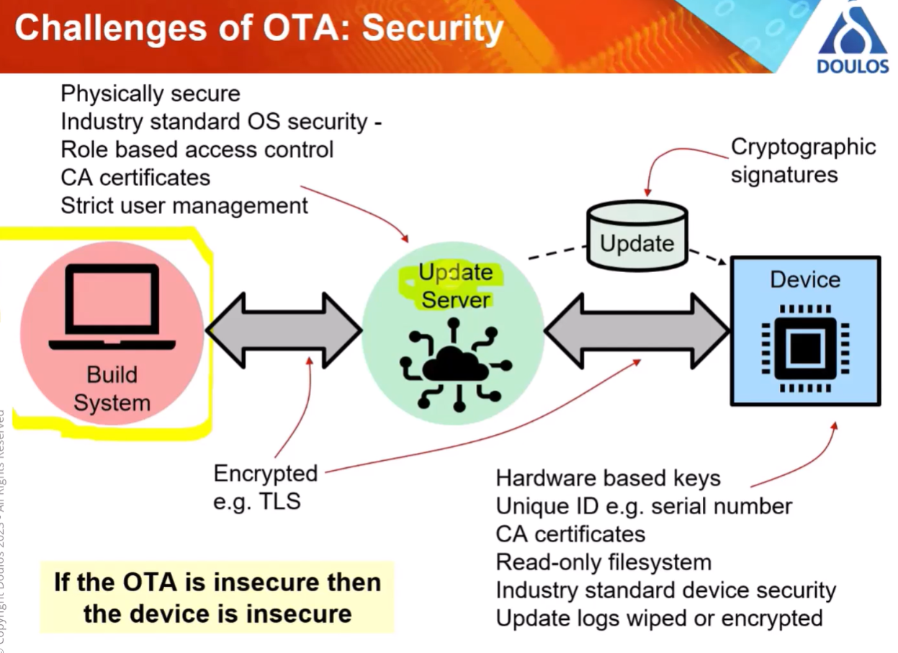
* fualt recovery: per package or per container
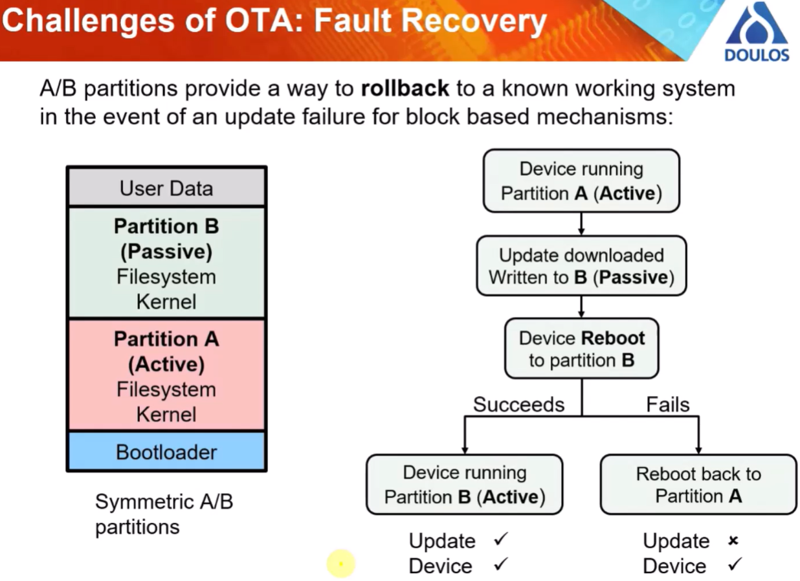
* partition approach
* or like early android-devices: with an recovery partition
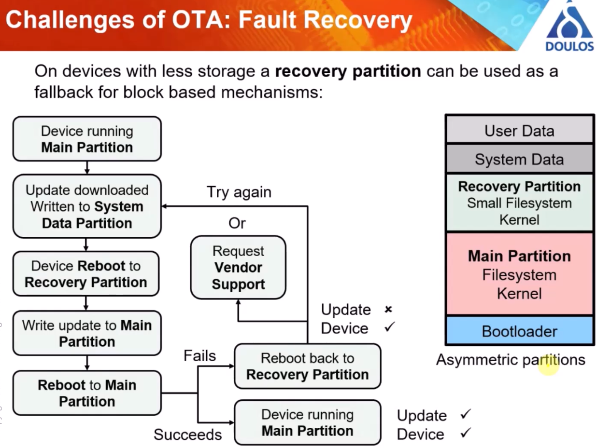

## differnt ones: RAUC, mender, SWUpdate, swupd, OSTRee
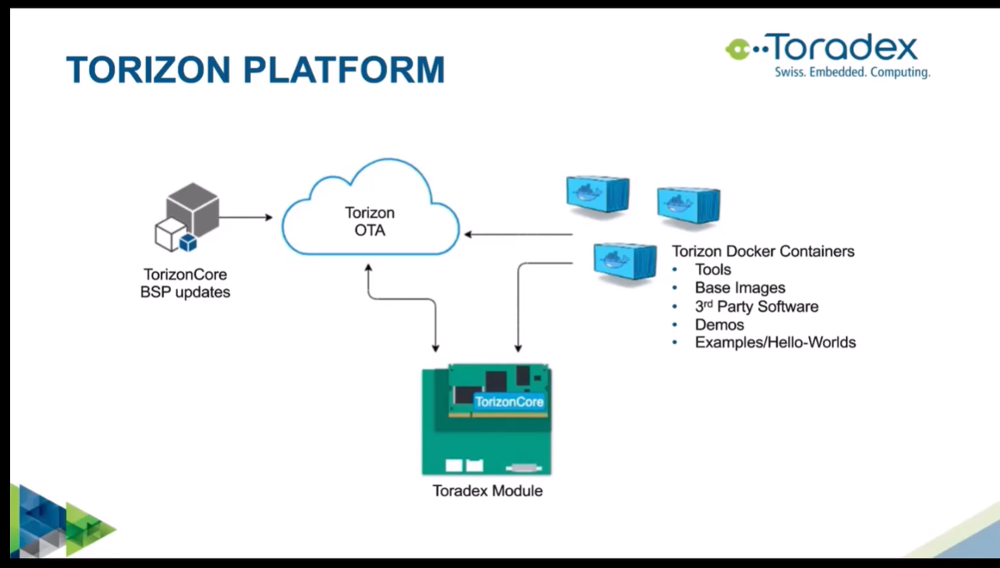

## Toradex part
* torizon Core can be used on several platforms
* Torizon Docker containers
* running on a Toradex module (or something else)
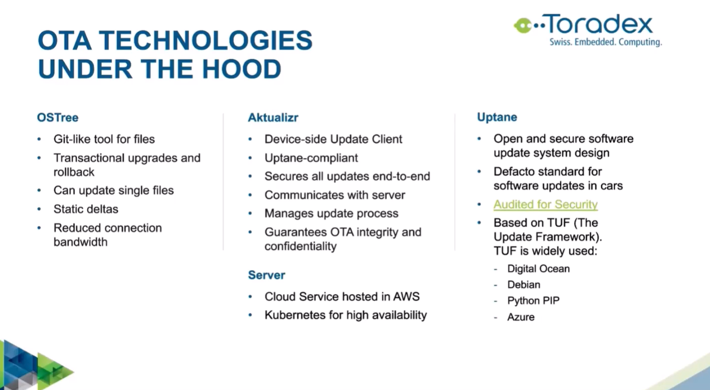
* runtime daemon as update client
* functionality is part of the OTA system; has special requirements for power-down
* based on TUF - the update framework
### security
* mutual TLS device <-> server, OAuth2 for API access
* uptane
* what can be updated: apps, kernel, but not bootloader right now (should come with future release)
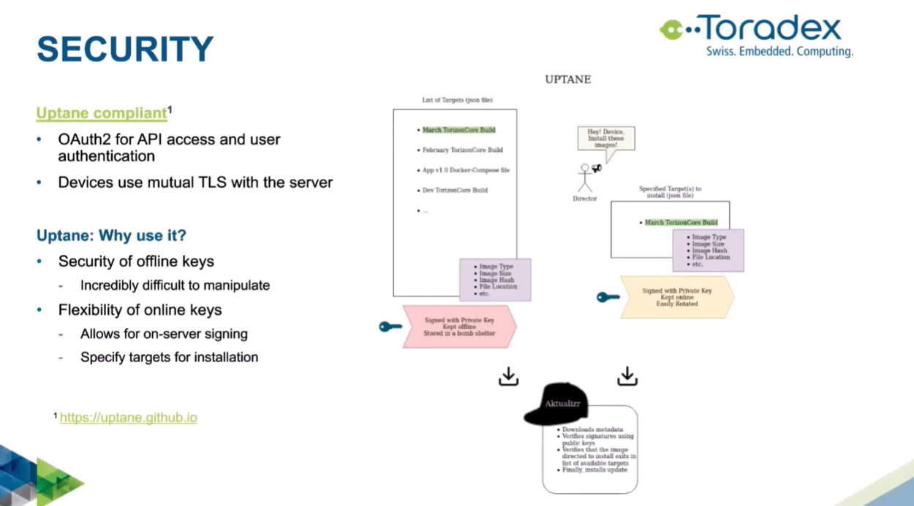
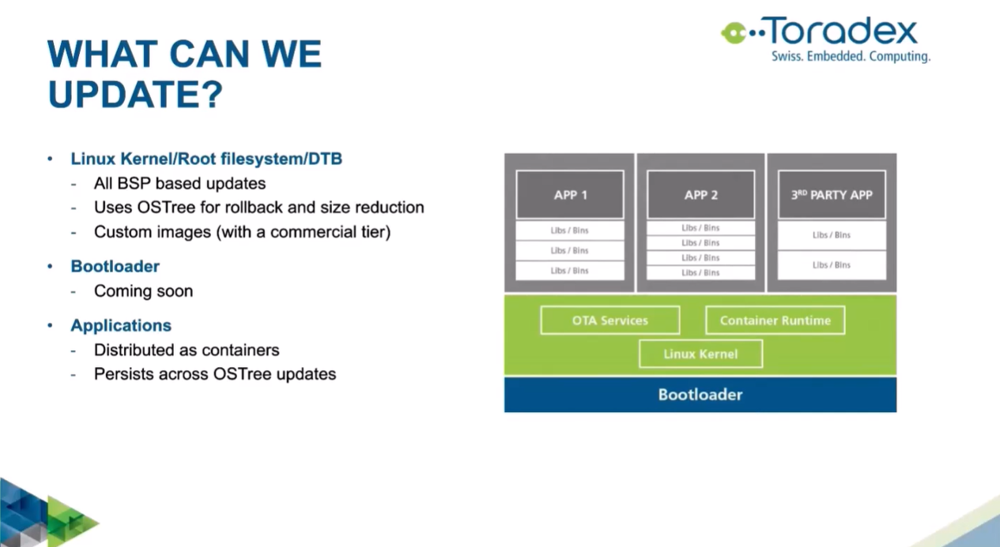
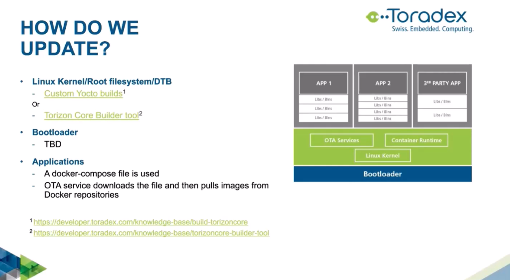
* global lockfile - which can be controlled by app to tell the updater to wait; right now an all-or-nothing-approach
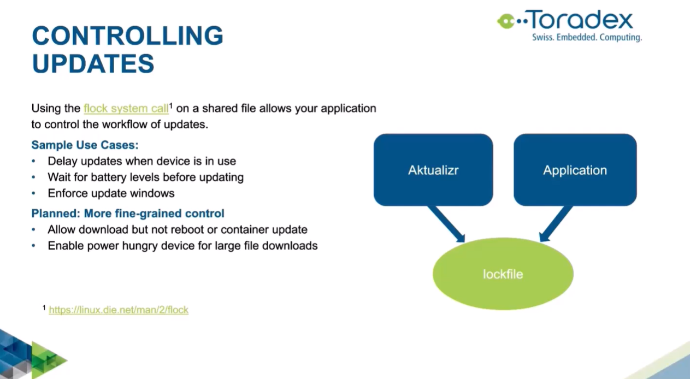
### Torizon platform
* devices, packages, fleets
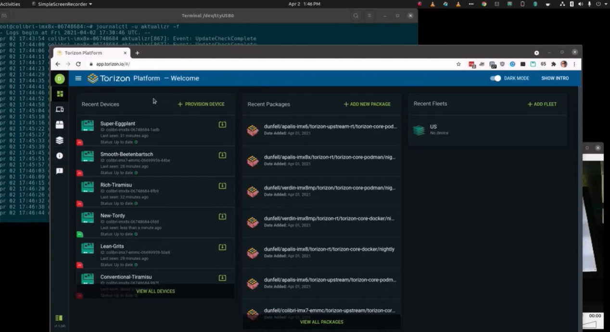
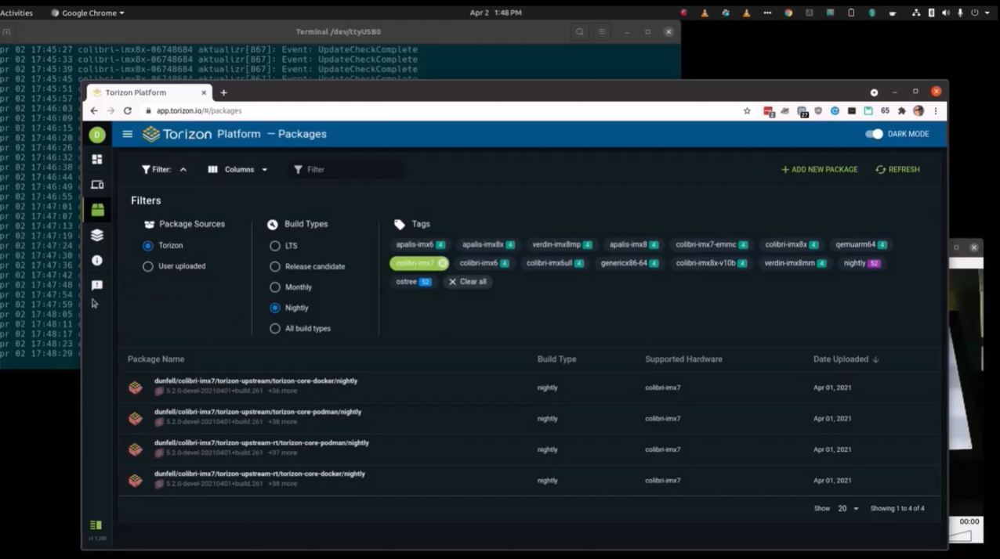
* refresh rate on the device was set to 5s -> works after reboot
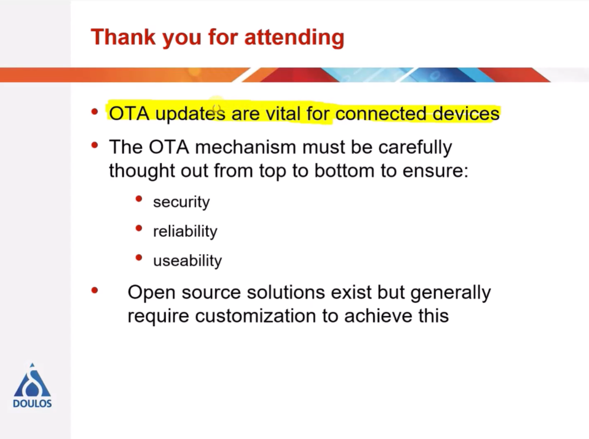
