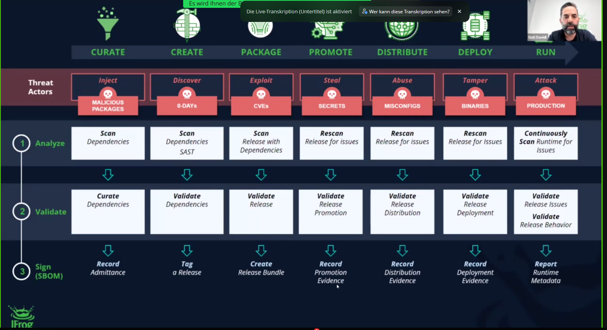

# JFrog Evaluate CVEs

* note: missing the first 15 min - but a recording will be provided

## re-evaluation of CVEs with their exploitability

## dealing with over-inflated CVSS?
* CNA's CVSS should be regarded with higher trust

* major linux distros provide their own severity score
* Red Hat for instance has a dedicated security team, so JFrog trusts their opinion more
* "jfrog security research report 2023" - TODO read this

## How can JFrog help?
* they analyze in anyp phase, validate and sign (tag) in order to prevent manipulation
* checks on soruce and binary-level: because binary is more than just source
* results are presented in a very easy manner
* scanner will automatically determine combinations which prevent exploitation of a vulnerability
* contextual analyzer in advanced packages
* JFrog scanned the Top100-docker-containers

