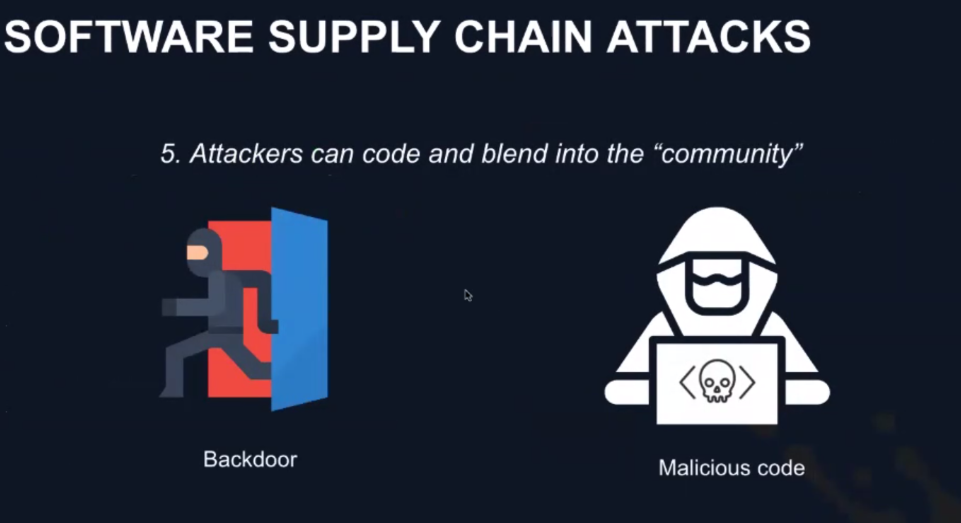
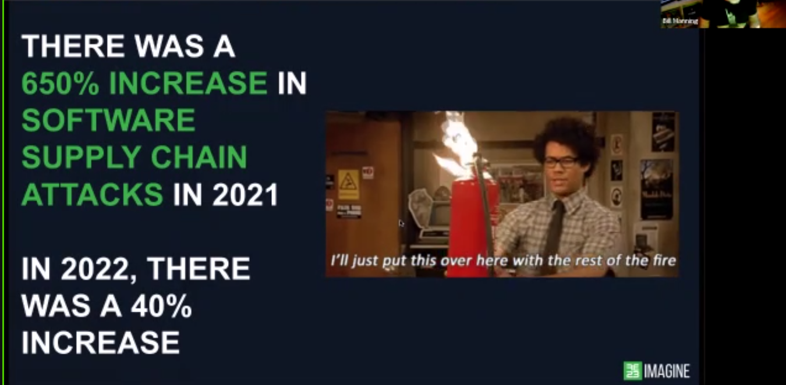
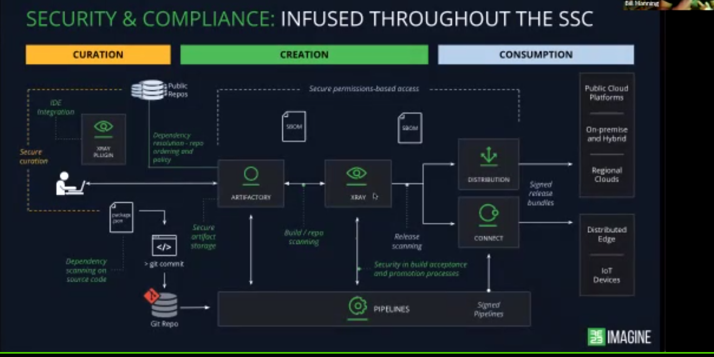

# 20230405 How to Spend Less Time Fixing CVEs

TODO: add theimages
TODO: add references for the first 9 ones

* Bill Manning host
* typical development: got a KPI to implement, asses the task, choose language, put packages and dependencies in
* * host to make sure that you don't pull via pip, npm, .. something in, which is wrong?
* * using not-tested packages is like plugging a usb-stick from parking ground to your production server
*  what about processes and what about zero-days?
*  95% of application used at least one open soruce component that was out of date by four or more years (or even abandoned)
*  what is the health of the open-source project?
  * software supply chain attacks need not much effort and skill
  *  spreads rapidly
  *  abuse trust relationships between companies

* SSC - software supply chain
* if you don't store your builds in some artifactory, then you will have a problem. because you can't tell how and who else will be affected by this

