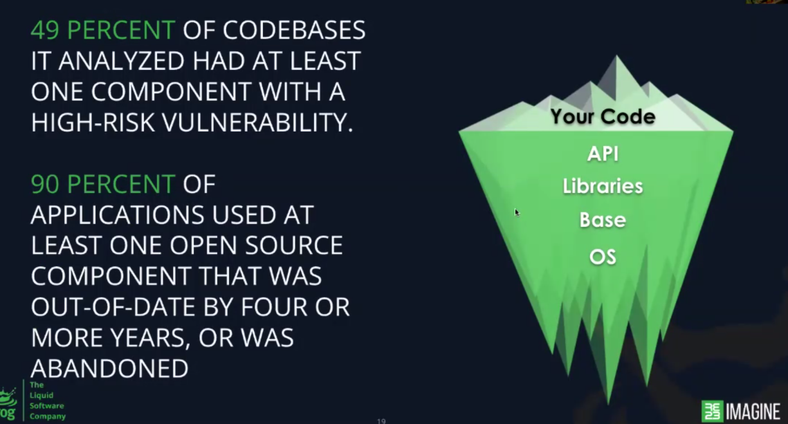

# 20230405 How to Spend Less Time Fixing CVEs
* Bill Manning is hosting and sharing his experiences
* typical development: got a KPI to implement, asses the task, choose language, put packages and dependencies in

* host to make sure that you don't pull via pip, npm, .. something in, which is wrong?
* using not-tested packages is like plugging a usb-stick from parking ground to your production server

*  what about processes and what about zero-days?
*  95% of application used at least one open soruce component that was out of date by four or more years (or even abandoned)
*  what is the health of the open-source project?
  * software supply chain attacks need not much effort and skill
  *  spreads rapidly
  *  abuse trust relationships between companies

* SSC - software supply chain
* if you don't store your builds in some artifactory, then you will have a problem. because you can't tell how and who else will be affected by this

## SBOM - software bill of materials

* docker containers contain also most of the time some nice passwords or other credentials, most of the time via the root history, ..
* JFrog XRay can prevent this
* sniffer onto the docker; it was starting a service in the background, which was sending the logfiles somewhere else - this is terryfing. because you have no control over this

## demo
* when you design your repositories: analyse xray-analysis, adjust watches and policies..
