# 20230412 Which kernel for your Embedded Linux project?
* hosted by Doulos

## topics
* embedded linux choices
* factors to consider
* updating the kernel
* kernel.org kernels
* other kernels

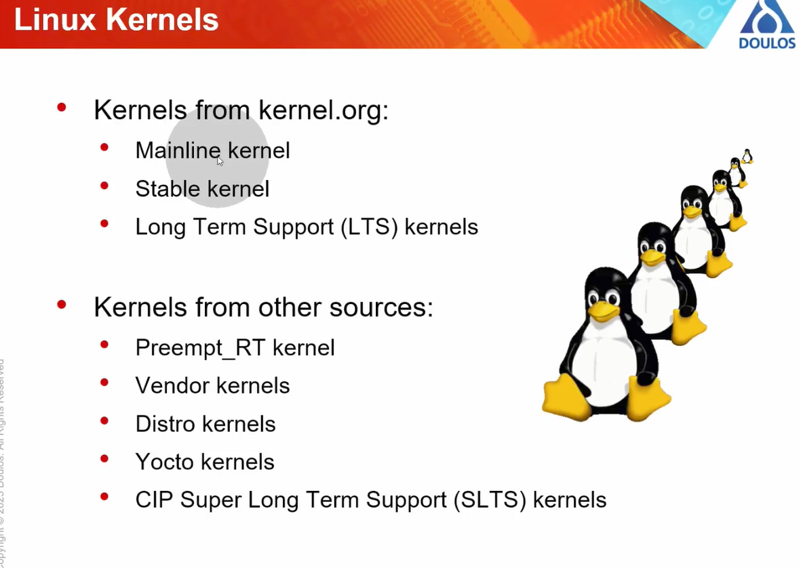

* process of making choices: so many choices ..
* system from an architecture PoV

## factors to consider

* what is the excpected life span of your product
* will the device be updated and maintained "in the field"?
* will you be mainlining your code? will the custom-made code be submitted to the kernel-maintenance-teams to be released on kernel.org? an organisation-level choice
  * will be available to all users (pro); con: getting code accepted can be time consumin and difficult

* updating your kernel version

* can break out of tree code
  * system call interface is stable between kernel versions
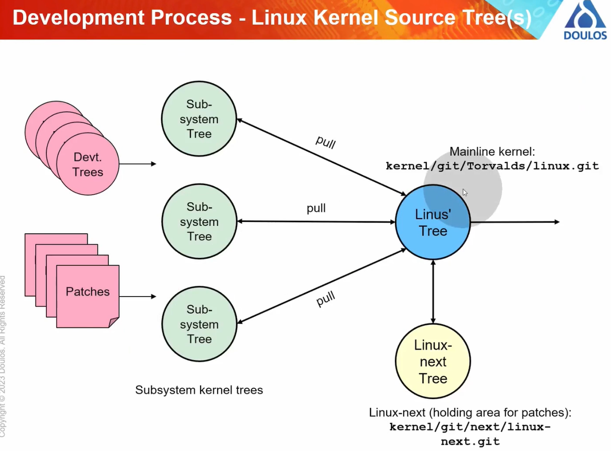  
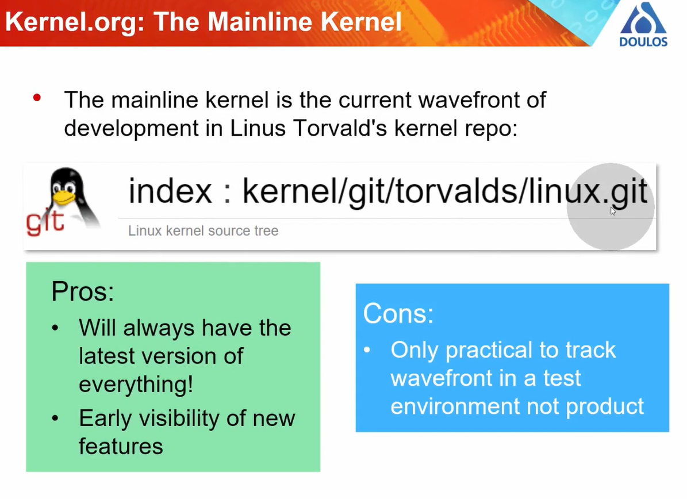  
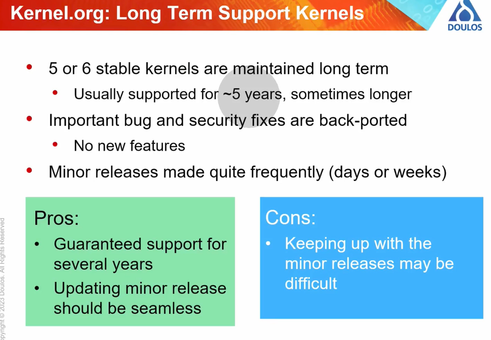  
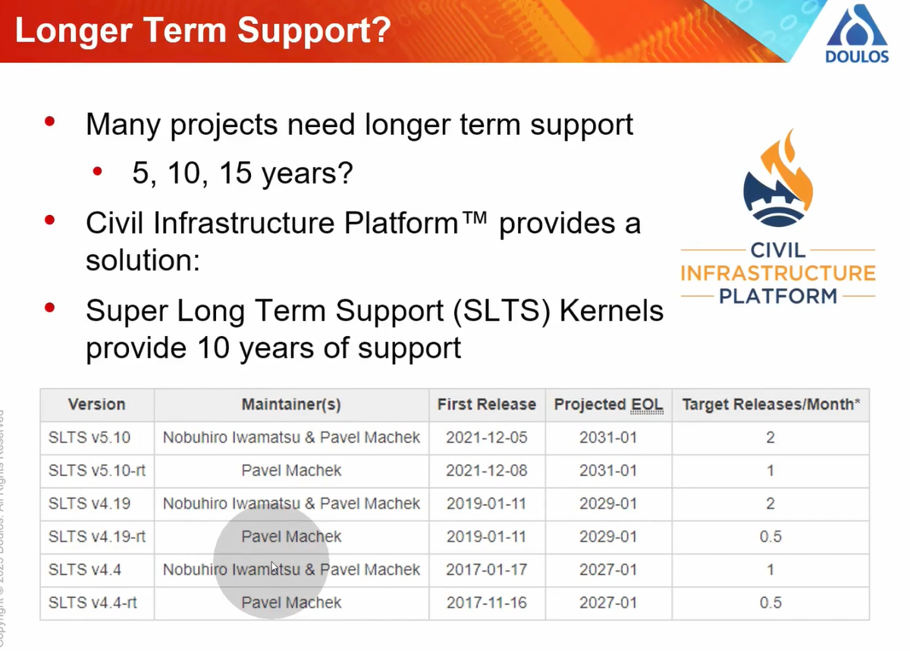  
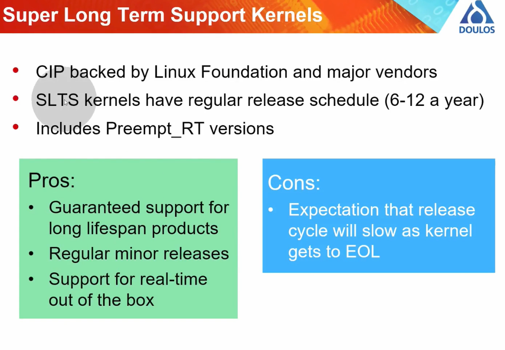  
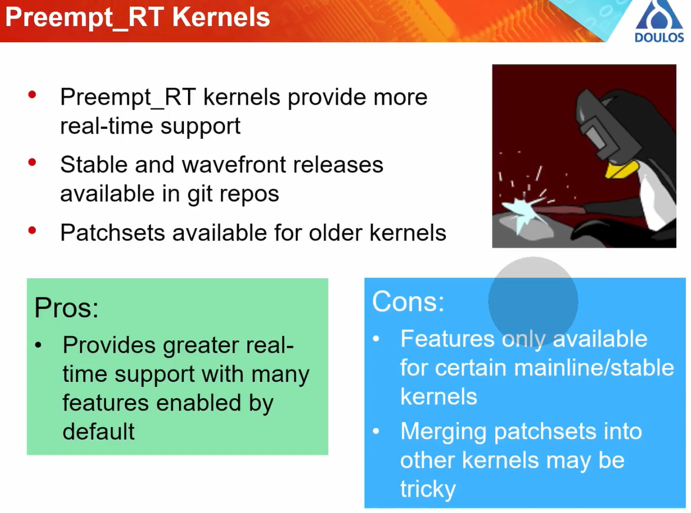  
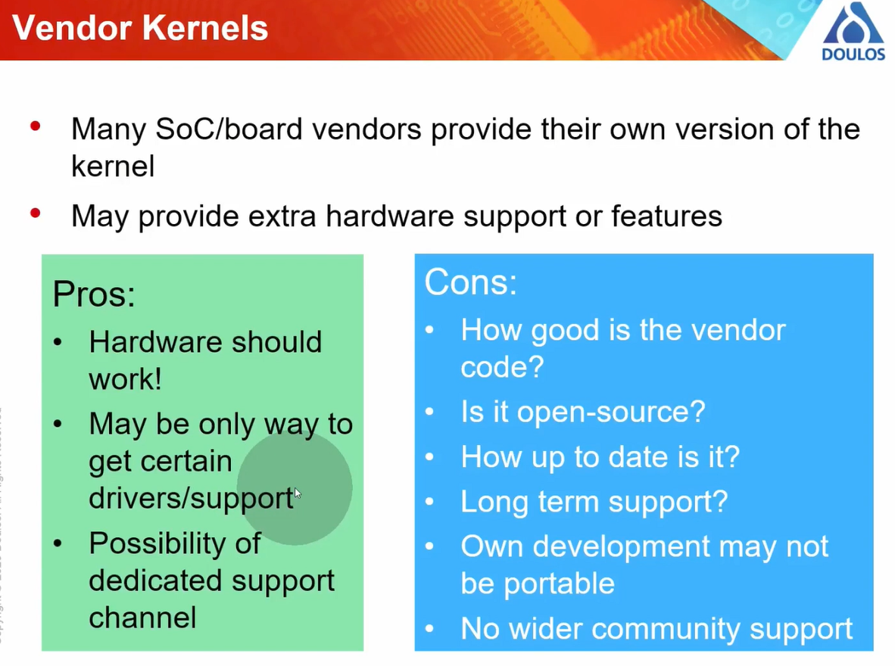  
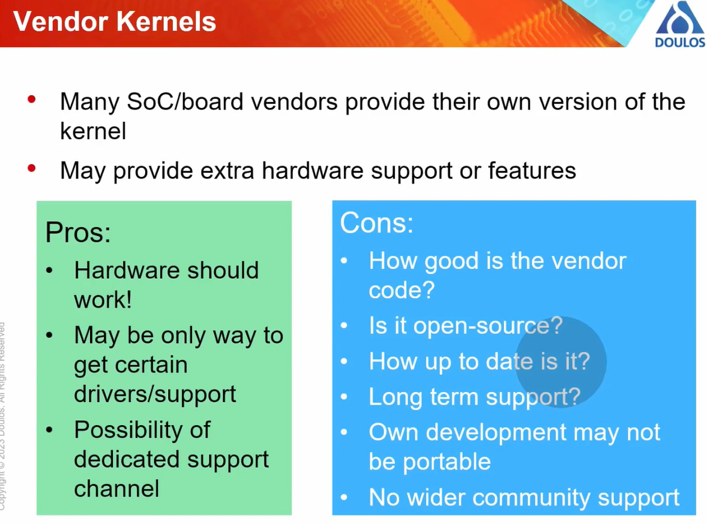  
## distro kernels
* installing a complete distro image is a quick and easy way to get a working system
* con: lack of flexibility
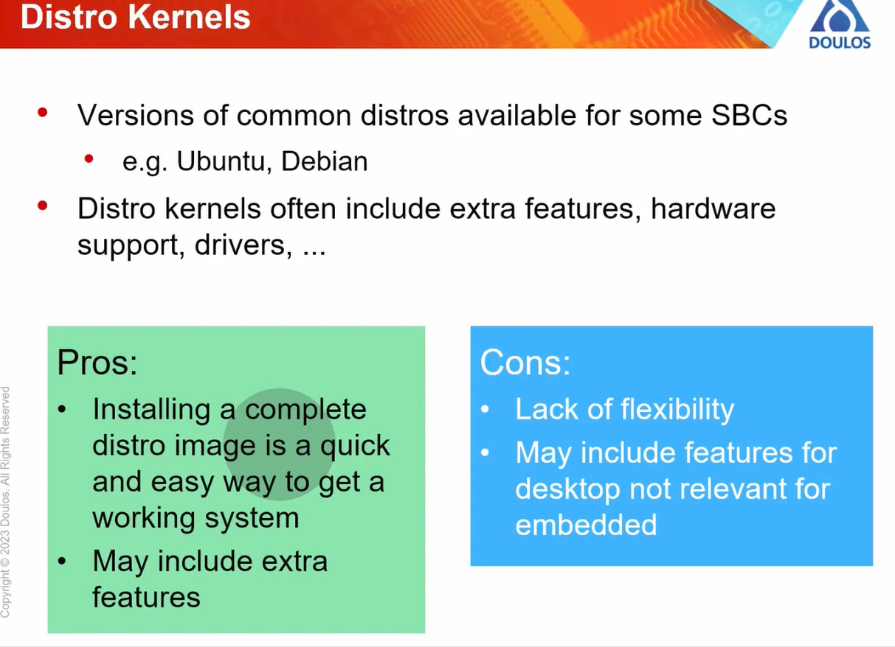  
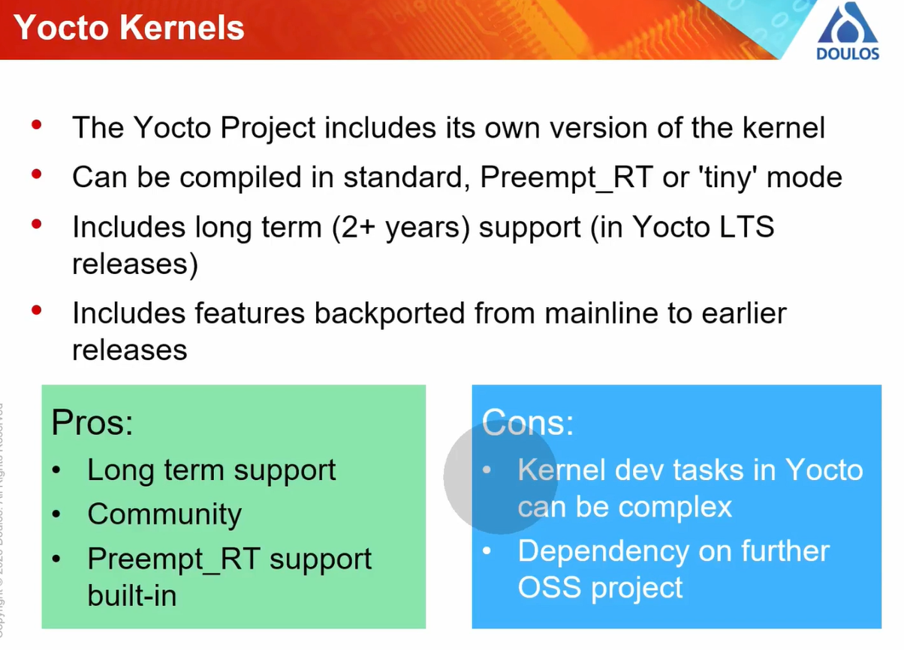  
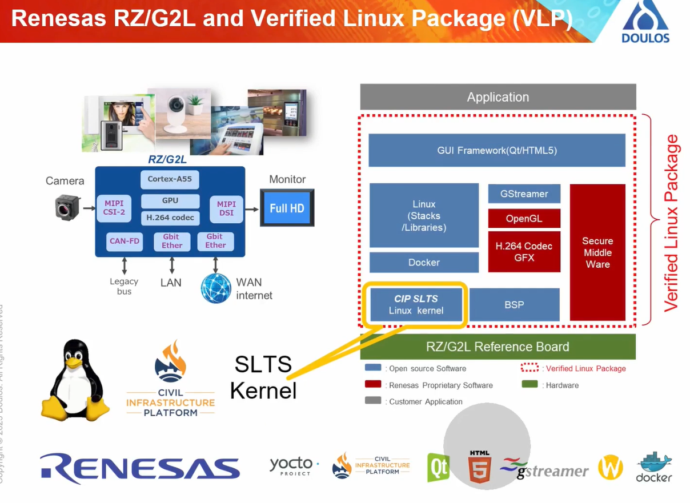  
## final question: qhi9ch is the right kernel for your project?
* out of tree kernel code?
* field updates possible?
* product lifespan?
* vendor only kernel features?
* real-time requirements?
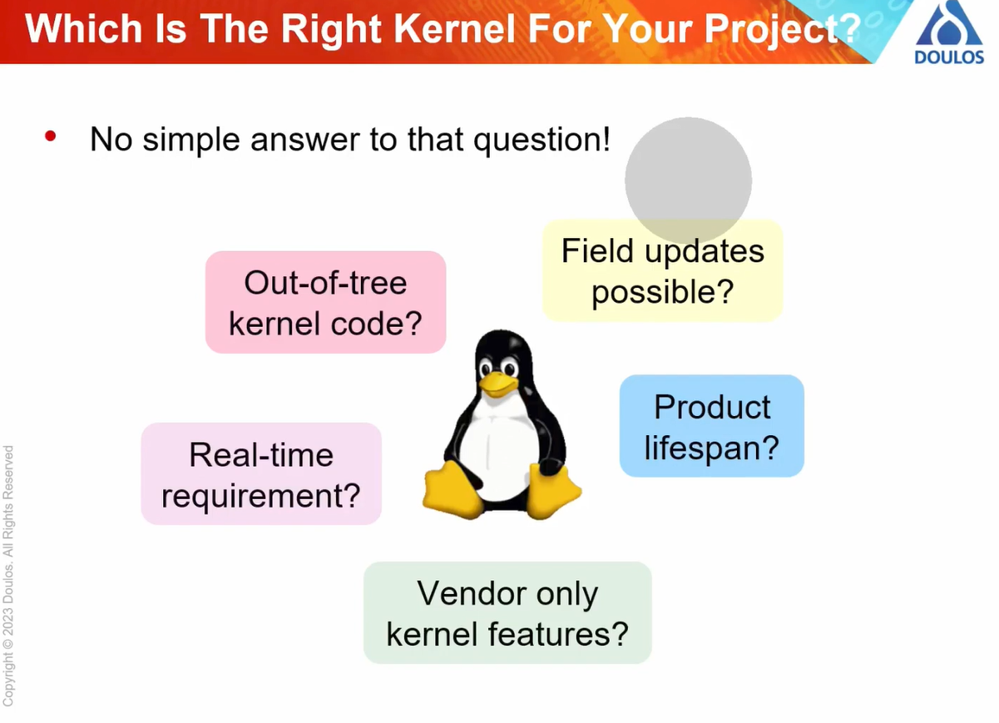  
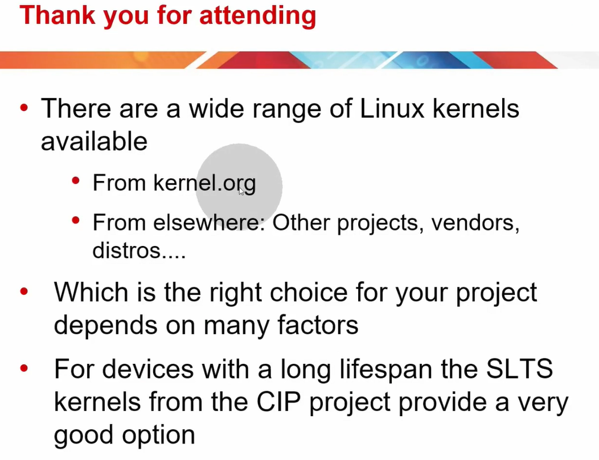  

## Questions and answers from the chat
```
Q:
    (in terms of security) How could one stay informed about critical kernel updates and patches?
A:
    You can subscribe to the kernel mailing list(s) but they are very busy. Another way is lwn.net e.g. https://lwn.net/Articles/928736/ 
```
```
Q:
    difference between mainline and stable kernel?
A:
    The mainline kernel is the development wavefront, including release candidates. The stable kernel is a snapshot of the most recent release. 
```
```
Q:
    Will Preempt_RT Kernel merged into mainline as the default kernel for everyone over time?
A:
    That work is ongoing.... hopefully it will be done soon but the work has been going for several years already 
```
```
Q:
    if vendor kernels are picked from mainline kernel, they should be open source?
A:
    They should be yes 
```
```
Q:
    Could you tell if other realtime sush as Xenomai, RTAI could be an alternative to prempt RT ? 
A:
    Yes, these could be an alternative to using the preempt_RT kernel and in some scenarios may be required to meet real time requirements. This is a subject for a future webinar maybe! 
```
```
Q:
    From security perspective, which kernels provide the best (documented) applicability to automotive applications?
A:
    This is a hard question to answer. There are no 'open source' kernels which are certified against some security standard to my knowledge. There are commercial vendors who can provide kernels which are 'pre-checked' against known security issues and so on. But these cost money of course. 
```
```
Q:
    Please comment about Zephyr project with regard to the theme of this webinar: https://www.zephyrproject.org/ 
A:
    Zephyr is an RTOS which is maintained by the Linux Foundation which has a similar development ethos as the Linux kernel but there is nothing in this webinar which is relevant to it. 
```
```
Q:
    Is it possible to have non Linux kernel derivative as a replacement of the standard Linux kernel for some specific cases, like hard relatime? 
A:
    Well you could use an RTOS instead of Linux but then you would need to start again in terms of your software stack. May be a better option would be to use an RTOS kernel alongside the Linux kernel, either in software (with Xenomai for example) or in hardware on a multicore device using e.g. OpenAMP. 
```
```
Q:
    Is the kernel testsuite is available somewhere ? 
A:
    The kernel includes some testing mechanisms within it and you can see tests in the kernel source base. See https://docs.kernel.org/dev-tools/testing-overview.html. There is also an ongoing project to standardise kernel testing: https://docs.kernel.org/dev-tools/testing-overview.html 
```
```
Q:
    difference between vendor and distro kernels?
A:
    As I said, vendor kernels are maintained by hardware providers whereas distro kernels come from Linux distros.
```
```
Q:
    What is Poky in Yocto? 
A:
    Poky is an example Linux distro provided in Yocto. Sometimes people refer to the Yocto build system itself as Poky, confusingly. 
```
