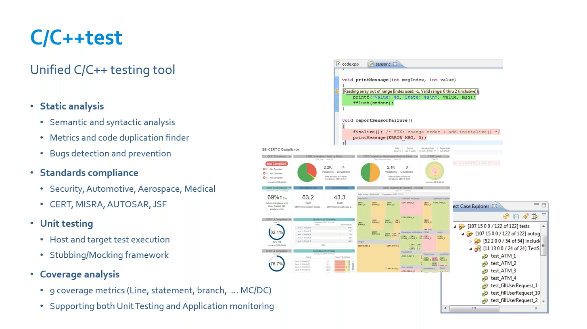
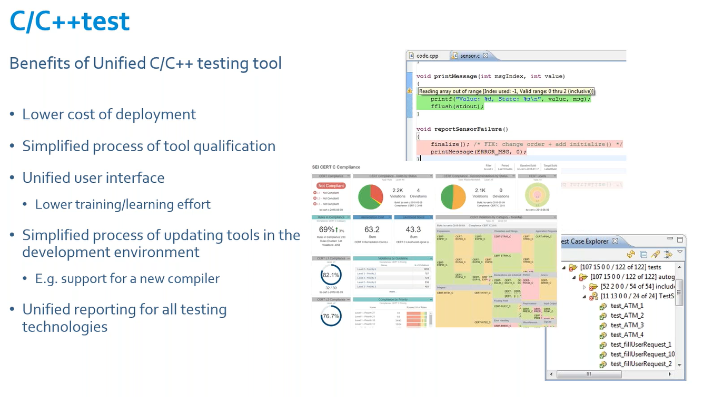
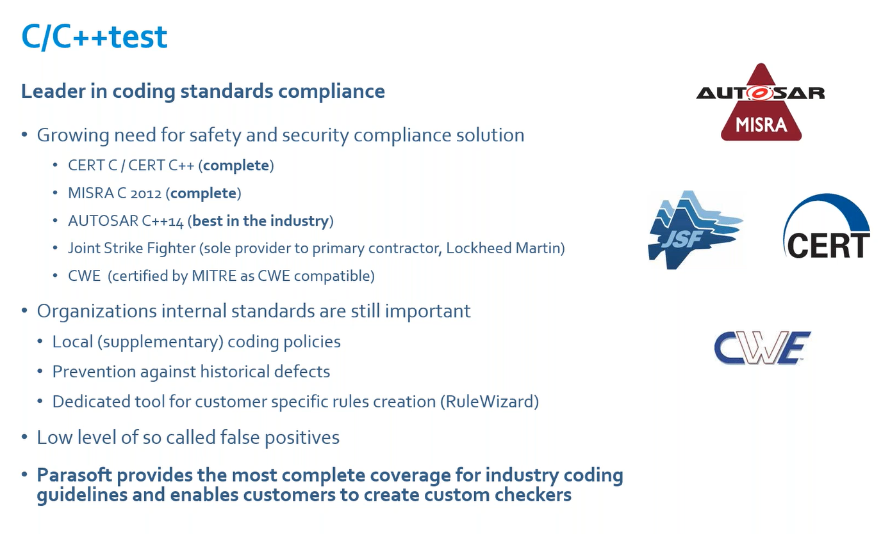
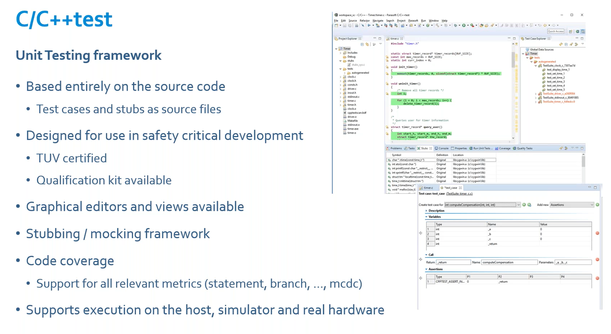
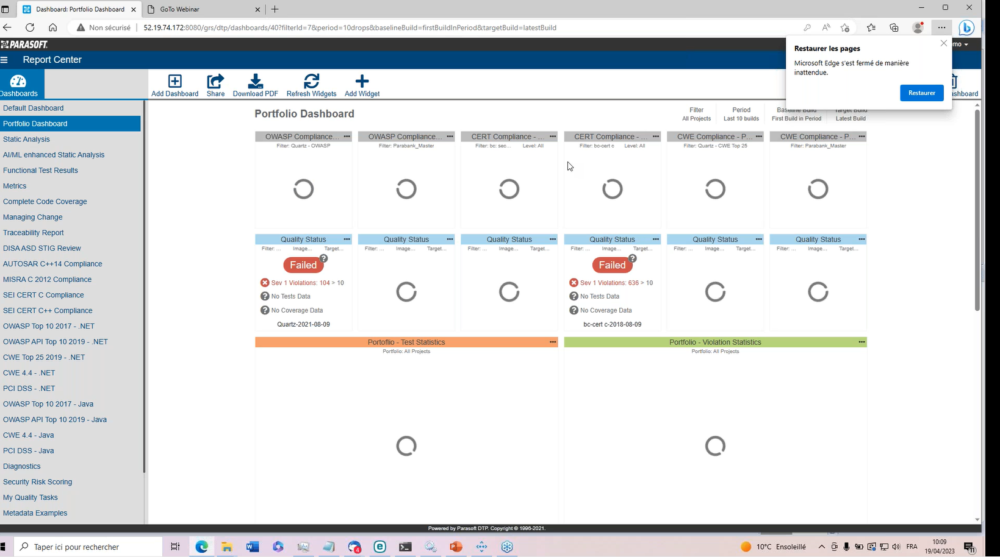
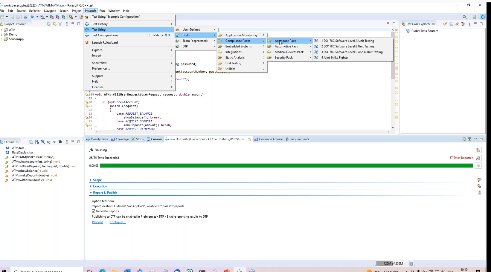
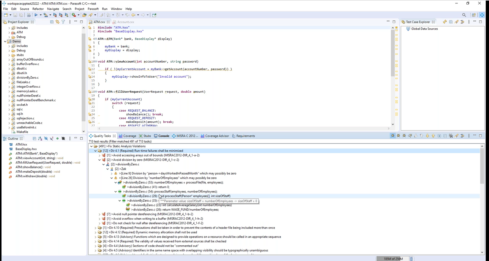
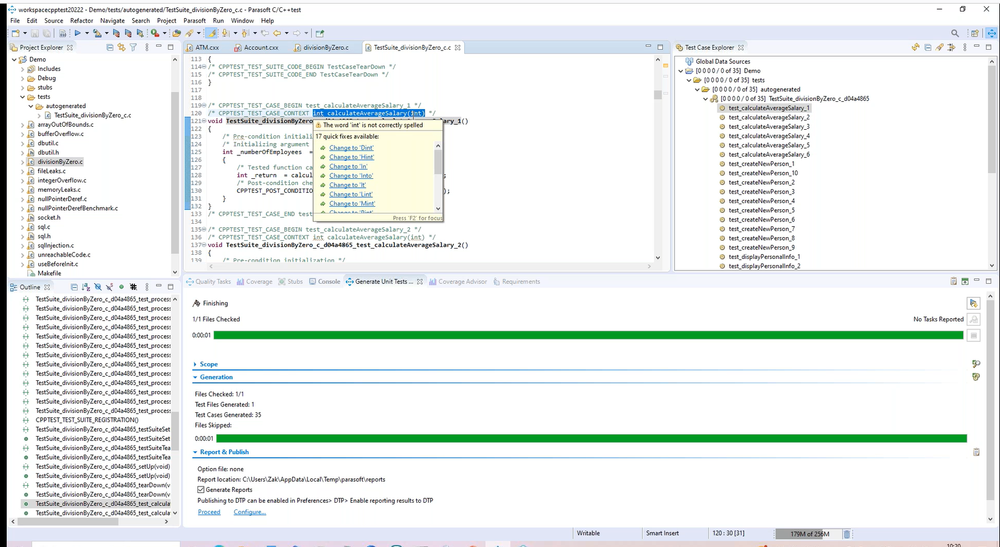
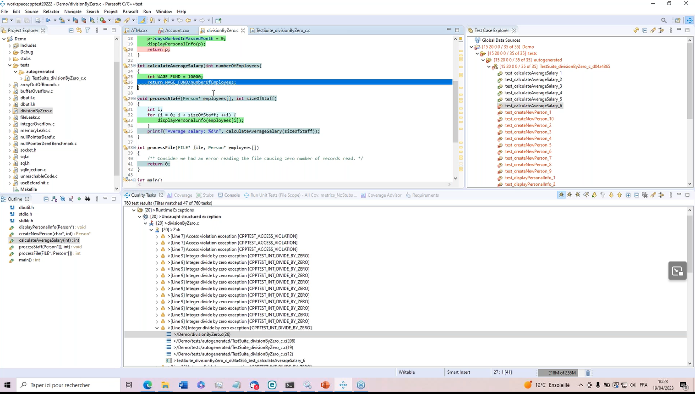

# 20230419 C and C++ Software Testing explained by Parasoft
* hosts: Chantal Wauters & Zak Maiga
* today: Parasoft C/C++ test U'nified Testing tool
* helping organizations reduce the burden of achieving compliance#

* provides static analysis
* standard compliance
* unit testing
* coverage analysis:9 coverage metrics, support both unit-testing and application-monitoring


## C/C++ test
* cert, misra, autosar, joint strike fighter, CWE ..



* plugins for ecplipse, visutal studio and visual studio code
* different packages for different compliance reports - easily selectable via menues


* configuration of the rules can be adapted as wished; picking from different sets

## unit testing
* auto-generating test-cases? 35 cases in a few seconds: wtf? it returns a set of cases as code, can be modified afterwards
  * line and statement-coverage was then quite high (70-80%)

* running the test-cases reveals immediately failing tests

* this helped immediately to see the fail for the division by zero-issue mentioned above
* fitting replacement for `gcov`

## Questions
```
Q:
    The auto-generation of tests-cases looks really mighty. How does it determine which cases to create? Doing a permutationof all input-parameters? With extreme values?
A:
    Depends on prototype of function; permutation, boundary testing (min, max), also zero, ones..
```
