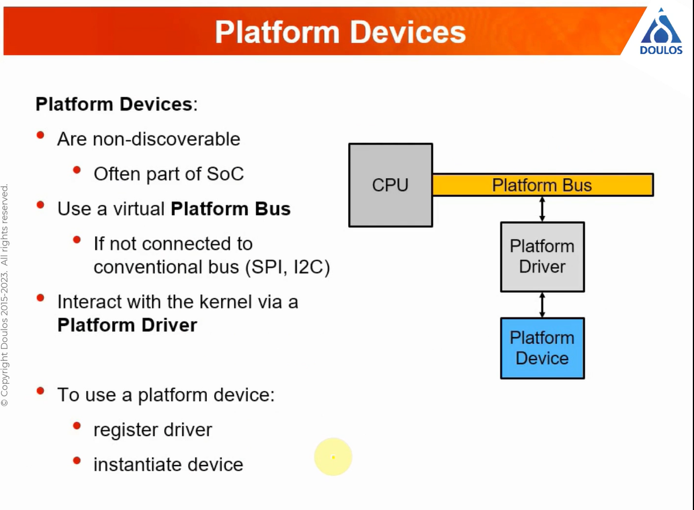

# 20230421 Anatomy of a Linux Device Driver

* hosted by Doulos
TODO add stuff from the invitation

* explanation about the stability of certain interfaces for each release

* note: **implement mechanism not policy**
  * no prejudging how the application is using the hardware
  * this makes the driver-implementation quite simple

* module license is also needed to be adde

* kernel offers different frameworks to help: like regmap and pinctrl, gpiod, ..
* manxy types of hardwar are interrupt-driven and will signal if they have something to say

* linux driver model

* maximize the amount of code, which is used, shared

## How to read the driver's source file?
* recommendation: start at the bottom, not top
* initalized, registered with matching framework, then matching to, populates the device

* platform devices

