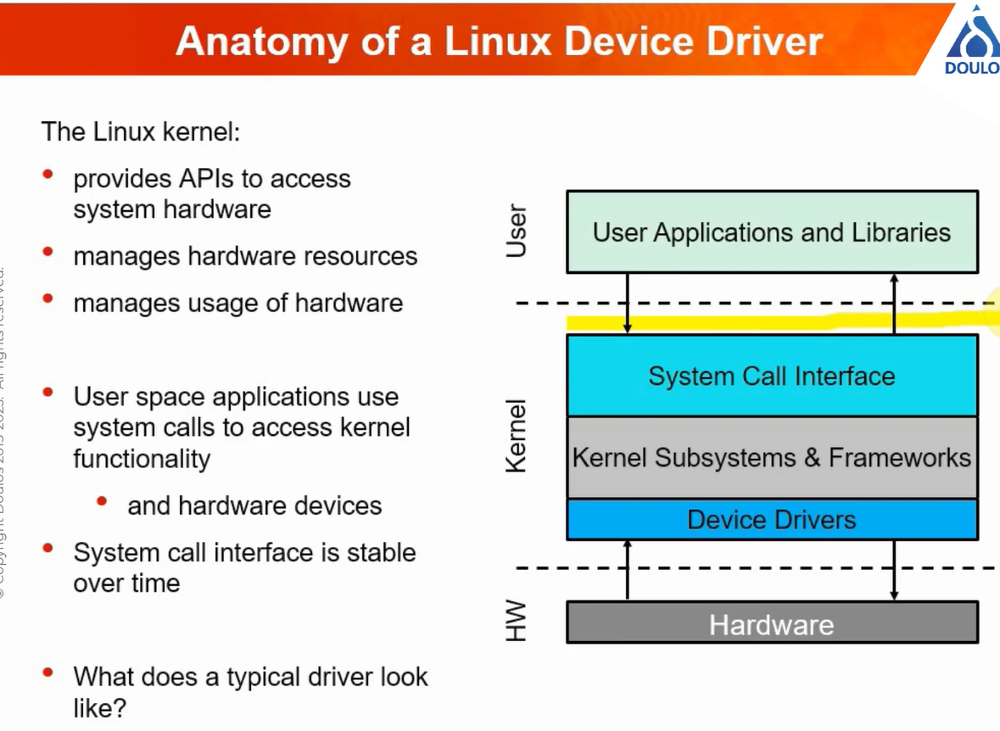

# 20230421 Anatomy of a Linux Device Driver

* hosted by Doulos
TODO add stuff from the invitation

* explanation about the stability of certain interfaces for each release


* note: **implement mechanism not policy**
  * no prejudging how the application is using the hardware
  * this makes the driver-implementation quite simple


* module license is also needed to be adde


* kernel offers different frameworks to help: like regmap and pinctrl, gpiod, ..
* manxy types of hardwar are interrupt-driven and will signal if they have something to say

* linux driver model

* maximize the amount of code, which is used, shared

## How to read the driver's source file?
* recommendation: start at the bottom, not top
* initalized, registered with matching framework, then matching to, populates the device

* platform devices


* everything is a file is an important theme for linux-operating-systems


* the set of operations you can implement are based on the operations of a file: read, write, open, close, ..

* read is copying from one buffer to the next; write is the inverse
* structure of a driver file


* real device: touchscreen-device, for various toradex platforms

* find relevant driver by looking for the `adi`


* in-tree and out-of-tree modules: important for mainlining


* mailinging: **pro: if they change an API, then they must also change your committed module - no work for you! :)**
* con: legal reasons; can be difficult; patience required (reviewers are busy people)
## summary


## Q & A

```
Q:
    what is a framework?
A:
    frameworks, or subsystems, if you prefer, are sets of functionality within the Linux kernel which provide a particular set of support or features. 

    How can we access driver function api from user space like to read write eeprom from user space, if driver is already loaded. 
A:
    the driver should provide some kind of interface to user space - we will talk about that later in the presentation
```
```
Q:
    Often hear about a phandle - what's that?
A:
    A phandle is a entry in the devicetree source which refers to another node or property elsewhere in the same devicetree 
```
```
Q:
    Where is the device match table defined? Can be defined in the module itself?
A:
    Yes, they're usually defined in the driver source file - towards the bottom usually,=. 
```
```
Q:
    Are there scripts or tools that verify that your device driver has all the recommended functions/fields added to it, as the kernel expects it? A kernel driver "linter" if you will?
A:
    Not that I know of. If you submit your driver to be included in the mainline kernel then your code will be thoroughly reviewed though! 
```
```
Q:
    why do we define the driver structure like this? what theory or model is the source of that?
A:
    This is the 'style' which is defined by the Linux driver model. It means all drivers look very similar to a certain extent. 
```
```
Q:
    if compatible contains vendor, device1 - does both strings have to match?
A:
    yes - in fact it is treated as a single string with no spaces. 
```
``` 
Q:
    How we can debug the driver at the time of development other than printk ?
A:
    There are a few options, Either using 'gdb' and 'kgdb' or making use of external JTAG debuggers. If you can run development in a virtrualised environment, such as qemu it is possible to debug the kernel with GDB directly, as if it were connected over jtag. The specifics of debugging with JTAG will depend on which jtag device you have. 
```
```
Q:
    I'm new to this. What is a linux device tree used for? 
A:
    the devicetree describes the hardware and is used by the kernel and drivers to determine how to talk to the hardware e.g. which memory addresses are devices mapped to?
```
```
Q:
    Can multiple device drivers be loaded for the same piece of hardware?
A:
    There are devices that may be split into multiple components, these can be covered by mfc drivers 'multi-function-controller' drivers, but really that's just a way to register multiple drivers for multiple components on a single device. for any given piece of hardware (that has for instance, direct register access) there should be a one-to-one mapping of the device and driver instanc.e
```
```
Q:
    SoC
A:
    If your driver is built into the kernel then it will be loaded as part of the boot process. If it is compiled as a module then there are mechanism for autoloading e.g. a modprobe conf file.
```
```
Q:
    in which step the existence of underlying HW is checked by the kernel? 
A:
    The kernel matches drivers against devices, and attempts to call 'probe()' when it believes it has a match. However quite often indeed at that time the hardware may not be even powered up. It can be the responsibility of the probe() function in the driver to power up the device and identify if it really is a device that the driver can support. It can then return success to indicate it will manage the device, or return a failure - and indicate that the device couldn't be found.
```
```
Q:
    in devictree - which meaning has the @xxx. Is that some address? Is this a parameter to the driver? 
A:
    In the nodes it is a unique identifier for that node. It's not actually the address or parameter at that stage. The correct way to specify the address used by the device is through the 'reg = ' property within the node. It's common practice to use this address as the unique identifier in the node name.
```
```
Q:
    Can you also mention a little about how to cross compile driver, especially using yocto sdk, differences between in-tree and out-tree compilation, and how to debug the driver code.
A:
    There is some information in an earlier answer about debugging. Cross compiling with the Yocto SDK is straightforward, it provides a cross compiler for your chosen architecture. intree compilation means the kernel make system is extended to compile the new code. Out of tree compilation uses a 'wrapper' makefile which calls the kernel build system on some out of tree source code.
```
```
Q:
    how do the linux scientists create the Linux driver model? 
A:
    It was developed over many interations of the kernel, which is constantly being updated and improved.
```
```
Q:
    can the device driver can have vulnerability are there tools exist for the same - and if we like to do the pen testing for them are any framework exist please give some ref 
A:
    All code can have vulnerabilities, but one of the key aims of the kernel drivers is to reduce attack vectors. The linux kernel has privelidged access to the hardware, and so it is important that the kernel-userpace interfaces are validated. Tehre are many projects that test these interfaces and perform 'fuxzzing' to check the security. Bugs identified are fixed and backported in the kernel stable tree.s
```
```
Q:
    what about ioctl() ?, in the past I use it a lot. Is used also in more modern kernel version ? 
A:
    ioctls are a fundamental mechnanism which allow drivers to provide an interface to user space which doesn't have to fit in with any of the standard file operations read, write etc. It is very common in device drivers.
```
```
Q:
    are unlocked_ioctl the same as private ioctl's?
A:
    unlocked_ioctl is the unlocked version of ioctl which was part of removingtt he 'big kernel lock' to protect against bugs when running on SMP systems. I believe this is a long handled task now so unlocked_ioctls are the normal path to take.
```
```
Q:
    C++ has any role in driver development?
A:
    The kernel is written in C. Recently support has been added for programming drivers in Rust, which is very interesting!
```
```
Q:
    how do we determine the clock for I2c? or we don't need to o determine it?
A:
    There will be limitations to what the maximum i2c speed can be. That may be the limits of the i2c controller, or the limits of a device connected to the bus. The bus speed can be configured and specified on the device tree nodes. If this is misconfigured you may find you can't talk to the hardware, and should use a lower speed. (but then of course the data rate will be slower)
```
```
Q:
    Rust OOP Language? 
A:
    Rust is an object orientated language in that it can operate with metods and interfaces on structs and enums ... but it's a bit different from C and C++. It has aspects that make it interesting to consider for system level programming, and is why it has been consdiered for use within the linux kernel.
```
```
Q:
    Why does convention force you to read driver code from bottom up. Why not turn it on its head so you can start at top and read down. 
A:
    C requires functions to be declared or defined before they are called. This means that the implementation of the code is usually before the code that calls it. From a kernel driver perspective it means that the tables which map the call hooks to the functions needs to be at the end of the driver.
```
```
Q:
    What is I2c 
A:
    I2C is a two wire bus that allows data to be shared between a master and multiple devices with a clock and a data line.
```
```
Q:
    why platform device is considered not discoverable?
A:
    platform devices usually cover devices which are on a memory mapped io and aren't discoverable, and are usually defined by specifying in device tree or ACPI that they are at a specific memory range. It's a hardware implementation detail that means they are not discoverable ... (unlike USB for instance which has an event and a way to identify which device is connected)
```
```
Q:
    I'm not clear about the difference of a built-in driver Vs a module driver.
A:
    The driver can be compiled directly into the large kernel file (the zImage or Image file) or they can be compiled into separate object files known as '.ko' files. These get dynamically loaded at runtime either automatically or with 'modprobe' or 'insmod'.
```
```
Q:
    I found code about the sysfs interface create and removing is chaotic. Is there any methods to optimize the create and remove code?
A:
    There are helpers to deal with adding them in groups, and I think there is a helper that supports removing a full group in a single call. But it is something that has to be managed to prevent memory leaks or dangling references that could cause a crash otherwise.
```
```
Q:
    so I2c clock doesn't configured with C program like in the presentation program example
A:
    I don't think userspace can configure the i2c speed. I think the c code presented was in kernel space.
```
