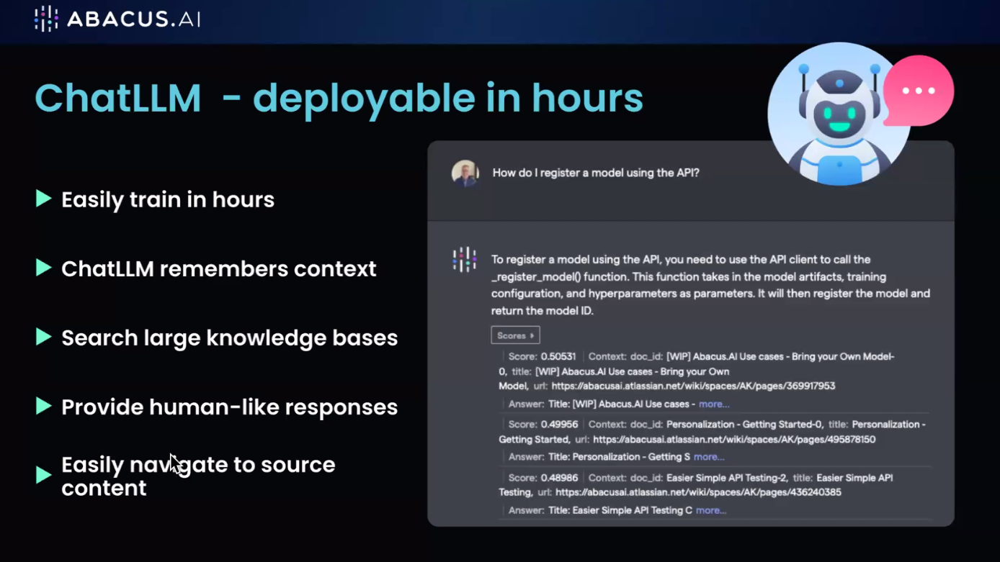
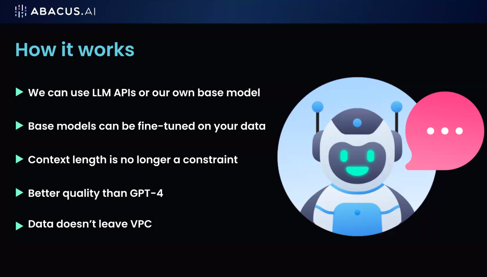
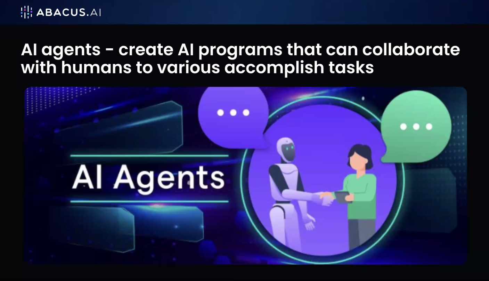
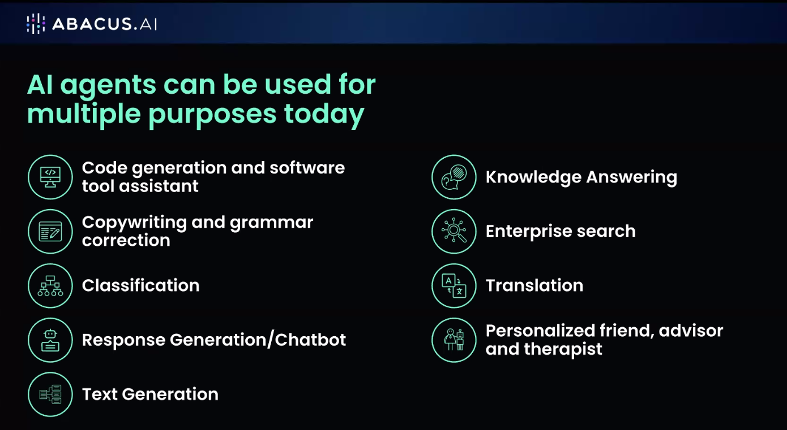
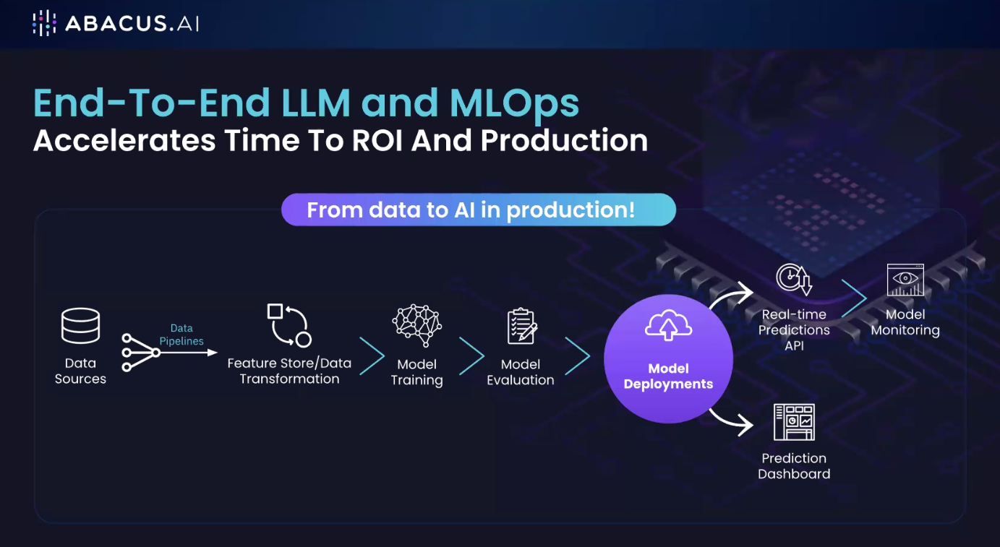
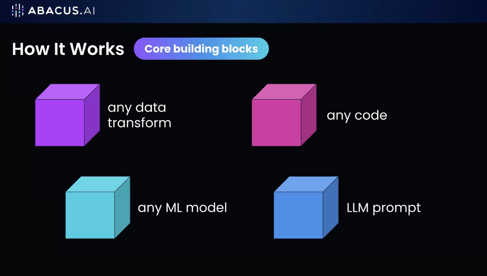
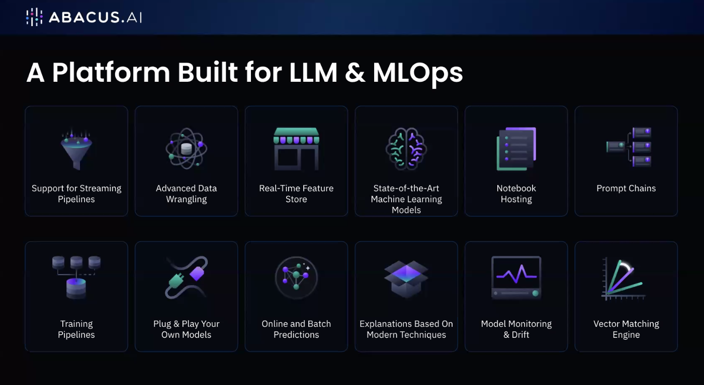
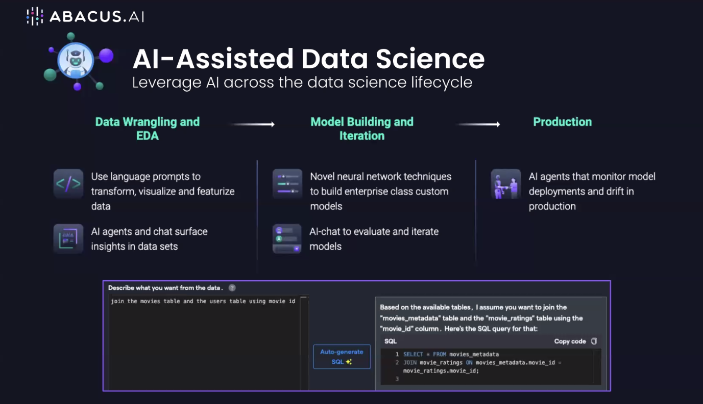
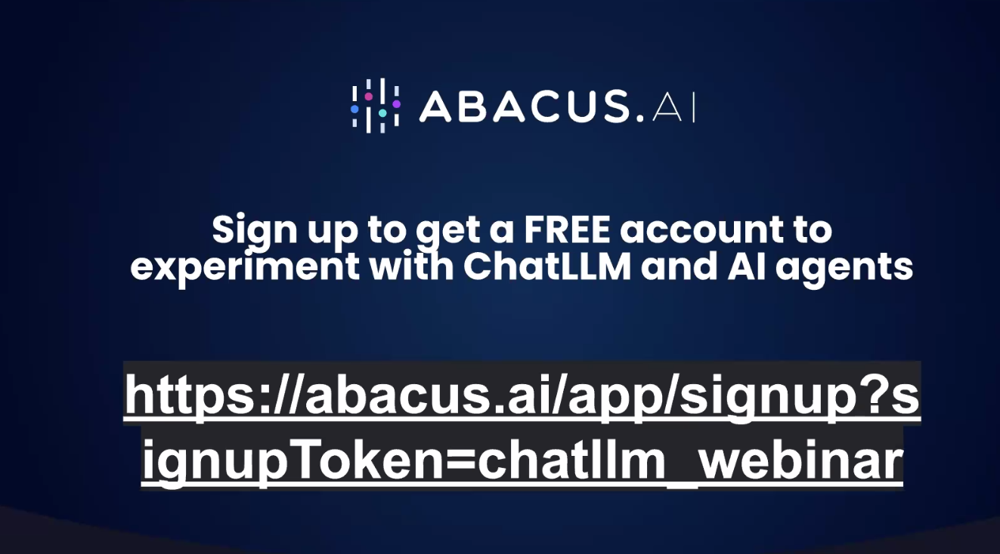
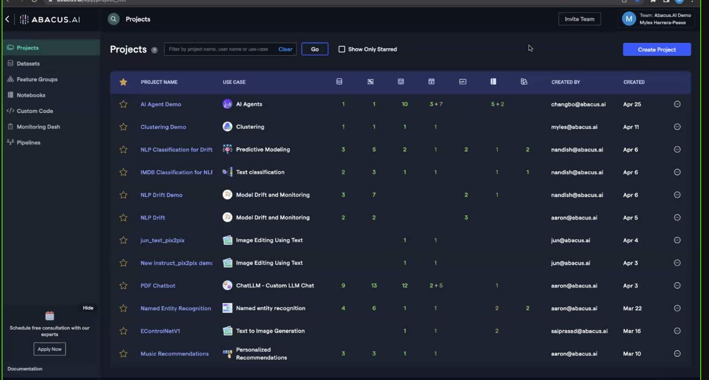

# 20230509 aicamp workshop LLM Ops and AI agents
* host Bindu Reddy
* concerns of customers of sending their data to openAi: because it could be used for training - what if the next version hallucinates your IP?

## how to apply abacus LLM on our own business documents? confluence, wiki, etc?
* largest context length of info you can give to your LLM is going to be just 32k

## AI agents and the needed platform
* in the next 1-2 years the most AI apps are human-collaboration-apps
* to run those agents, you need an LLM-platform - the engine: without that engine nothing works

* need some capabilities to run those agents bklocks -> chain blocks to create AI agents -> deployment & monitoring -> AI agent

* data scientists are using AI to build AI
* TODO: check the token

## show
* dashboard

-------

