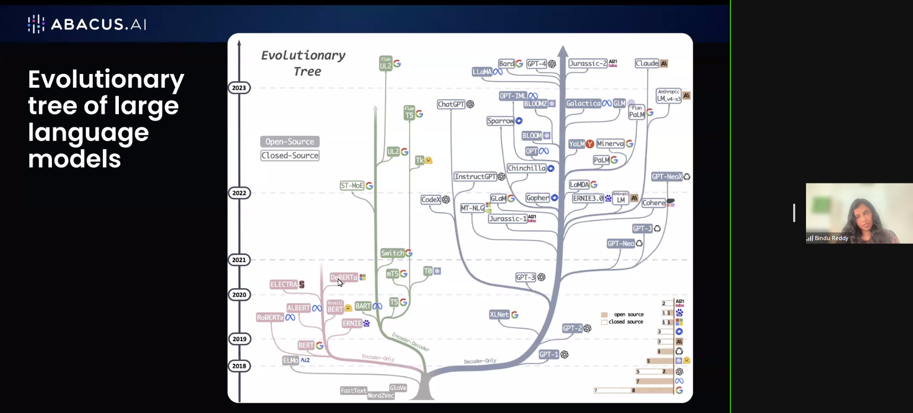
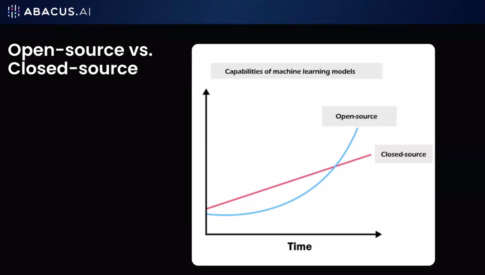
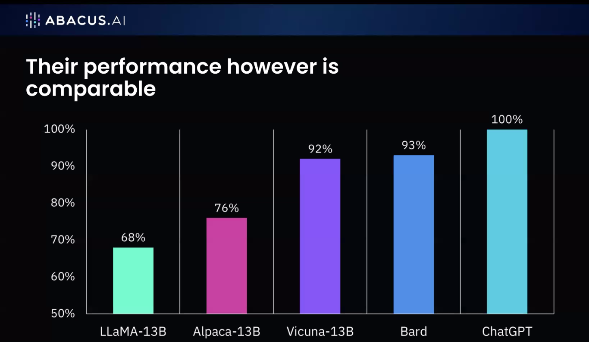
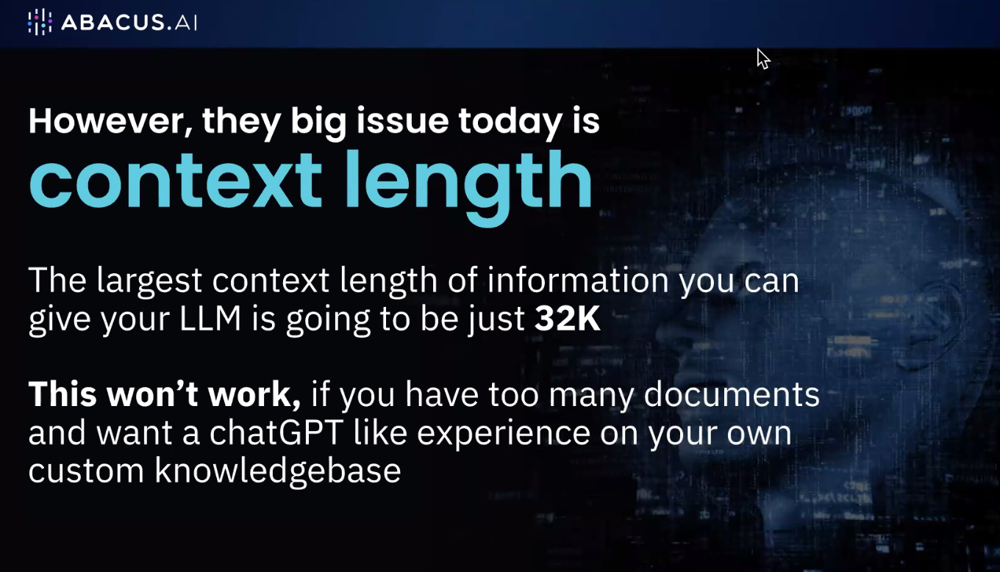
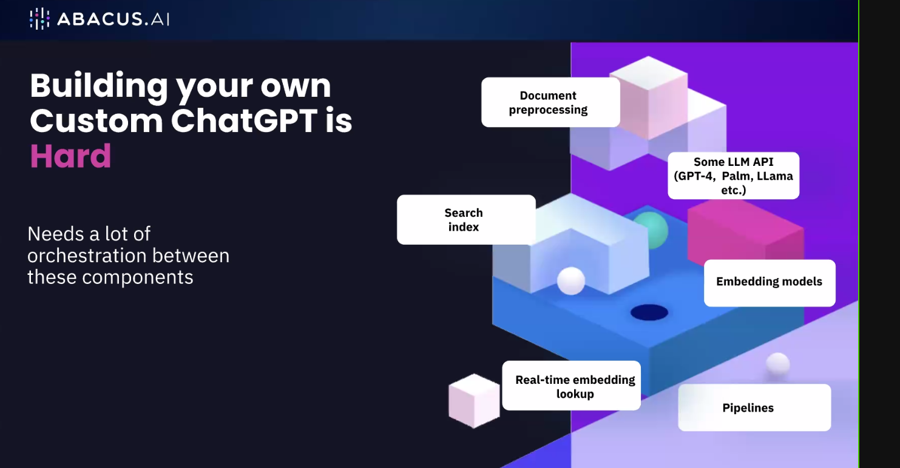
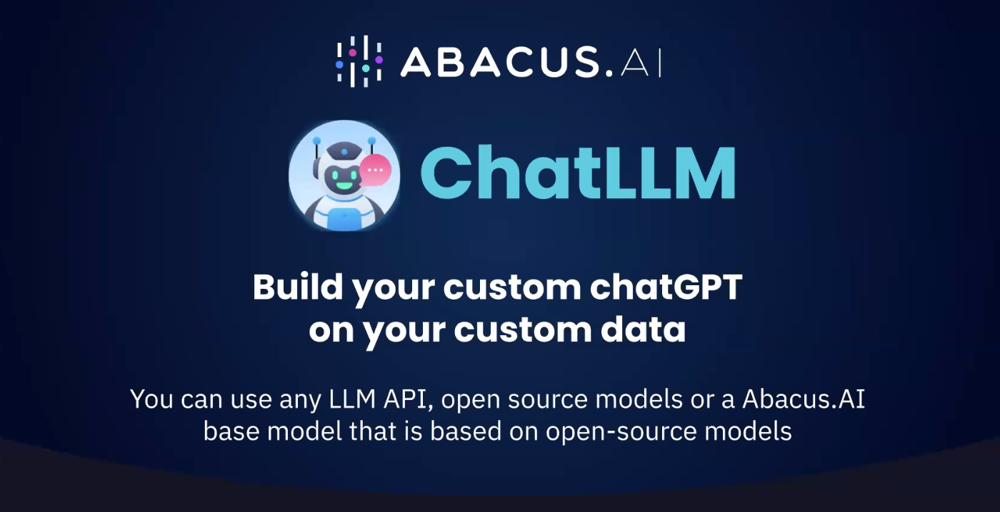
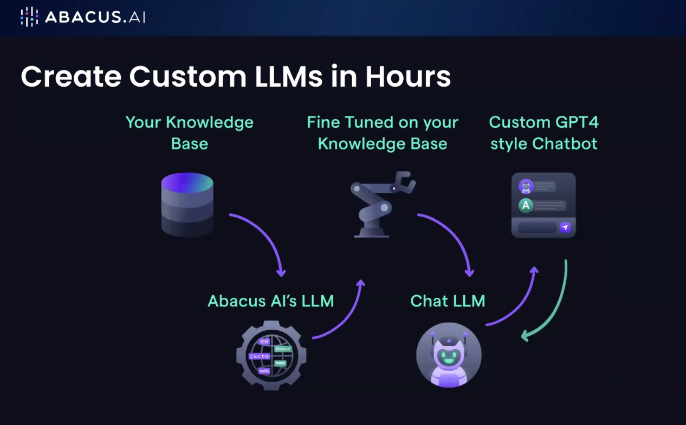

# 20230509 aicamp workshop LLM Ops and AI agents
* host Bindu Reddy
* concerns of customers of sending their data to openAi: because it could be used for training - what if the next version hallucinates your IP?

## how to apply abacus LLM on our own business documents? confluence, wiki, etc?
* largest context length of info you can give to your LLM is going to be just 32k

-------

