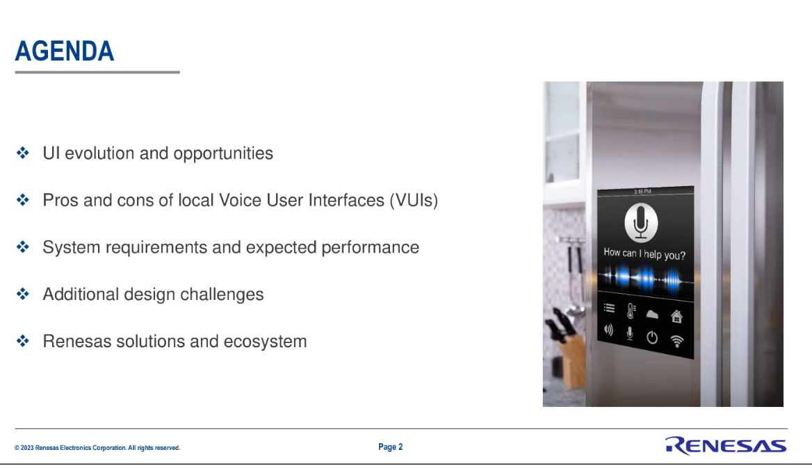
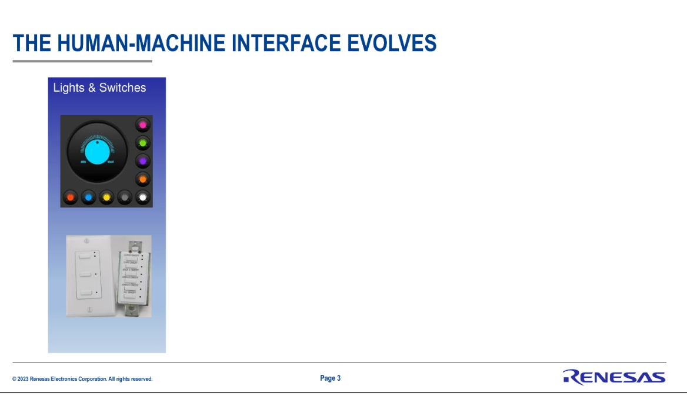
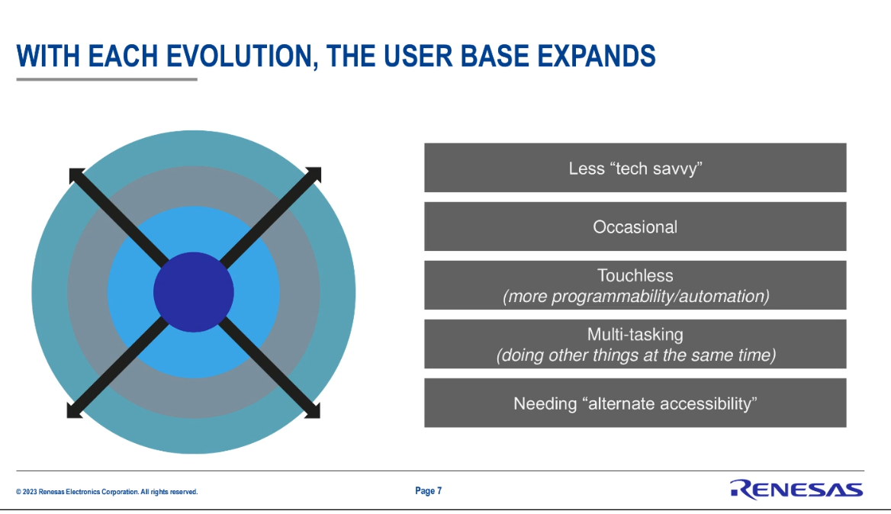

# 20230516 Can I Just Talk To My Device?

```
This session is part of our Renesas Virtual Conference. Registration/event page here. We are all familiar with cloud-based natural language recognition, but what can you do to enhance the usability of your products with voice if you are not connected? Join us to get an overview of the Renesas ecosystem around voice UI algorithms that run efficiently on their MCUs ? with resources and cycles left over for your application on the same device. You will also see how their acquisition of RealityAI and their efficient ML can be used to enhance your products. View and attend at https://resources.embeddedcomputing.com/Embedded-Computing-Design/Edge-Voice-User-Interfaces?bmid=ad4b79fe6a51&bmid_type=member
```

## presenters
Kaushal Vora; Sr. Director Business Acceleration & Global Ecosystem at Renesas
Vin D’Agostino; Founder/President of D’Agostino Industries, a Renesas Partner
Rich Nass; Executive Vice-President, Brand Director, Embedded Franchise, OpenSystems Media

## evolution of UIs



* touchless allows to handle the device without having to go there and to manipulate it
* 
