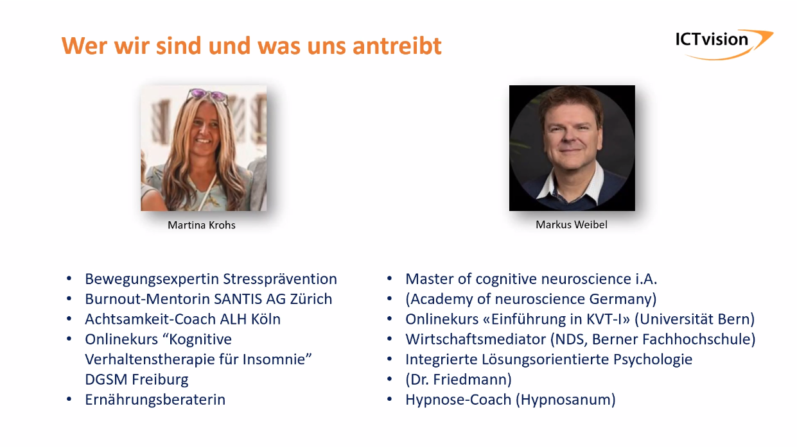
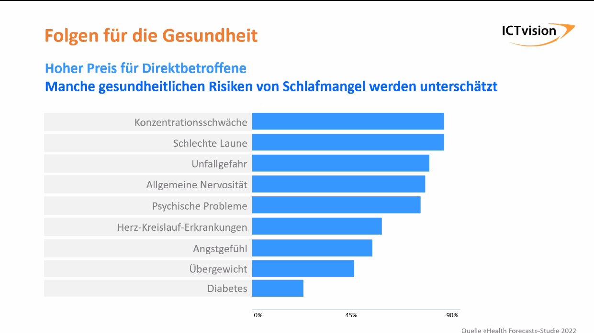
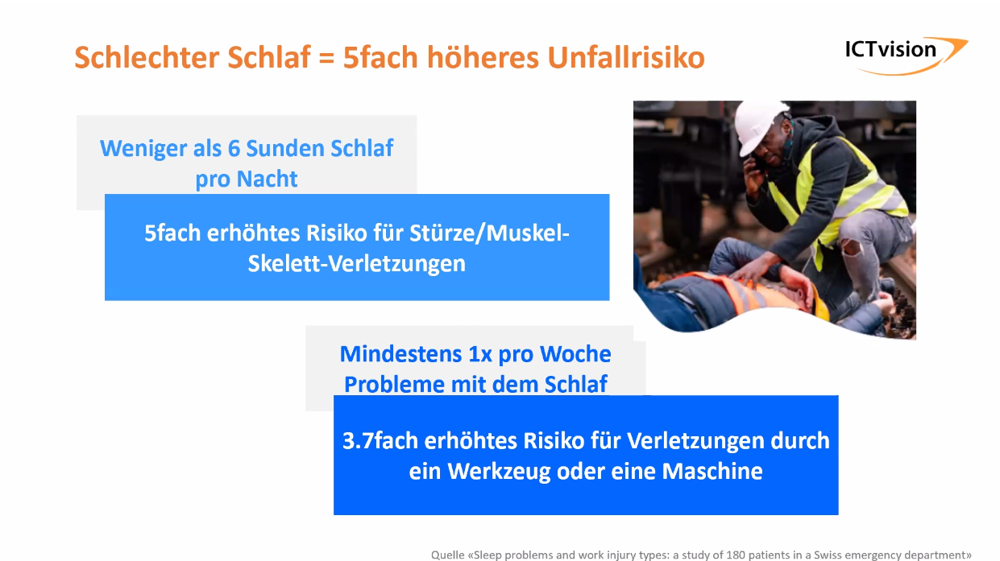
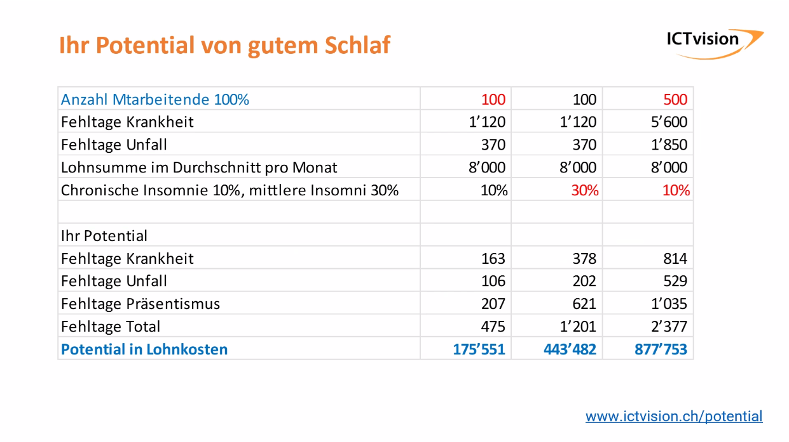
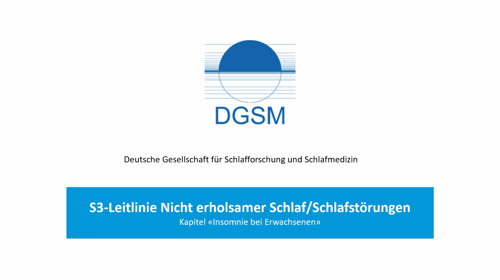
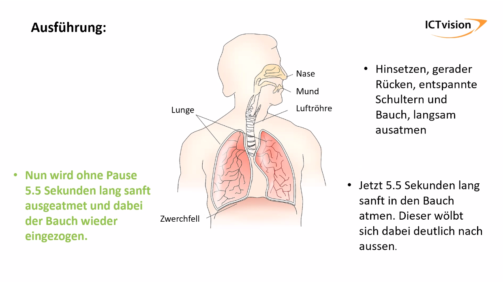
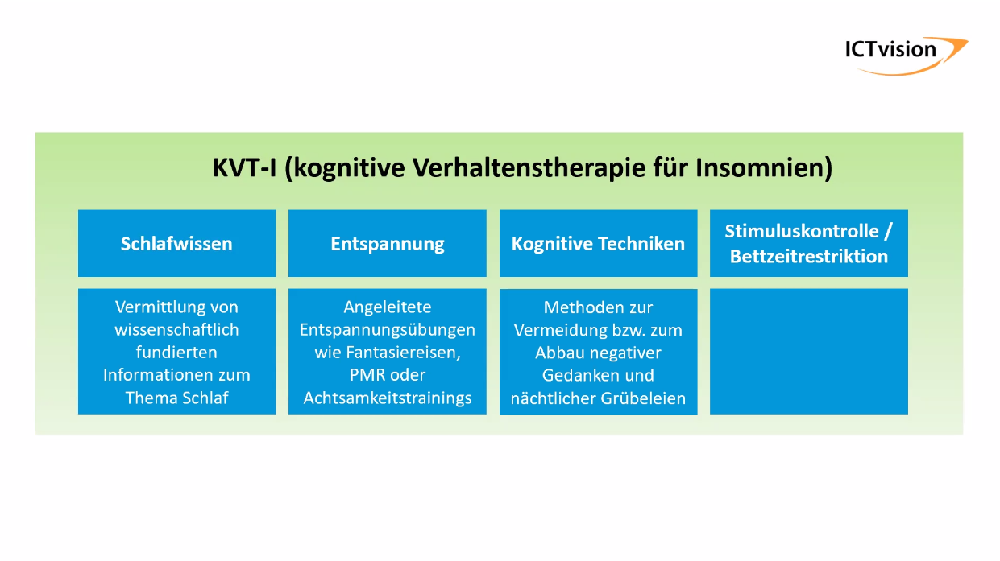

# 20230519 Geringe Arbeitsleistung durch schlechten Schlaf
* Impulse für den Mittelstand - Ingrid Janssen Einladende (BVMW)
* Martina Krohs (Stresspräventation) und Markus Weibel (https://schlechtschlafen.ch/)

* Frage: wie lange letzter Woche geschlafen? viele mit 7-8, einige mit 6
* 20-30% leiden gelegentlich unter Schlafstörungen
* 10% leiden unter chronischer Schlafstörung Insomnie (Ein-/Durchschlafen, nicht wieder einschlafen können)
* Anzahl Fehltage durch psychische Probleme haben sich in den letzten 10 Jahren verdoppelt
* 50% Zunahme Diabetes in 25 Jahren
* nicht leistungsfähig im Arbeitstag, Sekundenschlaf, Gähnen am Abend
* 90% aller Schlafstörungen sind stressinduziert
* weitere gesundheitsinduzierte Risiken

* Folgen am Arbeitsplatz: Produktivitätsverlust
* Mehrkosten durch zusätzliches PErsonal
* Know-how-Verlust
* Reputationsverlust am Markt
* "War of talents"
* Absentismus - 2,7fache der Fehlzeiten
## schlecher Schlaf - höheres Unfallrisiko

* Abwesenheit gut erfassbar; Knowhowverlust schwer
## Was bedeutet KVTI?
* Aspekte: Schlafwissen/Entspanung/kognitive Techniken/Stimuklsukontrolle (Bettzeirestriktion)
* angeleitete Atemübungen
  * **Resonaznatmung**: Beruhigungsübung, die Herz, Lungen und Kreislauf in einen Zustand der Kohärenz versetzt (besonders geeeignet vor Meetings oder Prüfungen)
  * Entspannung Schultern und Bauch, gerade Hinsetzen,   

* kognitive TEchniken: Probleme selbst unter Kontrolle bringen
* vermeiden und Abbau negativer Gedanken in Bezug auf den Schlaf spielen eine Rolle -> Gedankestuhl. Bequemer Platz ausserhalb des Schlafzimmers.

* note for myself: `You should meditate each day 20 min. in case of a really stressful and filled day, you should do it for 1 hour.`
