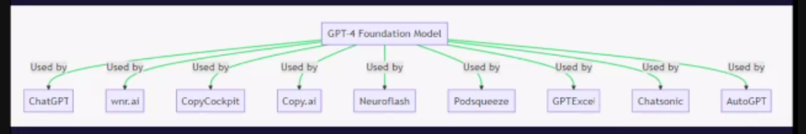
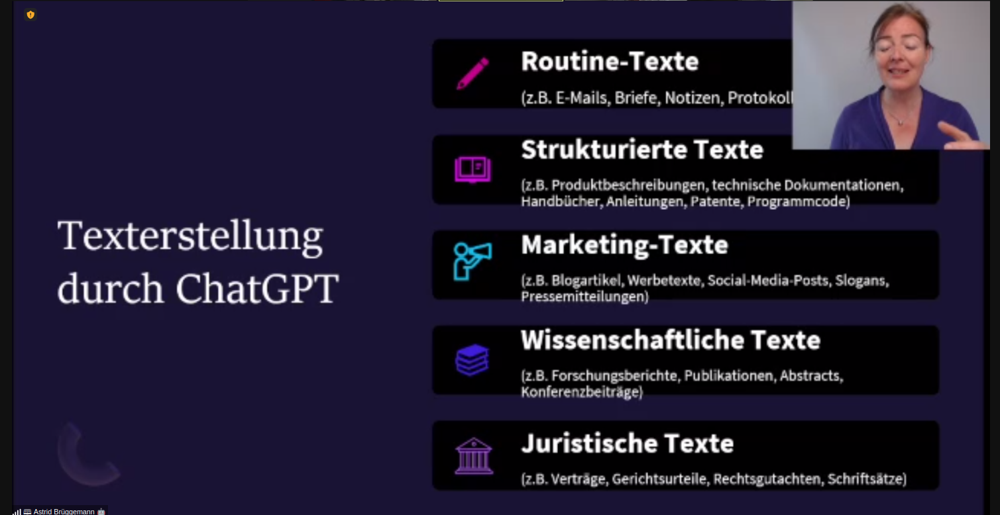

# 20230522 ChatGPT für HR, Marketing und Führungskräfte
* Astrid Brüggemann
* verschiedene Tools setzen auf (Chat)GPT4 auf: AutoGPT ..

* zwei grundsätzliche Möglichkeiten zur Nutzung: direkt im Chat oder die API: nur bei API-Nutzung privat und diskret nutzbar für Firmen
## Wofür nutzen?
* Texterstellung -> neue Produktivität

* unsere Alleinstellung: Urteilsfähigkeit, soziale Zusammenarbeit
* Kreativität: Slogans generieren lassen
* "Gib mir provokate Titel für Fehlerkultur und Jonglage" ..
* Datensammlung -> personalisiertes Marketing
* Pressemitteilung / Schreibe wie ein Journalist-> "jetzt ändere deine Rolle und gib mir Feedback zu der Mitteilung": Agiere wie eine Redakteurin
* Linkedin-Strategie

* Haufe - HR-Chatbot 
* Arbeiten der KI überlassen, so dass man Zeit für andere Sachen hat ..
* Recrutiing und Auswahl: Vorauswahl von Bewerbungen; automatisierte Vorstellungsgespräche; Kandidatenkommunikation
  * kann dazu fürehn dass Vorurteile und Biase aufgeweicht werden

