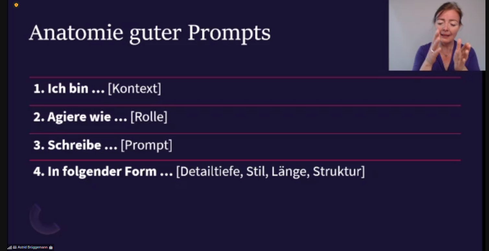
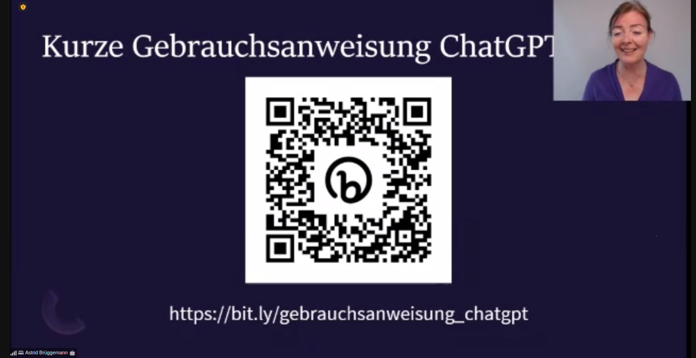

# 20230522 ChatGPT für HR, Marketing und Führungskräfte
* Host: Bundesverband mittelständische Wirtschaft (BVMW)
* Sprecherin:
```
Referentin:Astrid Brüggemann
81377 München
Deutschland (DEU)
Telefon: 089 12 50 39 38
Mobil: 0176 56 87 42 12
E-Mail: ab@astridbruggemann.com
```

* verschiedene Tools setzen auf (Chat)GPT4 auf: AutoGPT ..

* zwei grundsätzliche Möglichkeiten zur Nutzung: direkt im Chat oder die API: nur bei API-Nutzung privat und diskret nutzbar für Firmen
## Wofür nutzen?
* Texterstellung -> neue Produktivität


* unsere Alleinstellung: Urteilsfähigkeit, soziale Zusammenarbeit
* Kreativität: Slogans generieren lassen
* "Gib mir provokante Titel für Fehlerkultur und Jonglage" ..
* Datensammlung -> personalisiertes Marketing
* Pressemitteilung / Schreibe wie ein Journalist> "jetzt ändere deine Rolle und gib mir Feedback zu der Mitteilung": Agiere wie eine Redakteurin
* Linkedin-Strategie


* Haufe - HR-Chatbot 
* Arbeiten der KI überlassen, so dass man Zeit für andere Sachen hat ..
* Recruiting und Auswahl: Vorauswahl von Bewerbungen; automatisierte Vorstellungsgespräche; Kandidatenkommunikation
  * kann dazu führen dass Vorurteile und Biase aufgeweicht werden
* Personalentwicklung: Feedbackgespräche; Entwicklungspläne, individualisierte Weiterbildung
  *  gerade Neulinge profitieren

### Führungskräfte
* rise of AI (siehe youtube): Konferenz in Berlin
* Zeitsparer: youtube -> das Transkript nehmen (drei Pünktchen) -> Zusammenfassung generieren
* Führung: Strategieplanung/Administration/Sparringspartnerin
* Use Case: Strabag: Einsparungen /Risikomanagement

### Advocatus diaboli
* jemand, der widerspricht
* Diskussion, die man sonst nicht mit einem Menschen machen könnte

### Empathie
* bei Problemen mit Mitarbeiterin: Mail vor dem Senden nochmal empathie-wise bewerten lassen

### Summary
* Experten in jedem Bereich: Wissen leichter zugänglich
* Assistenz
* Fragen beantworten

## Anatomie eines guten Prompts
* zielgerichtete Prompts


* Qualitätssicherung: KI bitten Fragen zu stellen für fehlende Informationen


## Fallstricke
* Halluzinationen
* Unterschiede zwischen den Modellen ..
* Warum passieren überhaupt Fehler? Statistik; kein Wissen, kein Bewusstsein
* ChatGPT - nicht KnowledgeGPT

* für mehr infos: https://www.futurepedia.io/
