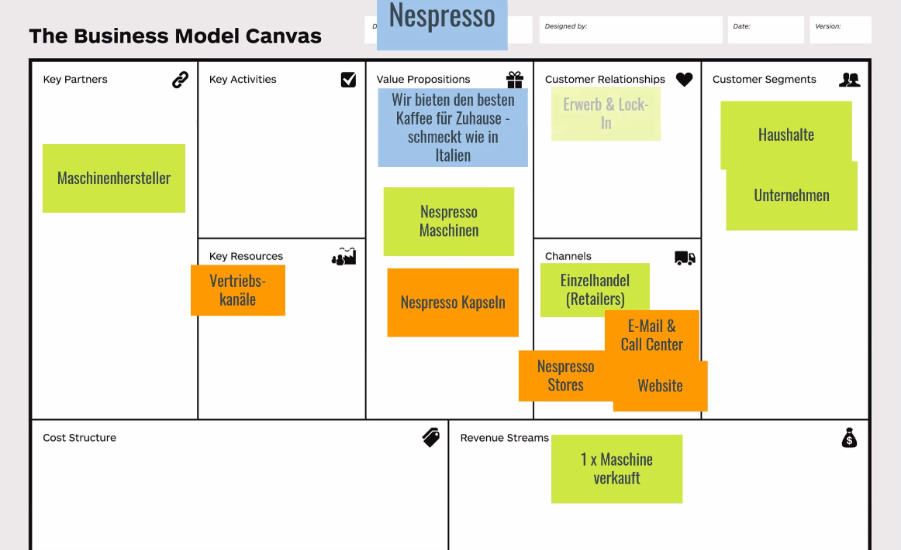

# 20230523 Muss mein Unternehmen wirklich agil sein?!
* Product Owner Meetup
```
Details

Muss mein Unternehmen wirklich agil sein?! Klar, wir kennen doch alle die Vorteile von agilem Arbeiten und Business Agility ist ja auch ein lohnendes Ziel, oder? Oliver Perner wird mit uns diese Fragen beantworten und dabei klären, was Business Agility ist, sowie den Unterschied zu Delivery Agility aufzeigen. Gemeinsam werden wir herausfinden, wie man ein Geschäftsmodell aufbaut und dabei den Fokus auf den größtmöglichen wirtschaftlichen Hebel setzt. Also alles Themen, die sich für Product Owner, Product Manager, Business Developer, Agile Coaches, Scrum Master, CEOs, CFOs, VPs of Business Development oder Innovation und Neugierige aller Art eignen :)

Über Oliver Perner
Oliver ist Enterprise Agile Consultant, Flight Levels Coach, Business Agility and Innovation Consultant. Er ist als Speaker auf Konferenzen und Meetups zu sehen und mit seiner Firma building BRIDGES hilft er seinen Auftraggebern bei der Lieferung der richtigen Sache zum richtigen Zeitpunkt.
```

## Agenda
* Oliver Pernener, Impulsvortrag, miro, dann Q&A
  * Entreprise Agile Coach

## Soll das Business agil sein?

* Business (Liefere das Wertvollste) versus Delivery Agilität (sei fähig zu liefern)
  * Flight level


* regelmäßig nachschauen, was ökonmihsc den höchsten nWert hat und regelmäßig prüfen, was die bottlenecks sind

* Hypothese: viele Unternehmen sind erfolgreich, weil sie Glück hatten
* Risiken für das Geschäft:
*   *ewige Entwicklungszeiten, zu geringe Ressourcen, Kunde akzeoptiert Produkt nicht, Marketing funktioniert nicht, ..


* Unternehmen wandeln sich von unternehmerische Denkweise zu Manageder-Denkweise in ihrem Verlauf

* Business Portfolio Map

* Fortune 1000 Firm Replacement Rate: steigt an (früher 30%, dann 70% in 2003-2013, what now?)
* passende Pivotierung für Startups
* Innovationsprozesse brauchen bestimmte Rahmenbedingungen
* Beispiel Bosch: _250_ 100k¼ innovationsprojekt um einen 1 milliarden business casse hervorzubringen?
  * 6 von 10 Investitionen verlieren Geld, 3 von 10 liefern wenig Gewinn, 4 von 1000 sind Homeruns (Unicorns)
  * Input 850 Businessideen: 

* unbundling customers: end user, influencer, recommender, economic buyer, decision maker, saboteur

* Veterinärmediziner: Schweinehustenerkenner - ist Saboteur - und braucht Value-Proposition
* value proposition canvas und business model canvas: verwendet das jeder? alle sagen ja, aber keine hypothesen und beweise ..
* "Competing against luck" - clayton m. christensen
* agile coaching competency framework


## Wie designt man ein business model?
* 9 building blocks des business models

* customer lock-in; club ..
* one note per sticky-note

