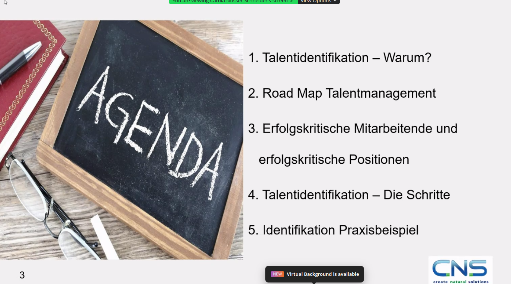
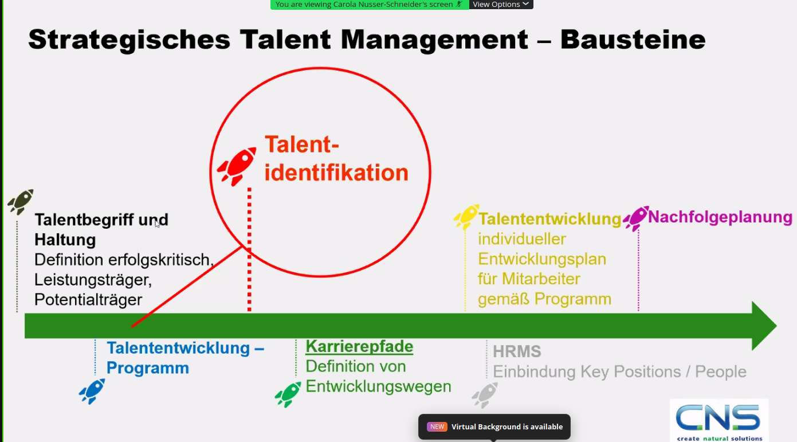
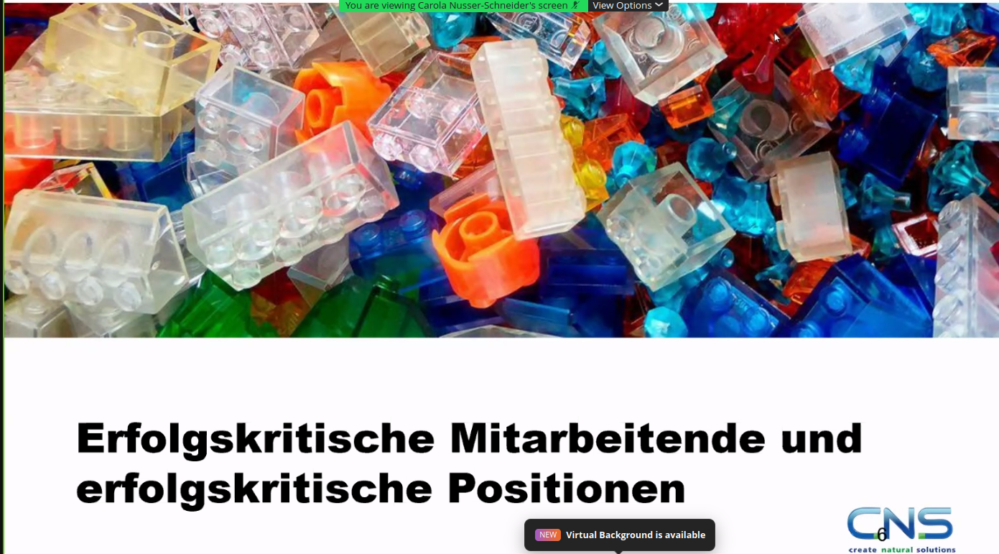
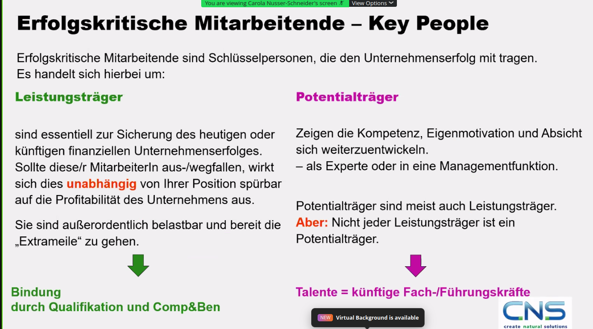

# 20230530 Talentidentifikation – Businesskritische Positionen dauerhaft besetzen
* Host Ingrid Janssen; Carola Nussen-Schneider als Vortragende
```
Referentin: 
Dipl. Kffr. Carola Nusser-Schneider
22395 Hamburg
P:   0049/40/671 03 616
M: 0049/170 47 23 111
cns@cnsconsult.de
www.cnsconsult.de
```

## Agenda

* Talenidentifikation - Warum?
* Roadmap Talentmanagement
* Erfolgskritische Mitarbeitende
* Talentidentifikation - wie geht denn das?

## Roadmap
* Haltung zu den Mitarbeitern, die für den Erfolg des Unternehmens kritisch sind
* Talententwicklung, Karrierepfade, HRMS
* wie mit identifizierten Talenten umgehen; Talententwicklung muss für alle nicht das gleiche sein

* HRMS nur für größere Unternehmen

## Was ist ein Talent?

* Leistungsträger vs. Potentialträger (manchmal auch beides in eine Person vereint)
* Leistungsträger: jmd. der auf heutiger Position maßgeblich zum Unternehmenserfolg beiträgt; Leute, die bereit sind, die Extrameile zu gehen; z. T. auch private Interessen zurückstellen; belastbar
* Potentialträger sind meist auch Leistungsträger; aber nicht alle L. sind P.
* Talente: künftige Fach-/Führungskräfte

## Erfolgskritische Positionen - Key Positions
* in Hinsicht auf Ergebnis, effiziente Prozesse oder Expertenwissen
* Beispiel: Personalbereich:
* interne Nachfolgeplanung ist erforderlich bis zu einem bestimmten Termin

## Schritte: Talentidentifikation
* wir sprechen von Potentialträgern für die dedizierte Nachfolgeplanung

* man könnte entsprechende Leute auch weiterentwickeln
* Praxisbeispiel: Mitarbeiterliste ziehen (Vertragsstatus sichten): Org-Einheit dazu; Seniorität auf der aktuellen Stufe; Leistungsträger zuweisen (max 5%), Potenzialträger

## Fragen
* Wer ist ein Talent: jemand, der nachfragt, querdenkt und die Ambition zeigt in größere Position zu wachsen
  * jemand, der in zwei bis drei Jahren in eine höhere Position wachsen kann
