# Product Backlog Management: Strategies for Success
* hosted by Teamleadsky (Alex)
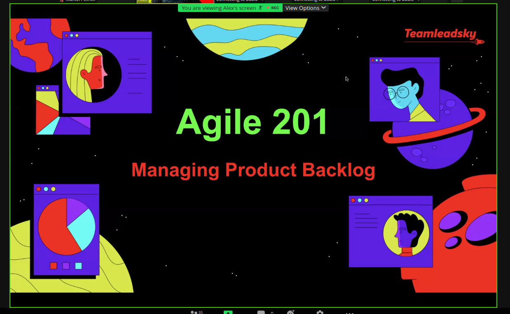
* miro board: https://miro.com/app/board/uXjVPnyOtM8=/
* sprint and product backlog: difference
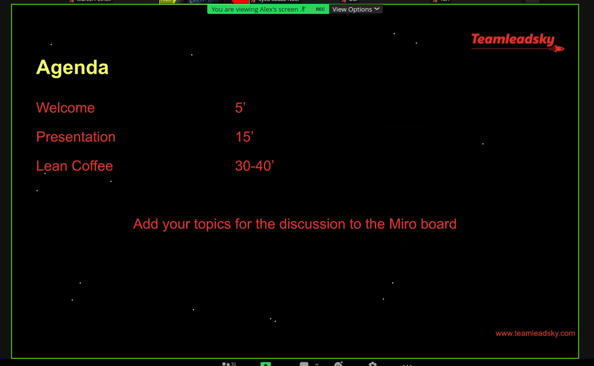
* product is a vehicle to deliver value
* product goal describes a future state of the product, which allows to generate more value

## product goals
* roadmap milestones with business objectives
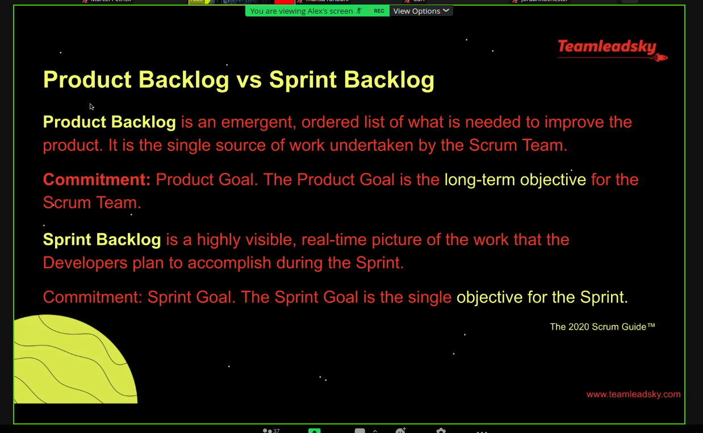
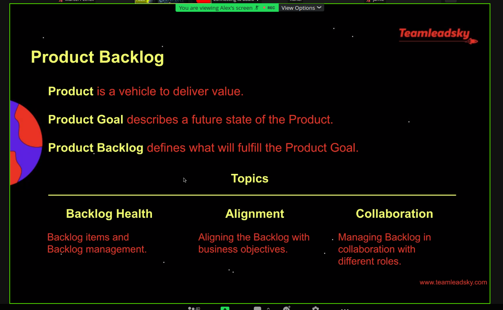
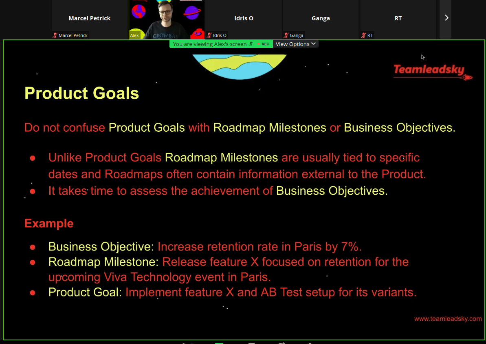
* product backlog items: precise, negotiable, ..
* DEEP characteristics of the backlog management: detailed, estimated, emergent, prioritized
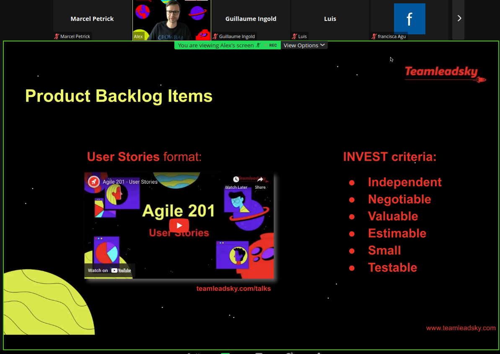
* product backlog items: short, well-structured
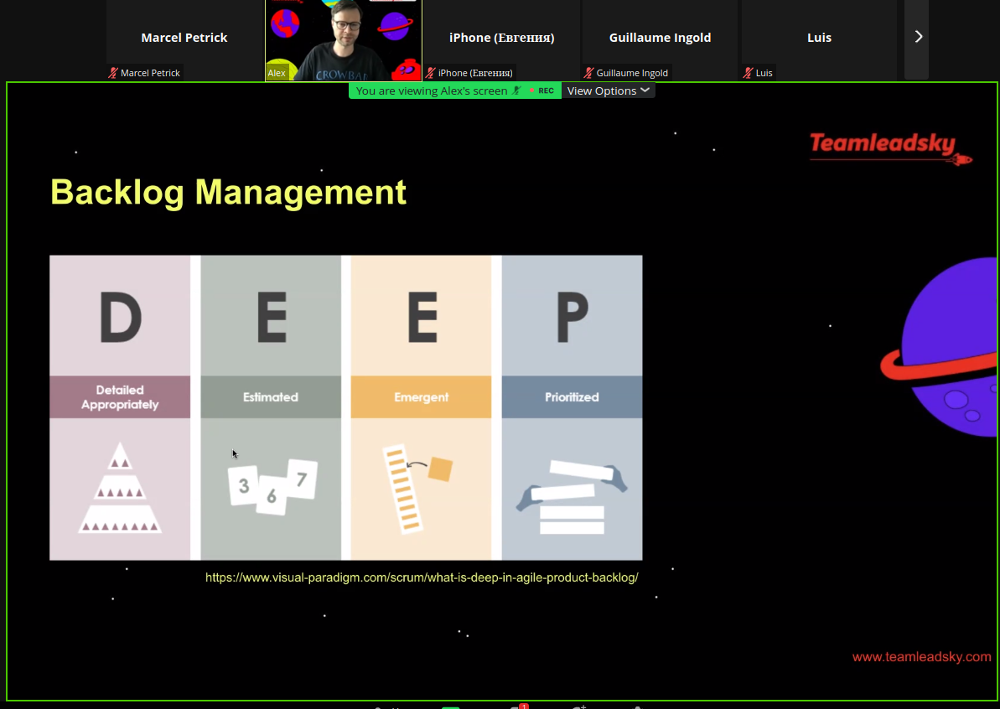
* three approaches for prioritization: MoSCoW, Kano, Impact/Effort
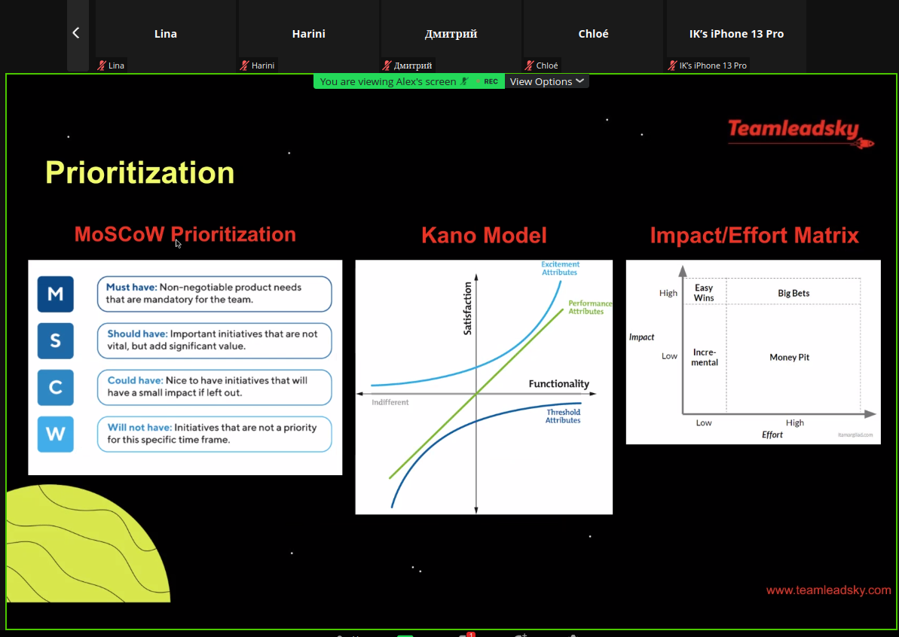

# backlog refinement
* no special event in scrum, but:
* regular cadence
* continuous process
* on-demand event (don't be shy)

* thorough refinements = shot plannings
* small groups: more focus time for the team; don't invite all the members to each refinement (really helpful advice, because I was always wondering if excluding some members in the invitations is ok..)
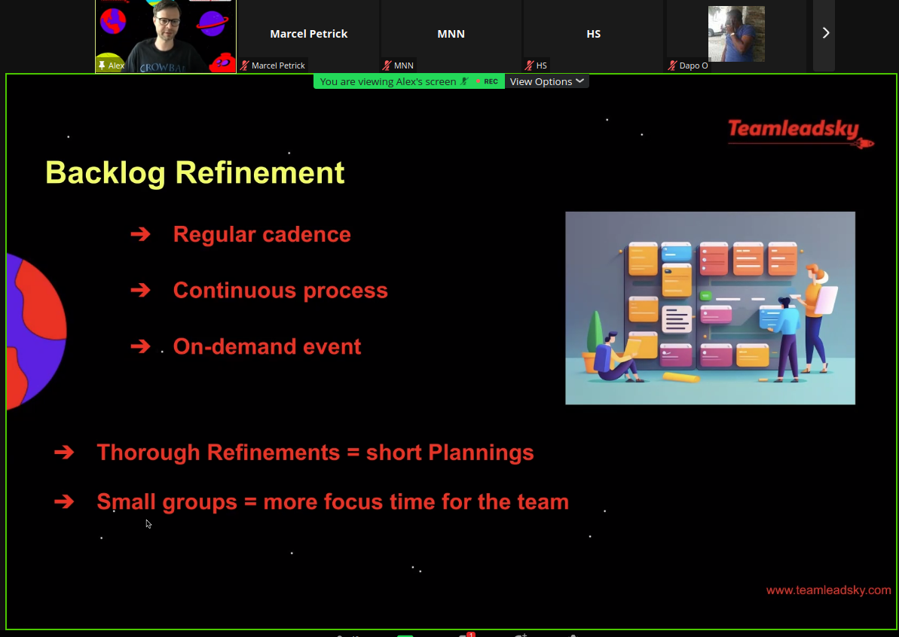

## drivers ans restrainers for efficient backlog management
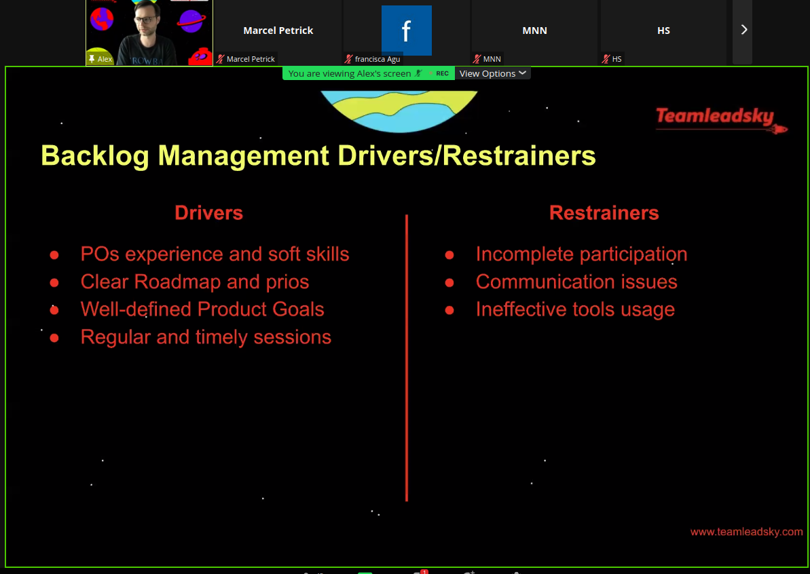
### good
* POs experience and soft skills ++
* clear roadmap and priorities
* well defined product goals
* regular and timely sessions

### bad
* incomplete participation
*  communication issues
* ineffective tool usage
* don't plan to far ahead .. or too detailed ahead
* people should not be afraid to share their ideas
   * foster culture of healthy, constructive discussions!
* remove artificial obstacles like flow-states: because all tickets should move from all states to all states (known problem..)
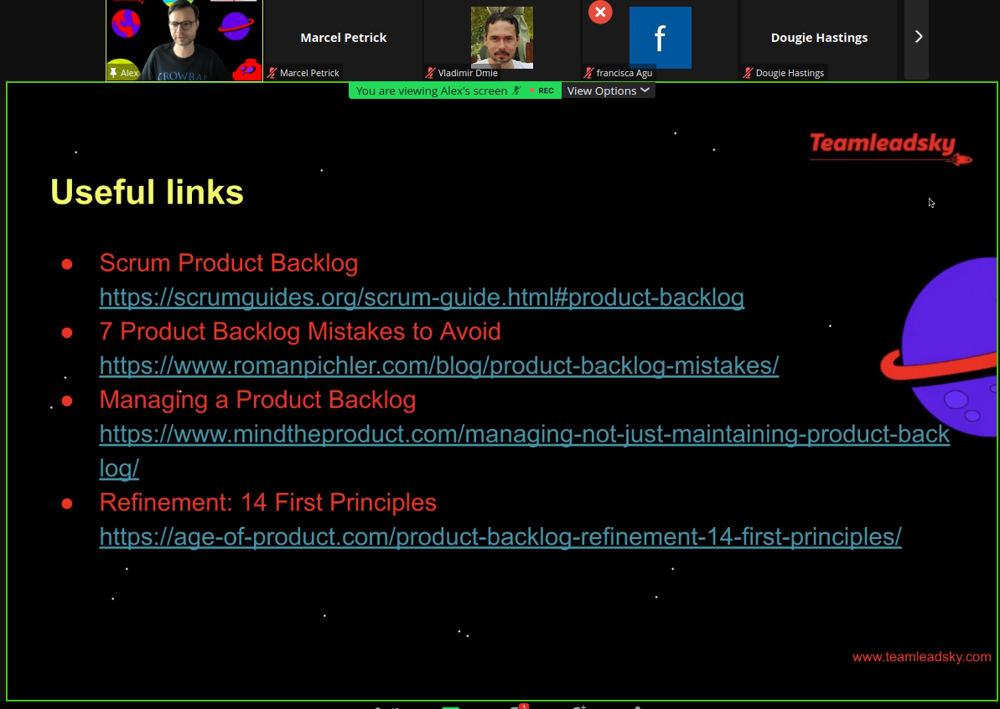

## Open discussion with miro board
* collection of input with priorization
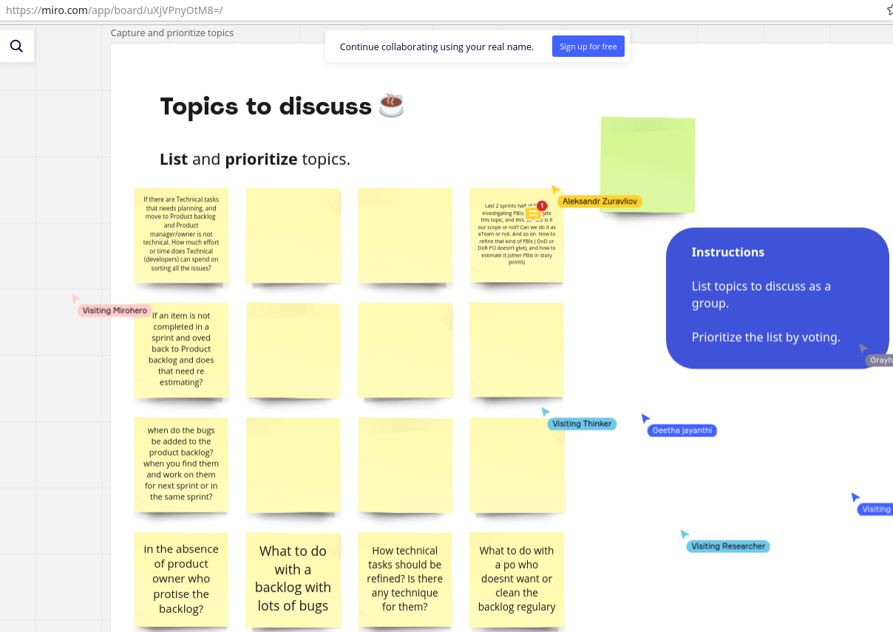
