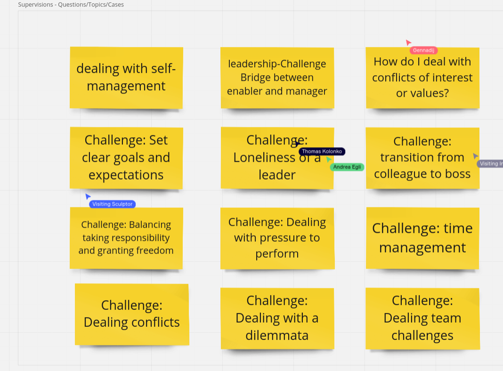
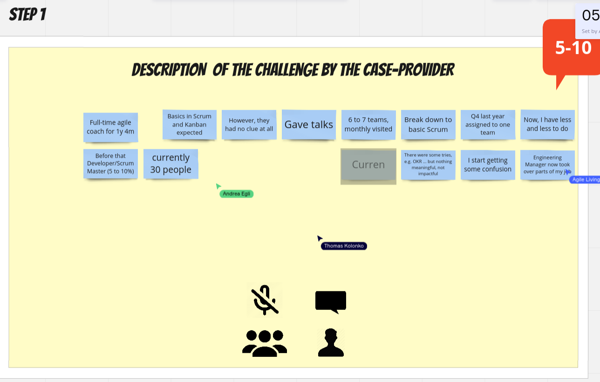

# 20230613 Supervision for Agile Professionals

* starting with chit-chat
* miro board: https://miro.com/app/board/o9J_ly0vkY4=/
* intro-session where everyone tries to express the reason why they have joined
* problems in company, etc.

## real supervision
* when does it feel easy for you to be a good listener?

