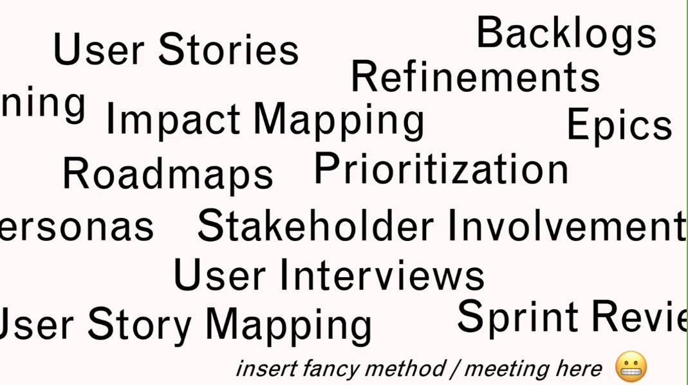
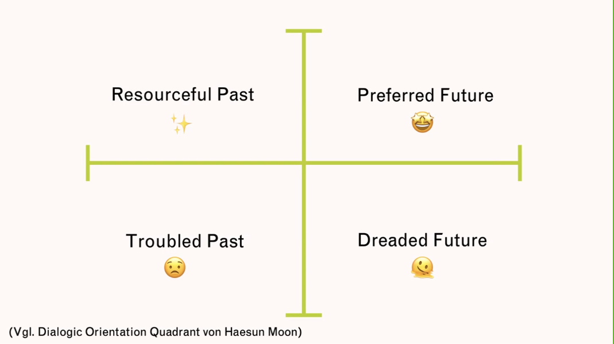
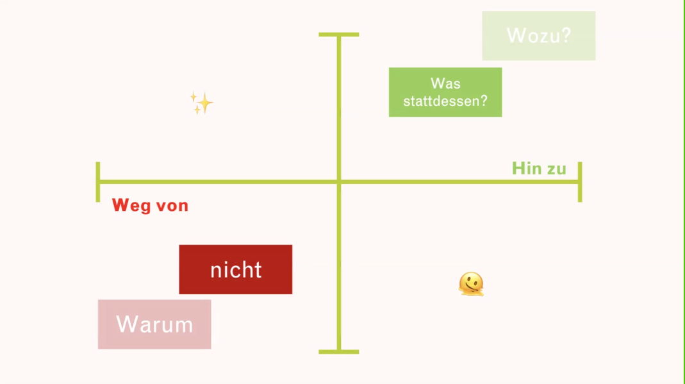
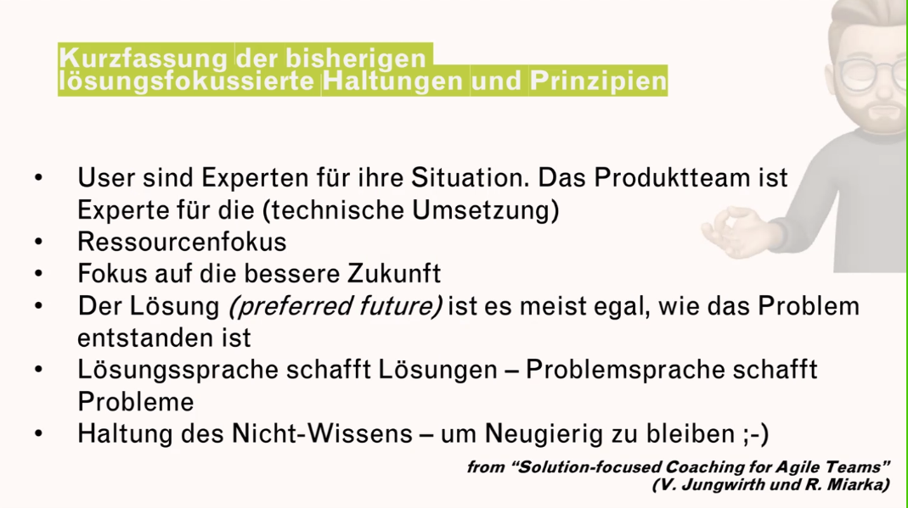
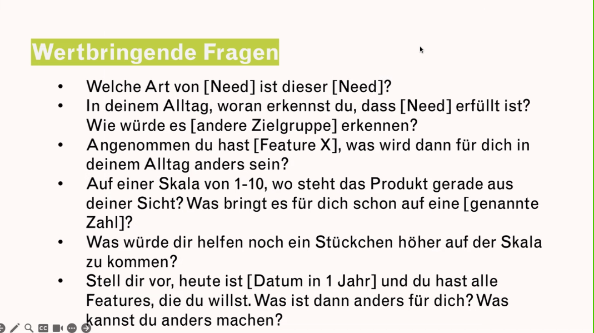

# 20230627 Lösungsfokussierte Kommunikation (nicht nur) für Product Owner

```
Details
Bist du schon einmal in eine Besprechung gewesen und hast bemerkt, dass die Leute über dieselbe Sache sprechen, aber unterschiedliche Worte benutzen, um sich auszudrücken? Dass sie in einen Konflikt geraten, weil sie sich nicht verstanden fühlen? Hast du schon einmal an einem Meeting teilgenommen, das vieeeel zu lange dauerte, weil die Probleme sehr stark analysiert, bevor eine Lösung gefunden wurde? Oder warst du schon einmal in einer Situation, in der du eine Lösung gefunden hast, nur um dann von den Beteiligten zu hören: "Das habe ich nicht gemeint"?

Einer der Schlüssel zur erfolgreichen Zusammenarbeit in jeder (Scrum-)Rolle ist Kommunikation - wer hätte das gedacht ;-) Und jetzt wird es spannend: Der lösungsfokussierte Ansatz nach Steve de Shazer und Insoo Kim Berg verändert grundlegend die Art und Weise, wie wir miteinander umgehen.

Mit lösungsfokussierter Kommunikation stellen wir sicher, dass die Informationen, die wir vermitteln wollen, von den anderen auch wirklich verstanden werden. Lösungsfokus unterstützt uns, Stakeholder:innen und Nutzer:innen die richtigen Fragen zu stellen, damit wir die relevanten Informationen zur Verbesserung des Gesamtprodukts zu erhalten. Und wir sorgen dafür, dass wir andere auf hilfreiche Weise einbeziehen. Klingt einfach - und ist schwierig zu meistern.

Mein Name ist Alexander A. Giurca, kurz Alex, und ich freue ich mich, dich am Dienstag, den 27. Juni, e-kennenzulernen. Du wirst mehr über den Lösungsfokus und seine Vorteile erfahren und auch konkrete Wissens-Nuggets erhalten, die du sofort in deiner täglichen Arbeit integrieren kannst.

Über Alexander A. Giurca
Alexander A. Giurca, BA ist Unternehmensberater und Organisationsentwickler in verschiedenen Branchen (FMCG, Pharma, Food, Banking, Automotive, ...) für agile Entwicklungen, Führung, Change Enablement, Innovation und Produktmanagement. Er ist ein ehemaliger Product Owner für eine Software mit über 4 Millionen Nutzern. In seiner Rolle als ehemaliger Digital Transformation Manager half er verschiedenen Unternehmen, mehr Innovation zu erreichen und neue, digitale Geschäftsmodelle aufzubauen. Als lösungsfokussierter Coach und zertifizierter "Training from the BACK of the Room"-Trainer bietet er neben seiner Beratungstätigkeit praxisnahe Trainings für Agilität, Führung, Lösungsfokus und Produktmanagement an.
```


* erster agiler Wert: Individuen und Interaktionen
* wirklich wirksame Kommunikation ist der übergeordnete Titel für dieses Meetup
* auf erwünschte Zukunft fokussieren: nicht troubled past or dreaded future

* nicht problelm-phobisch sein, sondern Problem wertschätzen und sich auf Lösung konzentrieren
* Was ist das Problem? Was ist schief gelaufen? Was kann in Zukunft schief laufen?
* *in Praxis hängen Problem und Lösung nicht immer direkt zusammen
* Wozu (Frage): Ich trinke gerne Kaffee - Durst löschen/Koffein hilft beim Wachwerden/Morgenroutine
  * hilft Lösungen zu entwickeln
 * Bedürfnisse, welche hinter dem Ziel stehen, erfragen
 
* in der Haltung des "Nicht-Wissens" bleiben, damit man nicht übersieht dass eine Lösung vielleicht nicht 100% korrekt war
* User sind ei Experten für Ihre Situation! Das Produktteam ist Experte für die (technische) Umsetzung
  als PO coaching-like die erwünschte Zukunft herausfinden
   * Gegensatz: Bedürfnisse verstehen versus Probleme verstehen
* "never put you but(t) in the face of an angry person" Marshal Rosenberg
* Kurzfassung er bisherigen lösungsfokussierten Haltungen und Prinzipien
  * User sind Experten für ihre Situation
  * Ressourcenfokus
  * Fokus auf eine bessere Zukunft
  * Der Lösung (preferred future) ist es meist egal, wie das Problem entstanden ist
  * Lösungssprache schafft Lösungen - Problemsprache schafft Probleme
  Ü Haltung des Nicht-Wissens - um neugierig zu bleiben
  * Widerstände als schlecht formulierte Bitten sehen: nicht gut genug ausgedrückt (Veronika Jungwirth)

* Stichwort "future jump"; aus Coachinecke
* * als Product Owner führen wir viele Coaching-like Konversationen

* Coaching ist freiwillig
* Product Ownership ist Haltungssache und hauptsächlich Kommunikation
* Haltung per se ist die Summe vieler, bewusster Entscheidungen in bestimmten Situationen anders zu reagieren

