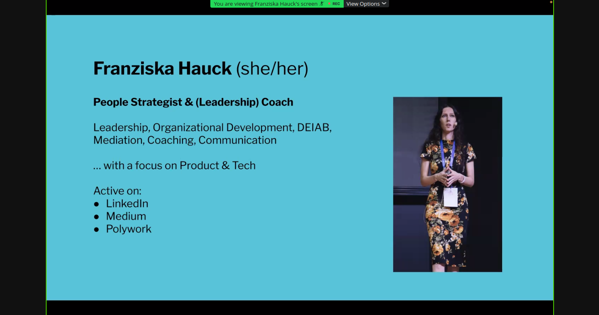
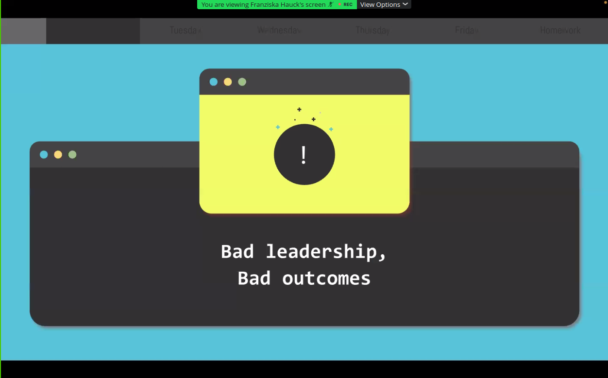
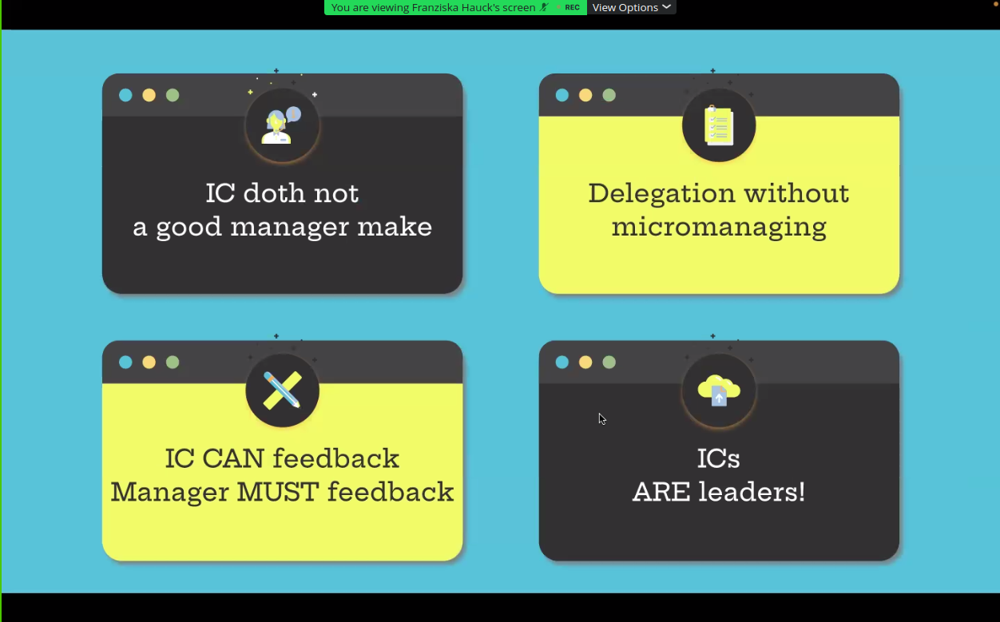
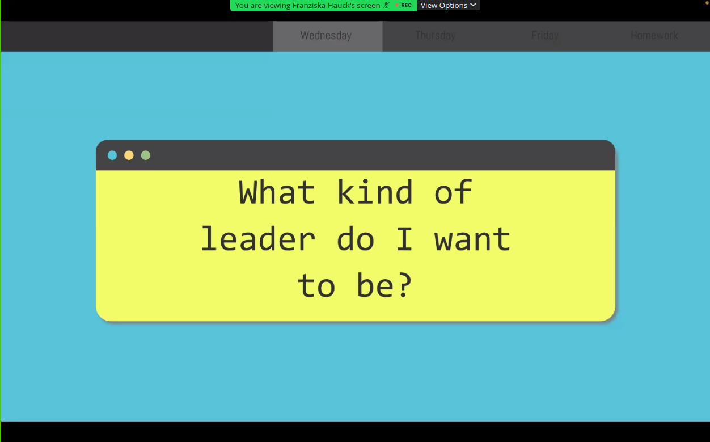
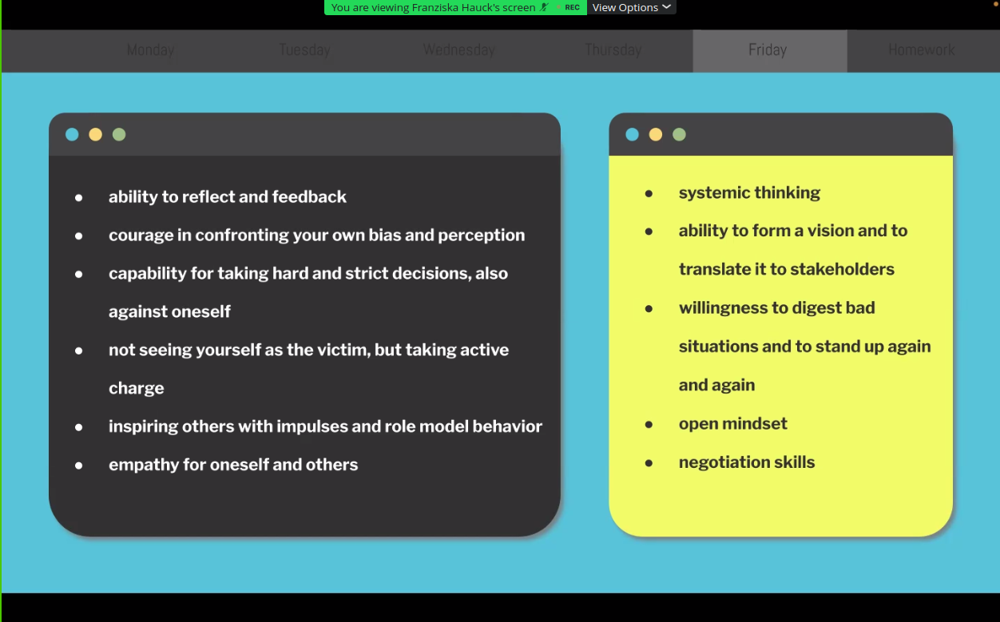
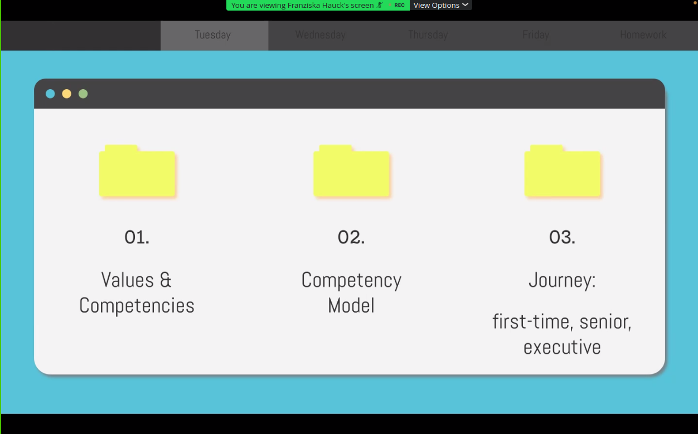
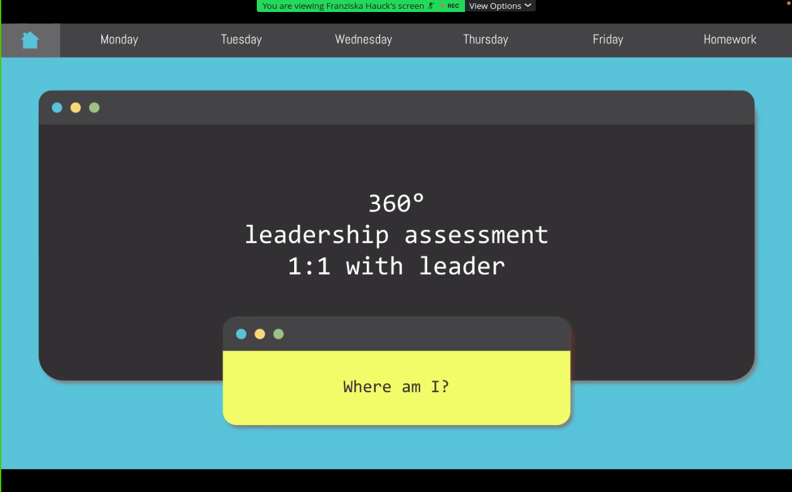
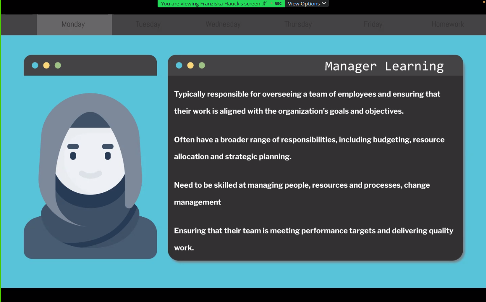

# 20230706 Develop your leader toolkit! 🧰
* host Aleksandr Zuravliov [Teamleadsky München]
```
ABOUT THE TALK
We need good leadership. Badly. The usual approach to develop leadership is to send (prospective) leaders to a 1-week resort and pray. But this is far from ideal. Ever wondered how you can develop your own leader toolkit? Franziska will walk you through a model and give practical tips in her talk.

ABOUT THE AUTHOR
Franziska Hauck is people strategist and leadership expert, with a strong focus on coaching leaders from the areas of tech & product. She is a qualified coach and certified mediator and a diversity, equity, inclusion, accessibility and belonging enabler. In her career, she has worked at large tech companies, medium-sized startups and as a freelancer.

https://www.linkedin.com/in/franziskahauck/
```

* Frnziska Hauck known as "tech people code" because she likes to crack tech people code
  * people strategist & leadership coach

* 

## bad leadership, bad outcomes

* she agrees, also saw chances to change details for a much better result
* what are ICs? IC - individual contributor?

* IC doth not a good manager make
* * delegation without micromanagement
 * IC CAN feedback; manager must feedback
 * ICs are leaders
* build leadership-toolkit (todo)
* usually companies do a 1-week-resort with some trainings and they expect to have perfect leaders with proper skillset: NOT GOOD
  * it can help to get some insights and hints to process, but usually not well received; we all have different learning types
  * developing means consistently learning and upskilling

## what kind of leader do i want to be?
* what do i not want to be?

* evertime she was faced with a bad leader (lack of investment or commitment): she said: everything but that
  * now she sues those moments to turn the ship around
* in other scenarios it means: asking yourself again what is currently needed to excel?
* what is a leadership profile
 - the chart
* there are different profiles; all things can be taken and improved
* good leaders have the ability to reflect and give feedback: observe people at any given moment
* open mindet; negotiation skill
* being a leader hurts: because you will notice that you are very biased and you have the ability to confront your bias
* consistently confront yourself about that bias
* not seeing yourself as the victim, but taking active charge
* strict decisions might also go against team members
* question also yourself if you are maybe the source for a problem?
* when you become a leader, then every action you do is watched - things which are done, said, .. everything will be pin-pointed
* systemic thinking
* willingness to digest bad situations and stand-up again and again
* negotiation skills: see Harvard TODO
* non-violent communication - TODO


* 01. values and competencies; 02. competency model; 03. Journey: first-time; senior; executive
 * manager first: try it out on yourself the very first time; this creates interesting insights

## how to get that feedback?

* 360° feedback: ask peers, other managers and other people with a working relationship to give working feedback; maybe also based on a score; based on a skill
  * check templates on the internet; send that out and get that feedback; huge potential for reflection (for things which still have to be learned)
  * written report helps also to avoid awkward 1:1-situations
* leadership assessments are another way
* 1:1 with leader

* after gathering the input, put this into a structured model, then devise a development plan (TODO) starting from that
* leadership books usually present mostly the view from a white men's perspective which does not reflect the diversity of reality
* helpers: courses, coaching, CoP
* coaching versus mentorship

## manager learning

