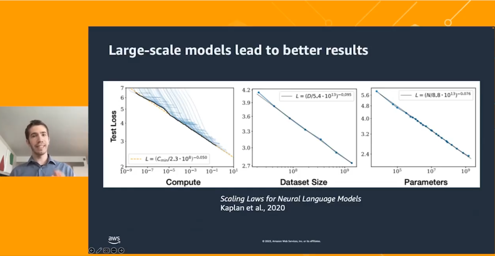
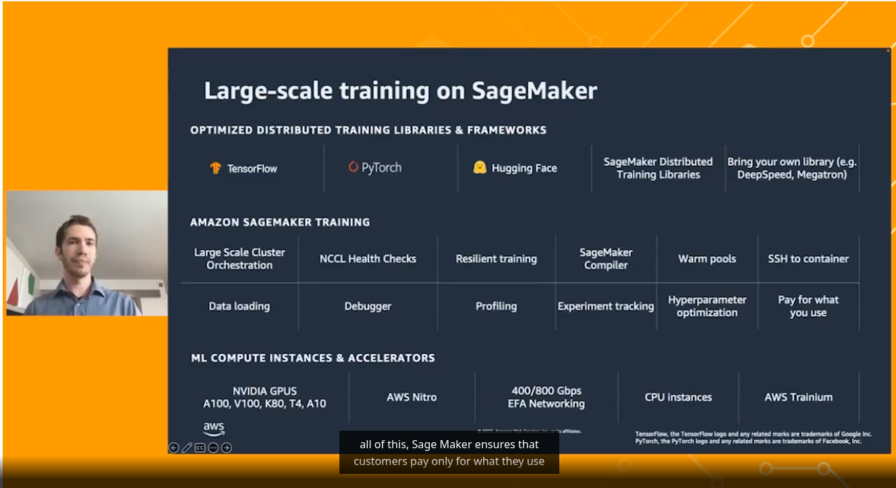

# 20230721 MachineLearning in 15: Train your ML at scale

* rise of large-scale models
* example of image generation models: 2017 very bad living room, 2022 very good (stable diffusion) - improvement by size
* noticeable architectural innovations

## challenges with training large-scale models
* hardware, health checks, orchestration, data, scaling up, cost
* todays models don't fit on one GPU
--> sagemaker can help (product from AWS)
* also: hosted TensorBoard for tracking stats; automated data management

TODO: https://aws.amazon.com/training/learn-about/machine-learning/?th=tile&tile=learnabout
