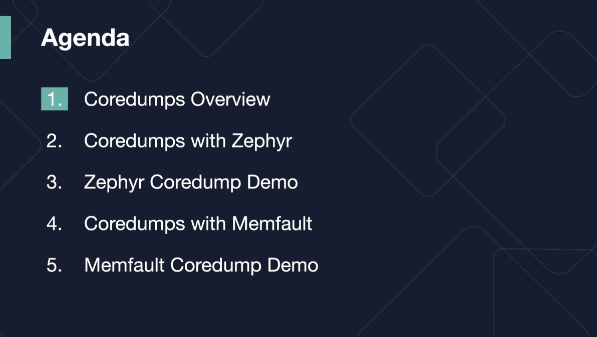
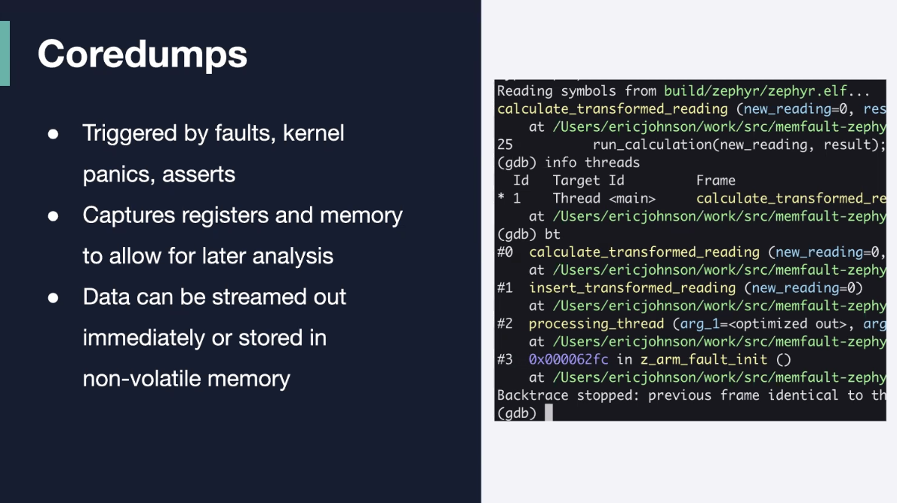
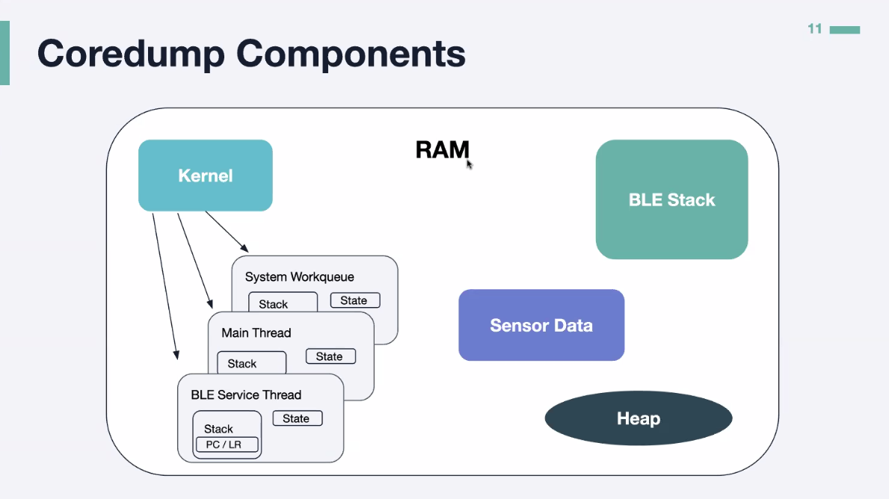
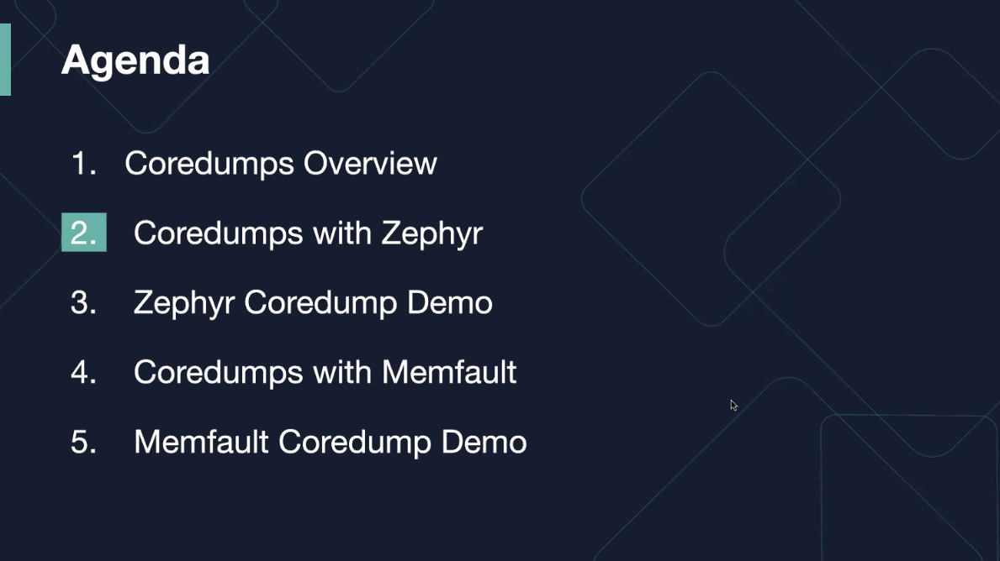
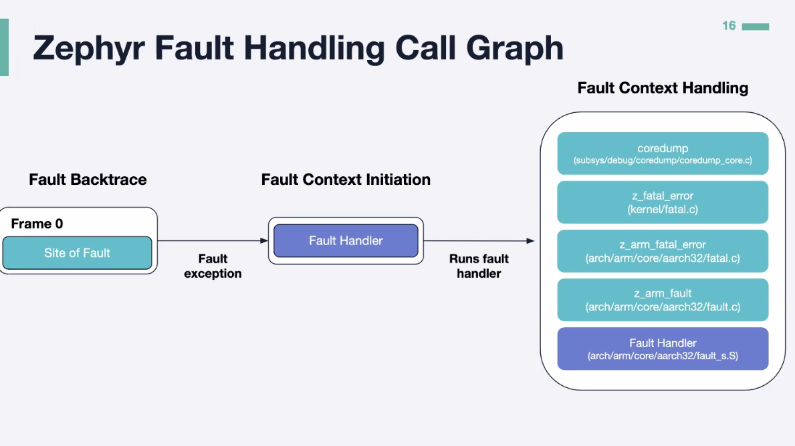
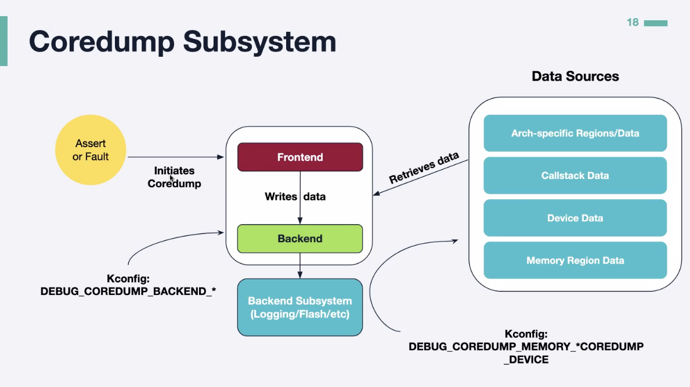
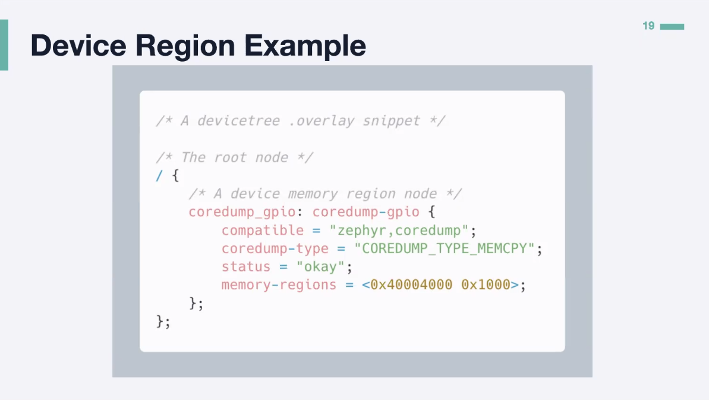

# 20230726 Employing Coredumps to Debug Your Embedded Devices

## invitation
```
Do you have a memory allocator that needs usage monitoring? Add it to your coredump! Or sensor data that causes a unique stack overflow? Add it to your coredump!
We know firsthand how difficult identifying and solving the root causes of firmware faults is, particularly for devices in the field. Local debugging and logging subsystems are commonly used to determine the issue cause, however, these tools are limited and invasive. This is where coredumps become helpful! Coredumps, an underutilized debugging resource, can provide valuable insights as they contain highly structured data that can be easily parsed.
Join this webinar as our Firmware Solutions Engineer, Eric Johnson, introduces you to coredumps and how to use them in practice. Eric will demo and example of coredumps with Zephyr, and you’ll learn how to: 
Capture details insights into faults with coredumps
Use GDB with a coredump
Utilize Memfault to collect coredumps on any embedded MCU, Linux, or Android devices
```

## host
* Eric Johnson von Zeyphyr is the presenter today


* gdb python extension: also covered today

## real talk
* logging is great, but does not cover everything
* hides and masks other logs; but having much problems
* logs hard to use i post mortem analysis
* hard to replicate at your desk
* Zephyr has panic-logging-function; good for diagnosis, but just one frame; needs lots of symbol decoding
* coredumps are better; and non-invasive

* normal runtime behaviour completely unaffected
* logging uses at least one background thread
* log immediate mode
### content of a core dump
* different regions of memories in the dump

* what os is your device based on? FreeRTOS, Zyphyr, other RTOS or bare-metal?

* if assertions are involved, then the stack becomes a bit more complicated

* special function can convert coredump-data into zephyr-format (call-stack-data)



* encourage use of gdb-bundle: because quite helpful
* example: gdb pauses after remote-connection
* 
