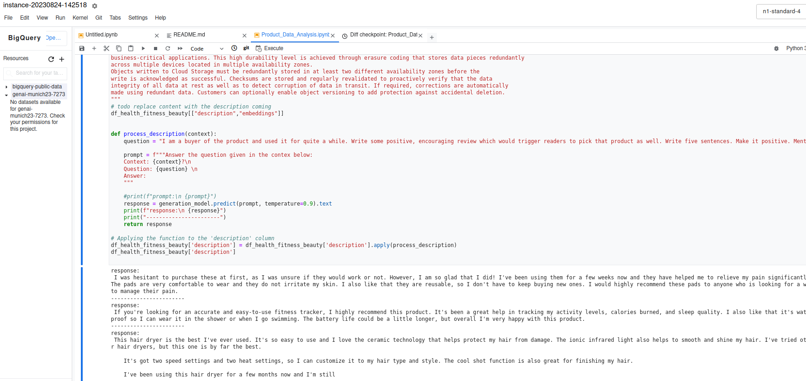

# 20230824 Google: Gen AI  for developers

## first talk

* Someone uses ChatGPT to create replies to transactional mails
* conceptual overview:
  * deep learning as subset of ML as subset of AI
  * neural networks inspired of human brain..
  * google tensor processing unit
  * lack of hardware, lack of open source software
  *  advances, when those things became more affordable
  * discriminative versus generative techniques: classification versus generation - label things based on an image OR create new content out of the description
  * many LLMs are "just" transformers: "attention is all you need" research paper
  * consists of encoder, self-attention-mechanism, very crucial for NLP tasks
  * more efficient than RNN  or CNNs
  img00
  * this revolution started at Google, and we continue to innovate: BARD ..
  todo img01
  * genAI landscape: note-taking, summarizing, writing replies, code generation, text to SQL, automate ..
  * four main areas: create new content, summarize, discover, automate
  img02
  * https:// imagen.research.google
  * problem: hallucinations are words or phrases that are generated by the model that are often nonsensical or grammatically incorrect
    * tries to provide answers, which don't exist clearly in the data; several attendees experienced such a case
    * the model is not trained on enough data, noisy or dirty data, not given enough context, not given enough constraints
    * prompt design is crucial and determines the quality of the output

### Gen AI on GCP quick tour
* clarification: consumers and enterprises have different needs: BARD and GPT are trained on the input data: specifically for consumers
* others are focused on businesses
img03 - portfolio for cloud ai
* Vertex AI (as end to end ML platform) and foundation models
* all runs on cloud GPUs/TPUs
* todo test: generative AI app builder
* today: Gen AI Studio: prototyping and testing models
  * image vision just for "trusted testers" - have to request access if interested TODO
  * Vertex model garden offers various enterprise user journeys
  * openAI access, usable for summarization, generation, ..
* generative ai app builder creates generative ai apps without writing any code
* also: enterprise search
* todo: google cloud console
### short intro
* Jelena Mjuskovic was first speaker
* create new pp: lots of UI as approach -> widget for my app where she can search through the content of Google cloud -> source: website, unstructured data, structured data ->  then you get the widget, which can be immediately tested
* Duet AI coming soon: AI-powered collaborator: looks like it is working for the user like copilot; needs developer preview program

## Responsible AI principles
img04
* be socially beneficial
* avoid creating or reinforcing unfair bias
* be built and tested for safety
* be accountable ..
* 16 safety filters, which can be defined for your use-case
* your data, your terms: data not shared with other users; model is frozen, not touched by prompting and fine-tuning
[end of the session]

# Ready to code?
* google cloud platform console
https://console.cloud.google.com/getting-started?pli=1&authuser=1
* 2 PaLM sizes: gecko and bison (more costly, larger)
* list of bison and gecko models..
img05 - the two models as cheat sheet

* now we start ..
* setup lab environment: open jupyterlab..
* clone this repo: https://github.com/GoogleCloudPlatform/generative-ai.git
* either usable via ui or pure code:
* spend time with "intro for gen ai api.."
```
Using Vertex AI PaLM API

You can interact with the Vertex AI PaLM API using the following methods:

    Use the Generative AI Studio for quick testing and command generation.
    Use cURL commands in Cloud Shell.
    Use the Python SDK in a Jupyter notebook
```
* chain of thought prompting elicits reasoning in LLMs
```Available models

The Vertex AI PaLM API currently supports five models:

    text-bison@001 : Fine-tuned to follow natural language instructions and is suitable for a variety of language tasks.

    chat-bison@001 : Fine-tuned for multi-turn conversation use cases like building a chatbot.

    textembedding-gecko@001 : Returns model embeddings for text inputs.

    code-bison@001: A model fine-tuned to generate code based on a natural language description of the desired code. For example, it can generate a unit test for a function.

    code-gecko@001: A model fine-tuned to suggest code completion based on the context in code that's written.

    codechat-bison@001: A model fine-tuned for chatbot conversations that help with code-related questions.

You can find more information about the properties of these foundational models in the Generative AI Studio documentation.
```

```
How does temperature affect the response?

Lower temperatures are good for prompts that require a more deterministic and less open-ended response. In comparison, higher temperatures can lead to more "creative" or diverse results. A temperature of 0 is deterministic: the highest probability response is always selected. For most use cases, try starting with a temperature of 0.2.

A higher temperature value will result in a more exploratative output, with a higher likelihood of generating rare or unusual words or phrases. Conversely, a lower temperature value will result in a more conservative output, with a higher likelihood of generating common or expected words or phrases.
```

```
Code generation with code-bison@001

The code generation model (Codey) from PaLM API that you will use in this notebook is code-bison@001. It is fine-tuned to follow natural language instructions to generate required code and is suitable for a variety of coding tasks, such as:

    writing functions
    writing classes
    web-apges
    unit tests
    docstrings
    code translations, and many more use-cases.

Currently it supports the following languages:

    C++
    C#
    Go
    GoogleSQL
    Java
    JavaScript
    Kotlin
    PHP
    Python
    Ruby
    Rust
    Scala
    Swift
    TypeScript
```
### prompt design
* go to prompts folder and into "prompt design": https://2cbed9ac6b3b308-dot-us-central1.notebooks.googleusercontent.com/lab/tree/generative-ai/language/prompts/intro_prompt_design.ipynb
* evaluation of summarizations: https://en.wikipedia.org/wiki/ROUGE_(metric)
* this is the vertex ai workbench, but those examples can also be run in colab

[break]

## Use case implementation
* use case implementation n product data
img07
* use case: open source data-set from best buy (also see github for best buy data set)

git clone https://github.com/NucleusEngineering/NucleusEngineering-genai-product-data-challenge.git
* maybe needs data cleaning
* ideas
img08
https://2cbed9ac6b3b308-dot-us-central1.notebooks.googleusercontent.com/lab/tree/NucleusEngineering-genai-product-data-challenge/Product_Data_Analysis.ipynb
* we should read this as a start
* ... hard time building groups, because they were either too large or already settled for a certain idea
* did some ideation with gpt: went with review generation
  * "Review Generator:

    Idea: Can the AI model generate a product review based on the product's features, price, and other available data? This can be used to understand potential customer feedback before actual reviews come in.
    Implementation: Use generative models to produce hypothetical reviews."
* working .. the hardest part was to get used to jupyter and dataframes ... but quite mighty:

```
context = """
Storage and content policy \n
How durable is my data in Cloud Storage? \n
Cloud Storage is designed for 99.999999999% (11 9's) annual durability, which is appropriate for even primary storage and
business-critical applications. This high durability level is achieved through erasure coding that stores data pieces redundantly
across multiple devices located in multiple availability zones.
Objects written to Cloud Storage must be redundantly stored in at least two different availability zones before the
write is acknowledged as successful. Checksums are stored and regularly revalidated to proactively verify that the data
integrity of all data at rest as well as to detect corruption of data in transit. If required, corrections are automatically
made using redundant data. Customers can optionally enable object versioning to add protection against accidental deletion.
"""
# todo replace content with the description coming
df_health_fitness_beauty[["description","embeddings"]]


def process_description(context):
    question = "I am a buyer of the product and used it for quite a while. Write some positive, encouraging review which would trigger readers to pick that product as well. Write five sentences. Make it positive. Mention some features of the product."

    prompt = f"""Answer the question given in the contex below:
    Context: {context}?\n
    Question: {question} \n
    Answer:
    """

    #print(f"prompt:\n {prompt}")
    response = generation_model.predict(prompt, temperature=0.9).text
    print(f"response:\n {response}")
    print("-----------------------")
    return response

# Applying the function to the 'description' column
df_health_fitness_beauty['description'] = df_health_fitness_beauty['description'].apply(process_description)
df_health_fitness_beauty['description']

```
* my result:


* check this: file -> `Product_Data_Analysis.ipynb`
[presentations from the teams]
* some people put the chat-history to the context of the query, so that it knows this for the next question

TODO: add all the images
