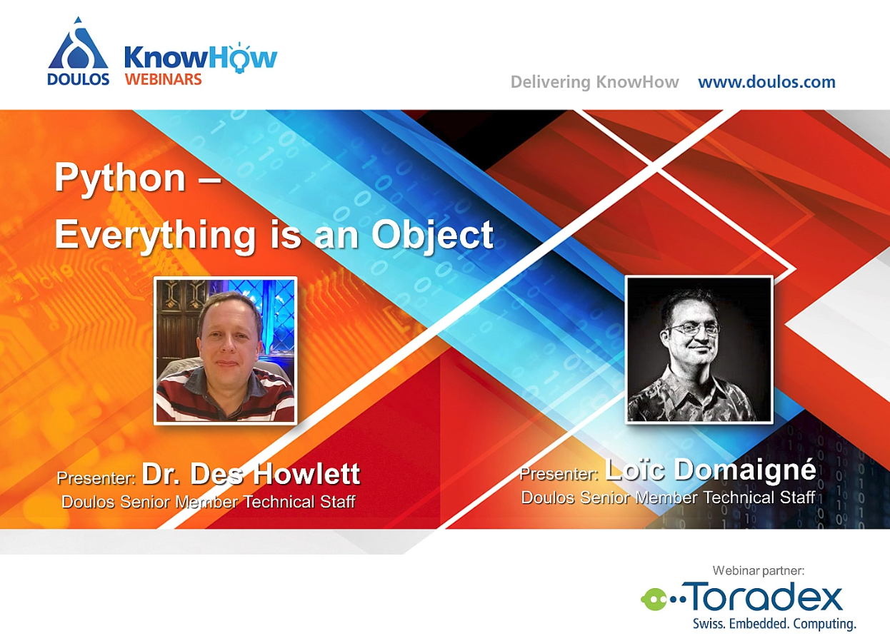
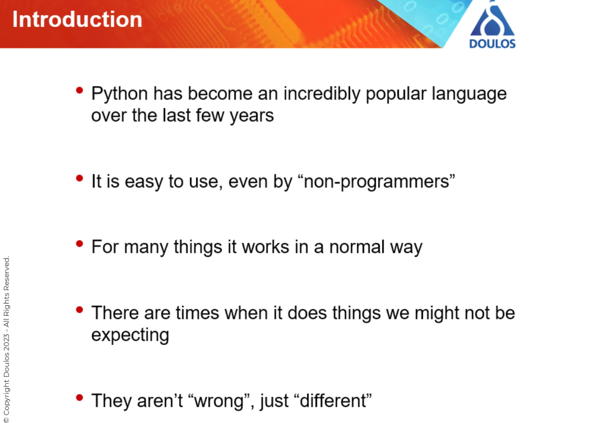
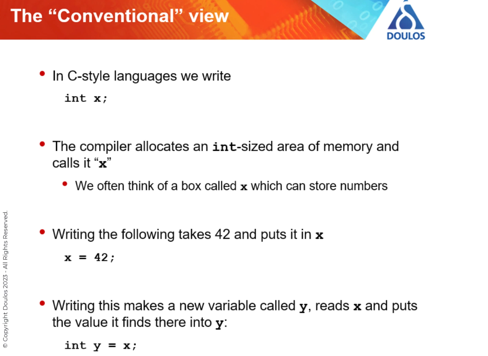

# 20230825 Doulos: Python - Everything is an object

```
Introduction Python has become an incredibly popular language in the last few years doing everything from automating design flows, data analysis and even just being a general “glue” which can translate one dataset into another. For most everyday tasks, it “just works” but there are times when you can be caught out when something unexpected happens, especially if you are used to other types of programming languages such as C, C++, C# or Java. In this webinar... ​Dr Des Howlett and Loic Domaigne of the Doulos Senior Technical Staff, will show you how all parts of Python have a lot in common, whether they are variables, classes, class objects or functions. We will see what happens when a variable is assigned, when functions are called and when generators yield new values. This will help you to adjust any mental map that you acquired from other languages and make you better at Python. The webinar will be part theory and part practical demonstration. At the end, you will be able to download a Jupyter Notebook which you can run yourself and continue your investigations into the inner workings of this very powerful language. Are you ready to take the leap to Python? The webinar is presented in partnership with Toradex and concludes with a brief overview of the Toradex board portfolio and Torizon software platform. 
```


## short intro
* it just works in a normal way, used even by non-programmers
* there are times when it does things we might not be expecting
* they aren't wrong, just different


## topics
* conventional model
* storing regular variables
* definitions of functions and classes
* function calls and stack frames
* generators and multithreading
* higher order functions: functions which create and define other functions

## note
* some things like integers and Booleans are not handled quite like objects for efficiency reasons

## conventional view


## Python is different

* end goal is the same, but the way is different
* the type information goes with the value; not the variable name
* so y = X where x = 42, then we just create a new binding to that object
* sometimes more efficient, in case of 100 variables with the same value, then you just have 100 labels instead of 100 containers
* but 42 is now immutable


---------------


20230825_Doulos_Python_Everything_is_an_object
