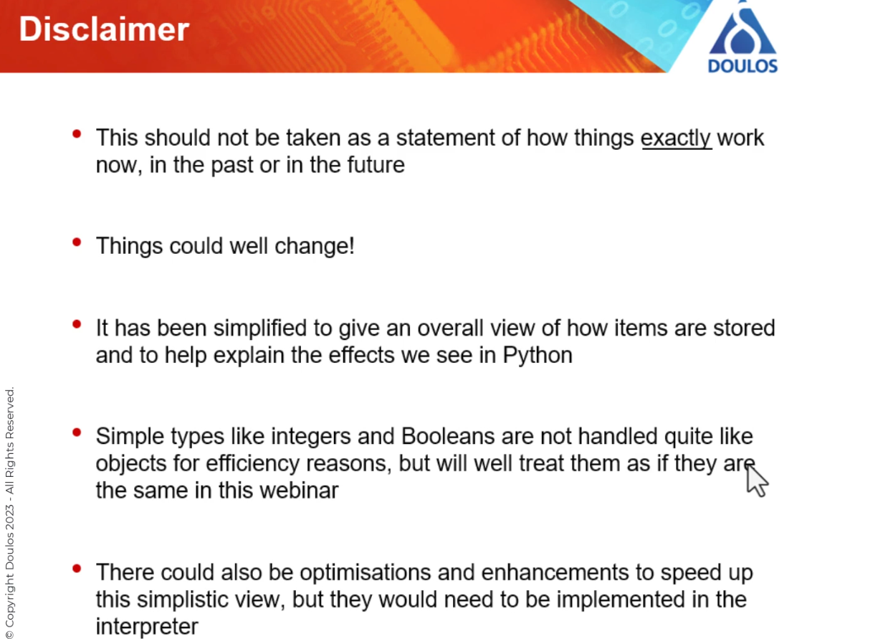
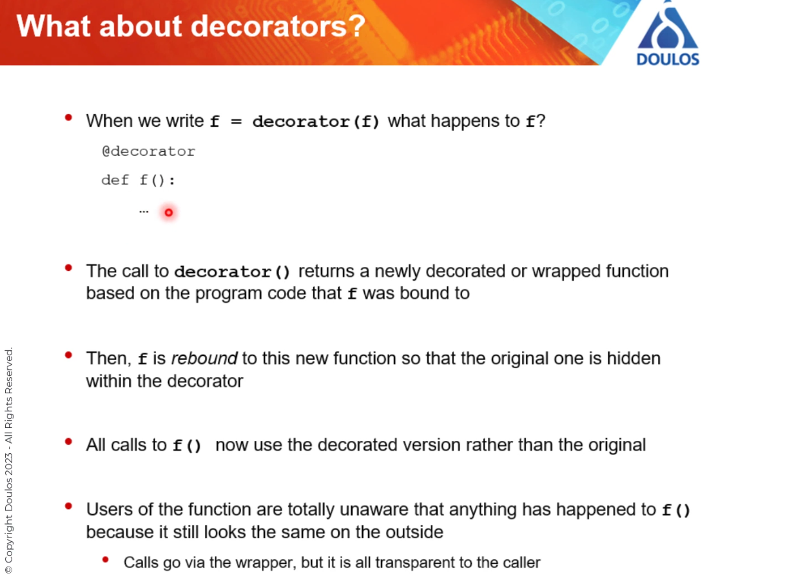

# 20230825 Doulos: Python - Everything is an object

```
Introduction Python has become an incredibly popular language in the last few years doing everything from automating design flows, data analysis and even just being a general “glue” which can translate one dataset into another. For most everyday tasks, it “just works” but there are times when you can be caught out when something unexpected happens, especially if you are used to other types of programming languages such as C, C++, C# or Java. In this webinar... ​Dr Des Howlett and Loic Domaigne of the Doulos Senior Technical Staff, will show you how all parts of Python have a lot in common, whether they are variables, classes, class objects or functions. We will see what happens when a variable is assigned, when functions are called and when generators yield new values. This will help you to adjust any mental map that you acquired from other languages and make you better at Python. The webinar will be part theory and part practical demonstration. At the end, you will be able to download a Jupyter Notebook which you can run yourself and continue your investigations into the inner workings of this very powerful language. Are you ready to take the leap to Python? The webinar is presented in partnership with Toradex and concludes with a brief overview of the Toradex board portfolio and Torizon software platform. 
```


## short intro
* it just works in a normal way, used even by non-programmers
* there are times when it does things we might not be expecting
* they aren't wrong, just different


## topics
* conventional model
* storing regular variables
* definitions of functions and classes
* function calls and stack frames
* generators and multithreading
* higher order functions: functions which create and define other functions

## note
* some things like integers and Booleans are not handled quite like objects for efficiency reasons

## conventional view


## Python is different

* end goal is the same, but the way is different
* the type information goes with the value; not the variable name
* so y = X where x = 42, then we just create a new binding to that object
* sometimes more efficient, in case of 100 variables with the same value, then you just have 100 labels instead of 100 containers
* but 42 is now immutable

* integers are immutable, strings are immutable
* adding numbers just frees the initial object and since it is not bound to anything anymore, it is left for the garbage collector
* every object has 2 parts, the type and the data
```
x = 42
y = x
x += 10
print(f"x: {x}, y: {y}")
# x: 52, y: 42
```
* type of objects can change when the code continues
* x is free to be whatever you want it to be
* when an object is not bound anymore, and the garbage collector comes and says "nobody wants you, nobody knows you", then it is free to destroy it (deallocate/destroyed)

* multiplying strings? just repeat it, not multiplying the characters
* for most people this does not matter, because their programs are shortlived; and it also does not matter how data is stored

* identifier names in Python are more like a hybrid pointer/reference with RTTI in C++
* what about definitions (functions)?

* just a container 
* "class" just means to create an object bound to a name
  * the data part is the definition of the members of the class
  * giving the class a name will prevent the garbage collector to throw away the name
  * variables are just local to the function
  * there is no classical stack, just stack frame objects (for recursive functions): which is released from the gc later

### Generators

* just possible because stack frames are retained during function calles
* a generator function makes a new stack frame object with all the local variables
* * every time the function yields, that stack frame remembers that point so it can continue on the next iteration
# multithreading

* see: module asyncio
* functions sleep, they take no ressources
* the stack frame object keeps track of where to retrun to in our task
# decorators

* the call to the decorator returns a newly decorated or wrapped function based on the program code that was f bound to
* the user still calls f() - the original function - but they called the edited function

# Seeing this in practice
* showcases in a jupyter notbook (coming in some days)
* using `nbtutor` to see the python internals

* check for equality: `x is y`?
* in python the name moves, not the object!
## reference counts and garbage collector

* `sys.getrefcount(x)` to check for refcount of a certain object ..
* import does create a name which is bound to the module
* in python all objects are objects: first order objects

* function calls and frame objects
* nested function calls


* grabbing the python frame with `inspect`: inspect.currentframe() - wow!
* can also be used to access the locals of a frame!
* one application is the generator function as shown: yield instead of return; one object tracks for a generator where it stopped - and where to resume
* decorator:


## Summary

* Python is, at its heart, a simple language but very powerful

## Questions

```
:
    Is there any technic to make objects corresponding to each variable "lightwiight" in Python? 
A:
    There is likely some hidden magic going on "under the bonnet" of Python to avoid having too many temporary variables being created. We are not really dealing with optimisation in this webinar, but looking at the mechanics of how the language works.

Q:
    when the x is rassigned to 43, will the object 42 will not only have label - "y" Is that right? 
A:
    Correct.

Q:
    Is there a possibility to create "weak" reference variables in Python (like Java has), so the underlying object reference count is not changed when such weak reference variable is assigned the object?
A:
    Yes, there's a module called weakref which would help you with that.

Q:
    Is it possible to alter the behavior of garbage collector, so it acts in a more predicable way, which might be preferable for embedded applications, or even disable garbage collector at all? 
A:
    Yes. You can set limits on when it runs (such as minimum memory levels) or turn it off. In embedded applications, such as using Micropython you can force a collection at exactly the point you want it to happen.

Q:
    Hello is typing a variable force the data to fit the type generating errors if not ? Or is it just for readibility ?
A:
    no. typing is a "type hint". It is used indeed for readability (so that the user knows the expected type). But you can use tools like mypy to check possible type mismatch. 

Q:
    If i print the id(x) it will show me a different address every time i assign x a new value? If i assign y = x now both x and y points to the same address right? But if i assign x another value now x and y are different and thus have different addresses 
A:
    If you change x so that it is bound to a new object, then the id has changed, yes.

Q:
    for your example, "y=x", did you mean that if later I were to change "x" would follow "y" the new value?
A:
    No, unless x is a mutable type like a list or a dictionary. Writing x = 42; y = x; x = 100 you would find that y is still 42.

Q:
    Wasn't there some difference between tuples and lists in that the latter are modify-in-place while the former are copy-then-modify?
A:
    Ah, that's a good question. A list is a collection of name binding. So a list L=[1,2,3], L[0] is a binding to item 0 the integer object 1, L[1] to the int 2 etc. We can modify this binding anytime, so L[0]='hello' binds now item 0 to the string 'hello'. Tuple are immutable list in the sense that you can't modify the binding of a tuple, so changing t[0] for instance raise an exception. But you could still modify the object refered by t[0] if it is mutable. 

Q:
    Could you send me this presentation? 
A:
    Yes, we will email you a link to a streamed video recording of the presentation as soon as possible - along with the compiled Q&A log and links to useful resources.

Q:
    Is there a way to inspect which operations has been done by the garbage collector? For example, i would see if a class method object is still active or if it has been destroyed
A:
    No. Something is not marked for collection until no part of your program can still access it. To know about an object, you would still have access to it, so by definition, it is not available for deletion.

Q:
    Will the stack frame be re-used if we call "Factorial(6);Factorial(6)"?
A:
    I don't think it will per default. There is the possiblity however to introduce the @cache decorator to cache previous value (we'll be discussing decorator soon)

Q:
    Do you just have to know a priori whether a type is mutable?
A:
    Yes. As a good starting point: lists, dictionaries, sets and class instances are mutable.

Q:
    I heard about alternative commercial garbage collector for Java suitable for embedded and mission critical applications. Do you know if there is something similar for Python? 
A:
    Personally, I haven't heard of it. 
11:31 AM

Webinar staffto everyone

Q:
    What other usages of generator are possible other than convert it to iterator? 
A:
    The underlying mechanism behind generator functions is used in asyncio to implement co-routines. It is not the same syntactically, but the language internals are.

Q:
    Pls share the recording, need to leave for another urgent meeting. Thanks!
A:
    We will email you a link to a streamed video recording of the presentation as soon as possible - along with the compiled Q&A log and links to useful resources.

Q:
    Will you email the link to video recording by default to everyone who attended this webinar or only to those who asked for it?
A:
    All registrants for the webinar will get the recording and resources :)

Q:
    Is there a difference between globals and function local variables, in both cases they are just ordinary objects or there is fundamental difference in underlying representation? 
A:
    In terms of the variables themselves, there is no difference. They are simple referenced by Python in different dictionaries: one global, the other local to the particular function. You will see that a little later in this demonstration.

Q:
    So this is not showing the orphan objects (42, 52, "Hello")?
A:
    They are being ignored by the visualisation software, otherwise they would not be truly "free" and able to be deleted by the garbage collector.

Q:
    When storying primitives in a list or tuples, does Python do any optimization against storage, or each primitive in the list is still ordinary object, similar to local primitive variable?
A:
    It may do, and it may change between Python releases - that is why we have ignored optimisation for the webinar. You would need to read the Python internals documents at python.org if you are looking for some very specific details.

Q:
    When storying primitives in a list or tuples, does Python do any optimization against storage, or each primitive in the list is still ordinary object, similar to local primitive variable?
A:
    Your question is interpreter specfic. Conceptually, list/tuple are a collection of name binding. Now, the interpreter can implement optimization technique, especially against primitive type when applicable. Also, the internal storage use to keep track of the variable etc (which is a dictionary) has been optimized accross various CPython release too. 

Q:
    Would you recommend any successor of Jupiter notebook? 
A:
    It looks good, but I haven't play much with it so far. We're using here the older interface, as the nbtutor extension hasn't been ported yet.

Q:
    does python optimize module imports or is the whole module in memory after import?
A:
    The whole module is loaded during an import (even if you write "from x import y"). In many ways it *has* to do that as it does not know which part(s) of the module you will end up using.

Q:
    Does Jupiter notebook allows scheduling, so it is possible to run specific Python statement in certain moment of time?
A:
    Jupyter notebook is running in an asyncio loop. So you could use asyncio to do some (co-operative) scheduling. Preemptive scheduling could be achieved with Threading or Multiprocessing for instance, but. Here be dragons (GIL, etc. and mixture with asyncio framework). 

Q:
    Each Python stack frame is also an object and interpreter stores such objects in dynamic memory underneath, not in stack? 
A:
    Correct :)

Q:
    assume i have a json file that I update inside python function, so I am updating inside the function the same file. is it possible that the function will not work because I am loading the jason to a dic? should I use two different json files instead ? 
A:
    What you are describing is a file-locking problem, which is not Python-specific. If you read the json to a dictionary and update the dictionary object inside a fucntion, it will stay consistent in both places. You can then save the dictionary back to a file once you have finished the updates. It would also be quicker as everything is in memory.

```
